# Architecture

### Agent Dashboard - System Design and Technical Reference


---

## Table of Contents

- [System Overview](#system-overview)
- [High-Level Architecture](#high-level-architecture)
- [Data Flow](#data-flow)
- [Server Architecture](#server-architecture)
- [Client Architecture](#client-architecture)
- [Database Design](#database-design)
- [WebSocket Protocol](#websocket-protocol)
- [Hook Integration](#hook-integration)
- [State Management](#state-management)
- [Security Considerations](#security-considerations)
- [Performance Characteristics](#performance-characteristics)
- [Deployment Modes](#deployment-modes)
- [Statusline Utility](#statusline-utility)

---

## System Overview

Agent Dashboard is a local-first monitoring platform for Claude Code sessions. It captures agent lifecycle events via Claude Code's native hook system, persists them in SQLite, and presents them through a React dashboard with real-time WebSocket updates.

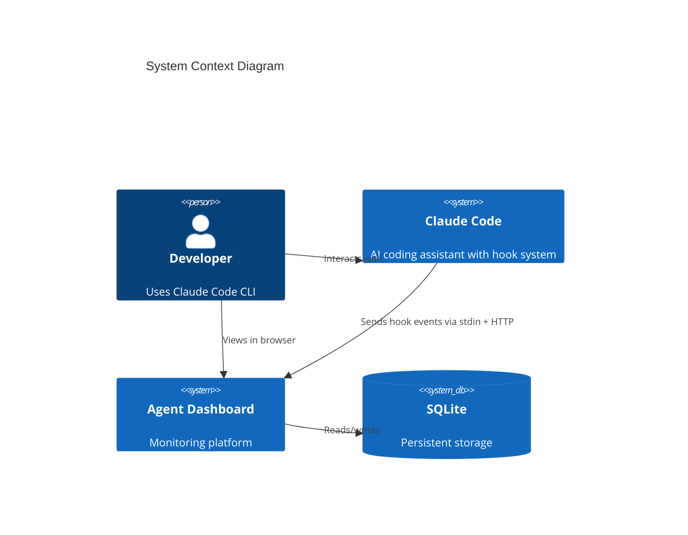

**Design goals:**

- Zero-config operation -- auto-discovers sessions from hook events
- Never block Claude Code -- hooks fail silently with timeouts
- Instant feedback -- WebSocket push, no polling
- Portable -- SQLite, no external services, runs on any OS with Node.js 18+

---

## High-Level Architecture

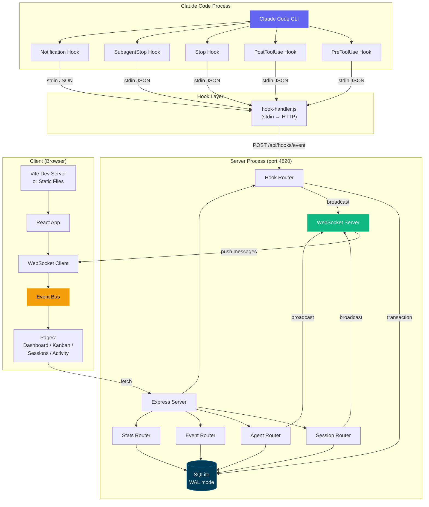

---

## Data Flow

### Event Ingestion Pipeline

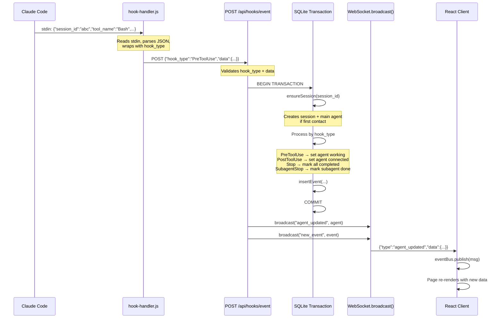

### Client Data Loading Pattern

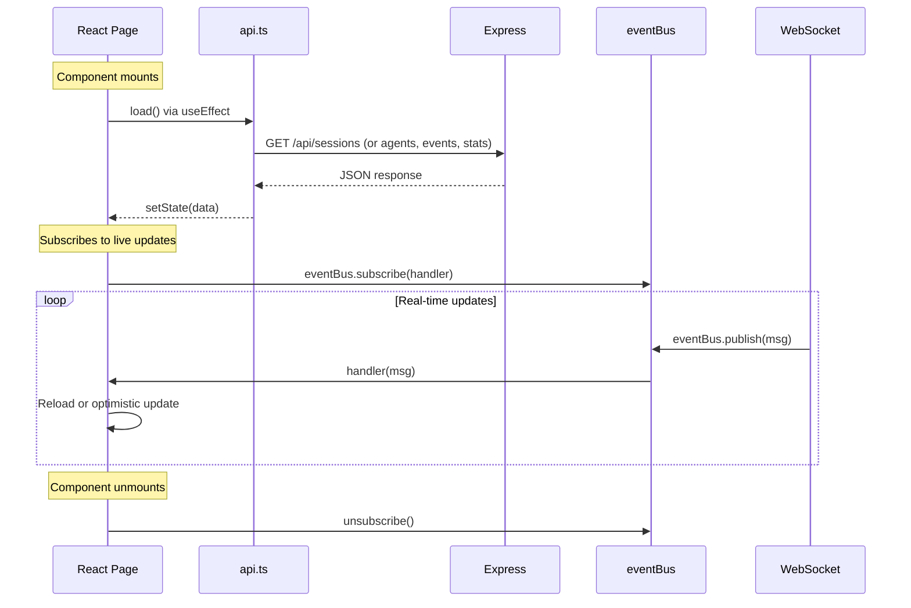

---

## Server Architecture

### Module Dependency Graph

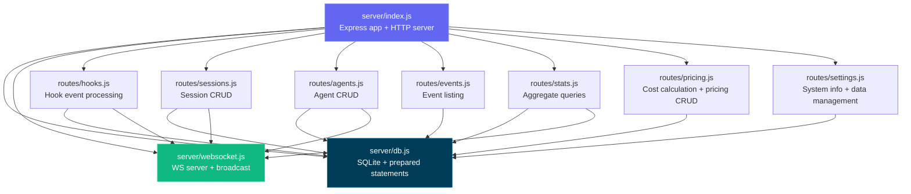

### Server Components

| Module                | Responsibility                                                                                                                                   |
| --------------------- | ------------------------------------------------------------------------------------------------------------------------------------------------ |
| `server/index.js`     | Express app setup, middleware (CORS, JSON parsing), route mounting, static file serving in production, HTTP server creation                      |
| `server/db.js`        | SQLite connection with WAL mode, schema migration (CREATE TABLE IF NOT EXISTS), all prepared statements as a reusable `stmts` object             |
| `server/websocket.js` | WebSocket server on `/ws` path, 30s heartbeat with ping/pong dead connection detection, typed broadcast function                                 |
| `routes/hooks.js`     | Core event processing inside a SQLite transaction. Auto-creates sessions/agents. Switch-case dispatch by hook type. Broadcasts all state changes |
| `routes/sessions.js`  | Standard CRUD with pagination. GET includes agent count via LEFT JOIN. POST is idempotent on session ID                                          |
| `routes/agents.js`    | CRUD with status/session_id filtering. PATCH broadcasts `agent_updated`                                                                          |
| `routes/events.js`    | Read-only event listing with session_id filter and pagination                                                                                    |
| `routes/stats.js`     | Single aggregate query returning total/active counts + status distributions                                                                      |
| `routes/analytics.js` | Extended analytics — token totals, tool usage counts, daily event/session trends, agent type distribution |
| `routes/pricing.js`  | Model pricing CRUD (list/upsert/delete), per-session and global cost calculation with pattern-based model matching |
| `routes/settings.js` | System info (DB size, hook status, server uptime), data export as JSON, session cleanup (abandon stale, purge old), clear all data, reset pricing, reinstall hooks |

### Request Processing

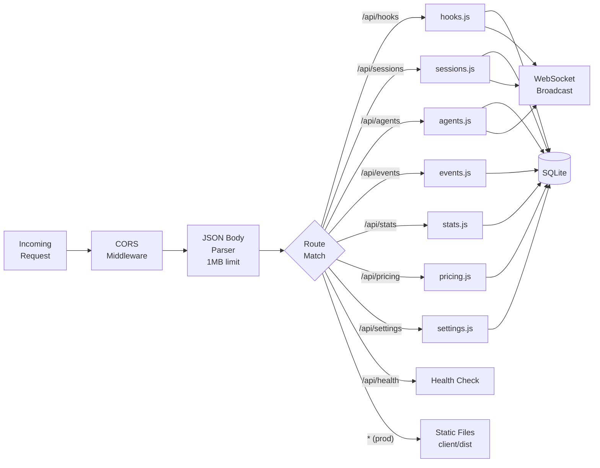

---

## Client Architecture

### Component Tree

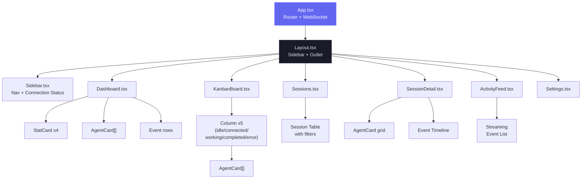

### Client Module Graph

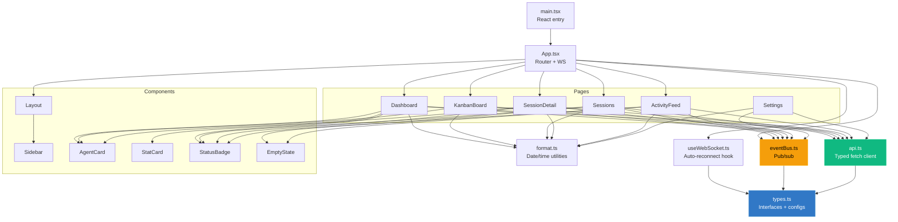

### Routing

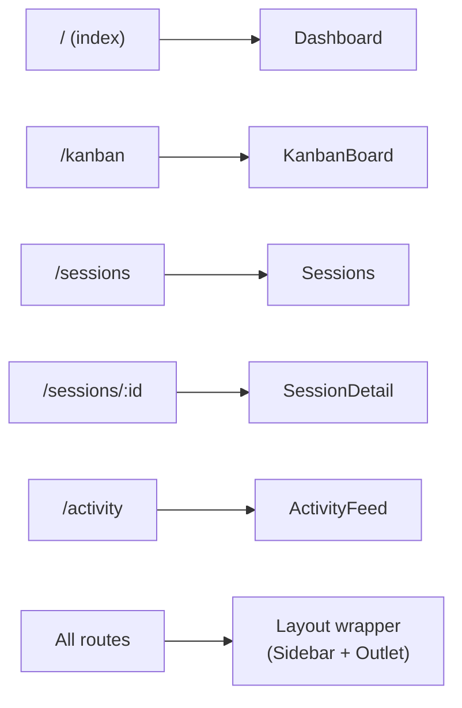

| Route           | Page          | Data Sources                                           |
| --------------- | ------------- | ------------------------------------------------------ |
| `/`             | Dashboard     | `GET /api/stats`, `GET /api/agents`, `GET /api/events` |
| `/kanban`       | KanbanBoard   | `GET /api/agents?limit=200`                            |
| `/sessions`     | Sessions      | `GET /api/sessions`                                    |
| `/sessions/:id` | SessionDetail | `GET /api/sessions/:id` (includes agents + events)     |
| `/activity`     | ActivityFeed  | `GET /api/events?limit=100`                            |
| `/settings`     | Settings      | `GET /api/settings/info`, `GET /api/pricing`, `GET /api/pricing/cost` |

---

## Database Design

### Entity Relationship Diagram

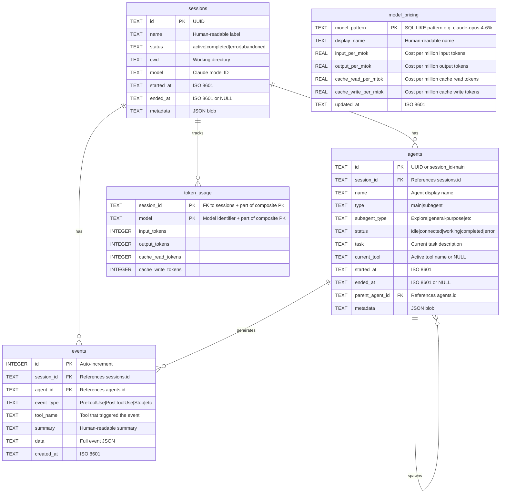

### Indexes

| Index                  | Table    | Column(s)         | Purpose                        |
| ---------------------- | -------- | ----------------- | ------------------------------ |
| `idx_agents_session`   | agents   | `session_id`      | Fast agent lookup by session   |
| `idx_agents_status`    | agents   | `status`          | Kanban board column queries    |
| `idx_events_session`   | events   | `session_id`      | Session detail event list      |
| `idx_events_type`      | events   | `event_type`      | Filter events by type          |
| `idx_events_created`   | events   | `created_at DESC` | Activity feed ordering         |
| `idx_sessions_status`  | sessions | `status`          | Status filter on sessions page |
| `idx_sessions_started` | sessions | `started_at DESC` | Default sort order             |

### SQLite Configuration

| Pragma         | Value  | Rationale                                                                  |
| -------------- | ------ | -------------------------------------------------------------------------- |
| `journal_mode` | `WAL`  | Concurrent reads during writes, better performance for read-heavy workload |
| `foreign_keys` | `ON`   | Referential integrity enforcement                                          |
| `busy_timeout` | `5000` | Wait up to 5s for write lock instead of failing immediately                |

### Prepared Statements

All queries use prepared statements (`db.prepare()`) for:

- **Security** -- parameterized queries prevent SQL injection
- **Performance** -- compiled once, executed many times
- **Reliability** -- syntax errors caught at startup, not runtime

---

## WebSocket Protocol

### Connection

- **Path:** `/ws`
- **Protocol:** Standard WebSocket (RFC 6455)
- **Heartbeat:** Server sends `ping` every 30 seconds; clients that don't `pong` are terminated

### Message Format

All messages are JSON with this envelope:

```typescript
{
  type: "session_created" | "session_updated" | "agent_created" | "agent_updated" | "new_event";
  data: Session | Agent | DashboardEvent;
  timestamp: string; // ISO 8601
}
```

### Message Flow

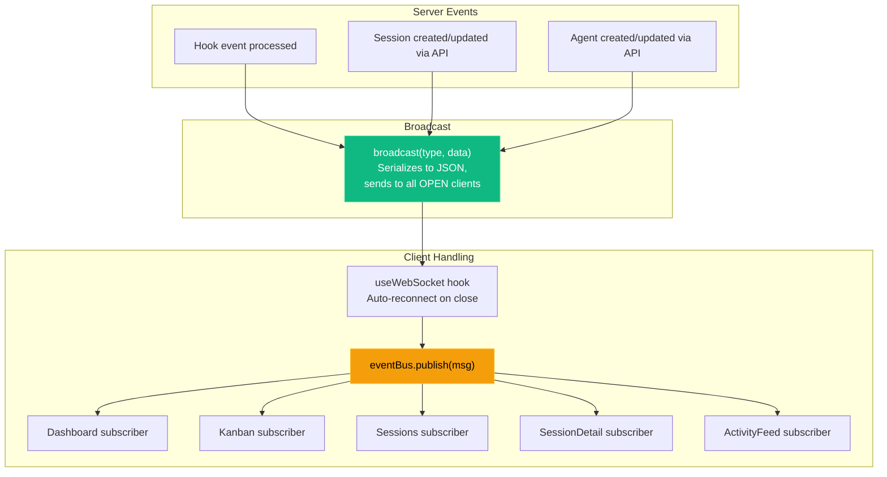

### Client Reconnection

The `useWebSocket` hook implements automatic reconnection:

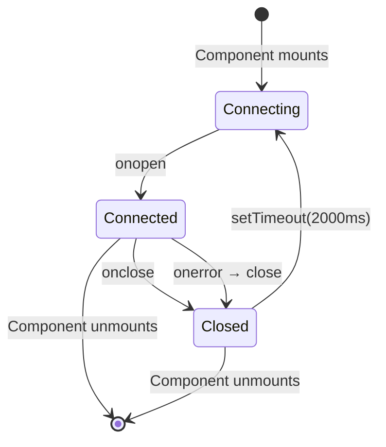

---

## Hook Integration

### Hook Handler Design

`scripts/hook-handler.js` is designed to be a minimal, fail-safe forwarder:

```mermaid
flowchart TD
    START[Claude Code fires hook] --> STDIN[Read stdin to EOF]
    STDIN --> PARSE{Parse JSON?}
    PARSE -->|Success| POST["POST to 127.0.0.1:4820<br/>/api/hooks/event"]
    PARSE -->|Failure| WRAP[Wrap raw input as<br/>{"raw": "..."}]
    WRAP --> POST
    POST --> RESP{Response?}
    RESP -->|200| EXIT0[exit(0)]
    RESP -->|Error| EXIT0_ERR[exit(0)]
    RESP -->|Timeout 3s| DESTROY[Destroy request]
    DESTROY --> EXIT0_TO[exit(0)]

    SAFETY[Safety net: setTimeout 5s] --> EXIT0_SAFETY[exit(0)]

    style EXIT0 fill:#10b981,stroke:#34d399,color:#fff
    style EXIT0_ERR fill:#10b981,stroke:#34d399,color:#fff
    style EXIT0_TO fill:#10b981,stroke:#34d399,color:#fff
    style EXIT0_SAFETY fill:#10b981,stroke:#34d399,color:#fff
```

**Key design decisions:**

- Always exits 0 -- never blocks Claude Code regardless of server state
- 3-second HTTP timeout + 5-second process safety net
- Uses Node.js `http` module directly -- no dependencies
- Reads `CLAUDE_DASHBOARD_PORT` env var for port override

### Hook Installation

`scripts/install-hooks.js` modifies `~/.claude/settings.json`:

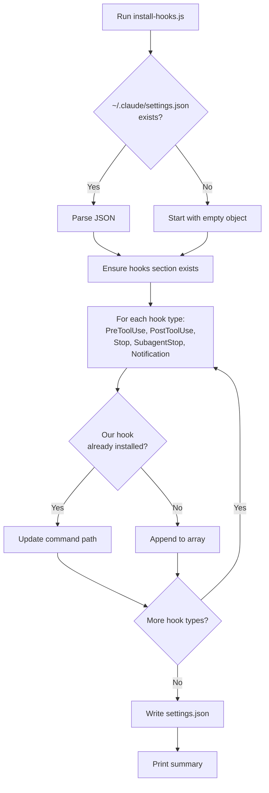

**Preserves existing hooks** -- only adds or updates entries containing `hook-handler.js`.

---

## State Management

### Client-Side Architecture

The client uses a deliberately simple state management approach:

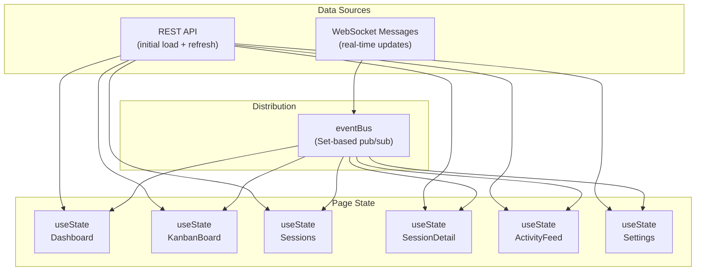

**Why no Redux / Zustand / Context:**

- Each page owns its data and lifecycle
- No cross-page state sharing needed
- WebSocket events trigger reload or append, not complex state merging
- Simpler mental model, fewer abstraction layers, easier to debug

### Event Bus

The `eventBus` is a Set-based pub/sub with `subscribe()` returning an unsubscribe function:

```typescript
// Subscribe in useEffect, unsubscribe on cleanup
useEffect(() => {
  return eventBus.subscribe((msg) => {
    if (msg.type === "agent_updated") load();
  });
}, [load]);
```

This pattern ensures:

- No memory leaks (cleanup on unmount)
- No stale closures (subscribe with latest callback ref)
- Only active pages receive messages

---

## Security Considerations

| Area                   | Approach                                                                                                                                                   |
| ---------------------- | ---------------------------------------------------------------------------------------------------------------------------------------------------------- |
| **SQL injection**      | All queries use prepared statements with parameterized values                                                                                              |
| **Request size**       | Express JSON body parser limited to 1MB                                                                                                                    |
| **Input validation**   | Required fields checked before database operations; CHECK constraints on status enums                                                                      |
| **Hook safety**        | Hook handler always exits 0; 5s max lifetime; uses `127.0.0.1` not external hosts                                                                          |
| **CORS**               | Enabled for development; in production, same-origin (Express serves the client)                                                                            |
| **No auth**            | Intentional -- this is a local development tool. Server binds to `0.0.0.0` only for LAN access; restrict with `DASHBOARD_PORT` or firewall rules if needed |
| **No secrets**         | No API keys, tokens, or credentials stored or transmitted                                                                                                  |
| **Dependency surface** | Minimal: 5 runtime server deps, 4 runtime client deps                                                                                                      |

---

## Performance Characteristics

| Metric                         | Value                        | Notes                                                            |
| ------------------------------ | ---------------------------- | ---------------------------------------------------------------- |
| **Server startup**             | < 200ms                      | SQLite opens instantly; schema migration is idempotent           |
| **Hook latency**               | < 50ms                       | Transaction + broadcast, no async I/O beyond SQLite              |
| **Client bundle**              | 200 KB JS, 17 KB CSS         | Gzipped: ~63 KB JS, ~4 KB CSS                                    |
| **WebSocket latency**          | < 5ms                        | Local loopback, JSON serialization only                          |
| **SQLite write throughput**    | ~50,000 inserts/sec          | WAL mode on SSD; far exceeds hook event rate                     |
| **Max events before slowdown** | ~1M rows                     | SQLite handles this easily; pagination prevents full-table scans |
| **Memory usage**               | ~30 MB server, ~15 MB client | SQLite in-process, no ORM overhead                               |

### SQLite WAL Mode Benefits

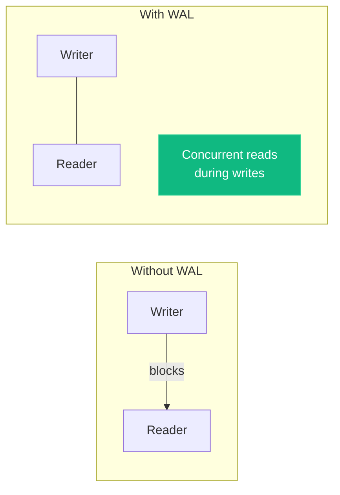

---

## Deployment Modes

### Development

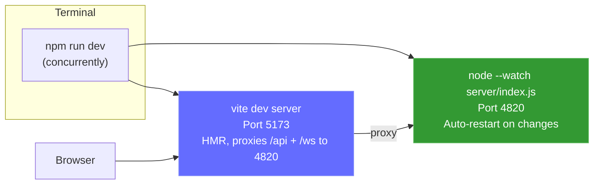

### Production

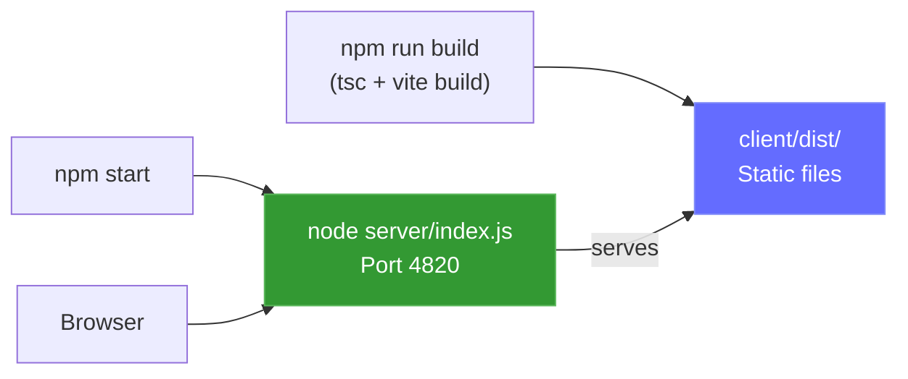

| Aspect            | Development                          | Production                      |
| ----------------- | ------------------------------------ | ------------------------------- |
| **Processes**     | 2 (Express + Vite)                   | 1 (Express)                     |
| **Client**        | Vite HMR on :5173                    | Static files from `client/dist` |
| **API proxy**     | Vite proxies `/api` + `/ws` to :4820 | Same origin, no proxy needed    |
| **File watching** | `node --watch` + Vite HMR            | None                            |
| **Source maps**   | Inline                               | External files                  |

---

## Statusline Utility

The `statusline/` directory contains a standalone CLI statusline for Claude Code, separate from the web dashboard. It renders a color-coded bar at the bottom of the Claude Code terminal.

### Data Flow

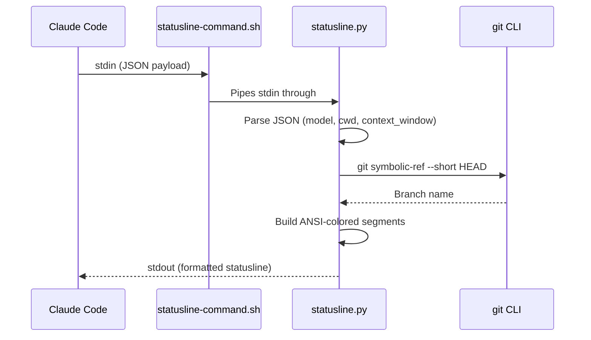

### Segments

| Segment      | Source                                | Color Logic                                        |
| ------------ | ------------------------------------- | -------------------------------------------------- |
| Model        | `data.model.display_name`             | Always cyan                                        |
| User         | `$USERNAME` / `$USER` env var         | Always green                                       |
| Working Dir  | `data.workspace.current_dir`          | Always yellow, `~` prefix for home                 |
| Git Branch   | `git symbolic-ref --short HEAD`       | Always magenta, hidden outside git repos           |
| Context Bar  | `data.context_window.used_percentage` | Green < 50%, Yellow 50–79%, Red >= 80%             |
| Token Counts | `data.context_window.current_usage`   | Always dim; `↑` input, `↓` output, `c` cache reads |

### Integration

The statusline is configured in `~/.claude/settings.json` via the `statusLine` key:

```json
{
  "statusLine": {
    "type": "command",
    "command": "bash \"/path/to/.claude/statusline-command.sh\""
  }
}
```

Claude Code invokes this command on each update, piping a JSON payload to stdin. The script reads the JSON, extracts fields, runs `git` for branch info, and prints ANSI-formatted output to stdout.

**Design decisions:**

- **Python 3.6+** -- available on virtually all systems, handles ANSI and JSON natively
- **No dependencies** -- uses only stdlib (`sys`, `json`, `os`, `subprocess`)
- **Shell wrapper** -- `statusline-command.sh` sets `PYTHONUTF8=1` for Windows Unicode support and resolves the absolute path to the Python script
- **Fail-safe** -- exits silently on empty input or JSON parse errors, never blocks Claude Code

---

## Technology Choices

| Technology                      | Why This Over Alternatives                                                                                                                      |
| ------------------------------- | ----------------------------------------------------------------------------------------------------------------------------------------------- |
| **SQLite** (via better-sqlite3) | Zero-config, embedded, no server process. WAL mode gives concurrent reads. Synchronous API is simpler than async alternatives for this use case |
| **Express**                     | Battle-tested, minimal, well-understood. Overkill would be Fastify for this scale; underkill would be raw `http` module                         |
| **ws**                          | Fastest, most lightweight WebSocket library for Node. No Socket.IO overhead needed since we only push JSON messages                             |
| **React 18**                    | Stable, widely known, strong TypeScript support. No need for Server Components or RSC given this is a client-rendered SPA                       |
| **Vite**                        | Fast builds, native ESM, excellent dev experience. Proxy config handles the dev server split cleanly                                            |
| **Tailwind CSS**                | Utility-first approach keeps styles colocated with markup. No CSS module boilerplate. Custom theme config for the dark UI                       |
| **React Router 6**              | Standard routing for React SPAs. Layout routes with `<Outlet>` give clean shell composition                                                     |
| **Lucide React**                | Tree-shakeable icon library. Only imports what's used (~20 icons)                                                                               |
| **TypeScript Strict**           | Catches null/undefined bugs at compile time. `noUncheckedIndexedAccess` prevents array bounds issues                                            |
