# Deployment Guide

Production deployment guide for Claude Code Agent Monitor. This document covers every supported deployment path — from a single Docker container to a fully orchestrated, multi-cloud Kubernetes deployment with blue-green releases, automated canary analysis, and comprehensive observability.

## Architecture Overview

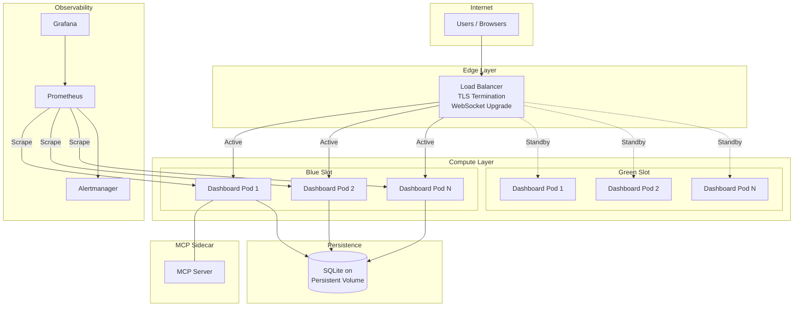

## Deployment Methods

Three deployment methods are supported, each targeting different operational maturity levels:

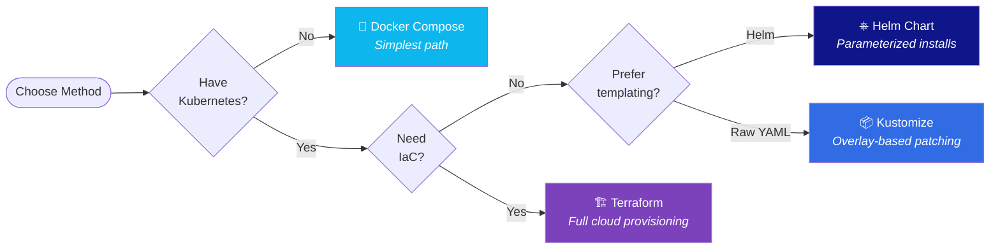

| Method | Best For | Prerequisites | Cloud Agnostic |
|--------|----------|---------------|:--------------:|
| **Docker Compose** | Local dev, single-server | Docker | ✅ |
| **Helm** | Teams with Kubernetes | `helm`, `kubectl` | ✅ |
| **Kustomize** | GitOps, raw YAML fans | `kustomize`, `kubectl` | ✅ |
| **Terraform** | Full infra provisioning | `terraform` | ✅ AWS/GCP/Azure/OCI |

---

## Quick Start: Docker Compose

The fastest path to a running production instance:

```bash
# Build and start everything
docker compose up -d --build

# Verify
curl http://localhost:4820/api/health
# → {"status":"ok","timestamp":"..."}

# View logs
docker compose logs -f
```

The included `docker-compose.yml` at the project root runs the dashboard on port `4820` with a persistent `./data` volume for SQLite.

---

## Helm Deployment

### Prerequisites

```bash
# Verify tools
helm version    # >= 3.12
kubectl version # >= 1.27
```

### Install

```bash
# From the repository root:
cd deployments/helm/agent-monitor

# Dev environment (1 replica, relaxed resources)
helm install agent-monitor . \
  -f values-dev.yaml \
  -n agent-monitor-dev --create-namespace

# Staging (2 replicas, moderate resources)
helm install agent-monitor . \
  -f values-staging.yaml \
  -n agent-monitor-staging --create-namespace

# Production (3+ replicas, HPA, strict security)
helm install agent-monitor . \
  -f values-production.yaml \
  -n agent-monitor-production --create-namespace
```

### Helm Values Hierarchy

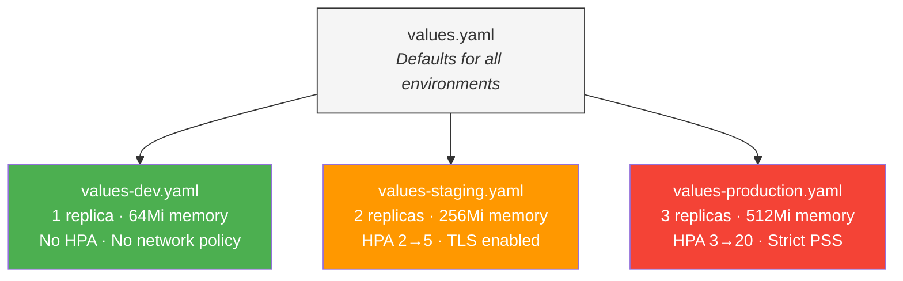

### Key Configuration

| Parameter | Default | Description |
|-----------|---------|-------------|
| `replicaCount` | `2` | Number of pod replicas |
| `image.registry` | `ghcr.io` | Container registry |
| `image.tag` | `""` (appVersion) | Image tag |
| `service.type` | `ClusterIP` | Service type |
| `ingress.enabled` | `false` | Enable Ingress resource |
| `persistence.enabled` | `true` | Enable PVC for SQLite |
| `persistence.size` | `5Gi` | PVC size |
| `autoscaling.enabled` | `true` | Enable HPA |
| `mcp.enabled` | `false` | Deploy MCP sidecar |
| `monitoring.enabled` | `false` | Enable ServiceMonitor |
| `networkPolicy.enabled` | `true` | Enable NetworkPolicy |

### Upgrade

```bash
helm upgrade agent-monitor . \
  -f values-production.yaml \
  -n agent-monitor-production \
  --set image.tag=sha-abc1234
```

### Rollback

```bash
# View history
helm history agent-monitor -n agent-monitor-production

# Roll back to previous
helm rollback agent-monitor -n agent-monitor-production

# Roll back to specific revision
helm rollback agent-monitor 3 -n agent-monitor-production
```

### Test

```bash
helm test agent-monitor -n agent-monitor-production
```

---

## Kustomize Deployment

### Base + Overlays Structure

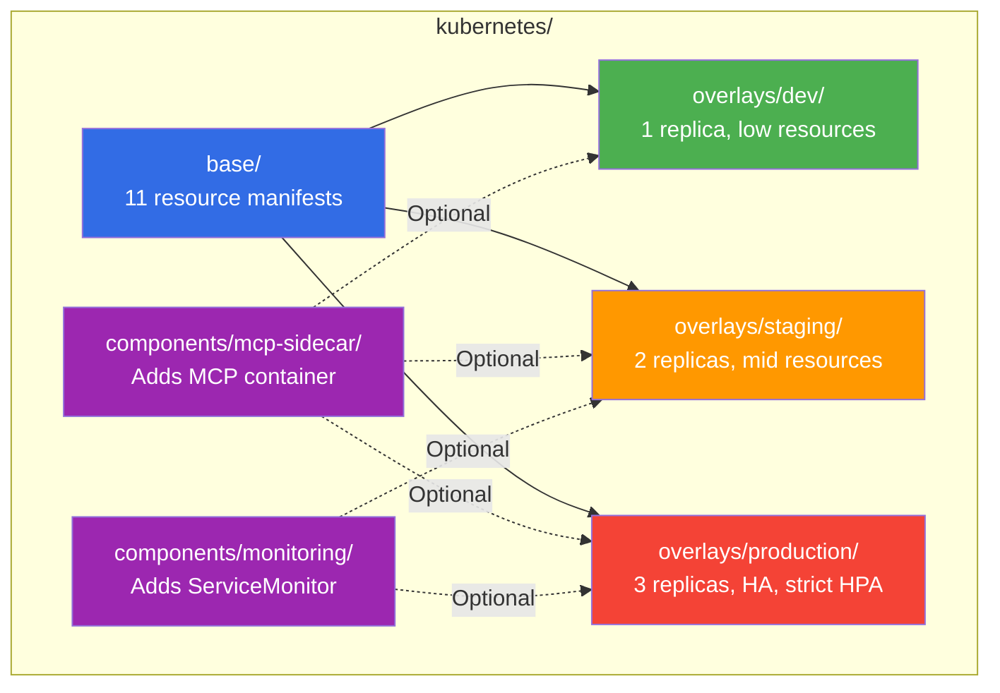

### Deploy

```bash
cd deployments/kubernetes

# Preview what will be applied
kubectl kustomize overlays/production

# Apply
kubectl apply -k overlays/dev          # Dev
kubectl apply -k overlays/staging      # Staging
kubectl apply -k overlays/production   # Production
```

### Enable MCP Sidecar

Add the component to your overlay's `kustomization.yaml`:

```yaml
# overlays/production/kustomization.yaml
components:
  - ../../components/mcp-sidecar
  - ../../components/monitoring
```

Then re-apply:

```bash
kubectl apply -k overlays/production
```

### Base Resources

The base layer includes all required Kubernetes resources:

| Resource | File | Purpose |
|----------|------|---------|
| Namespace | `namespace.yaml` | Isolated namespace with Restricted PSS |
| Deployment | `deployment.yaml` | App pods with probes, security context, anti-affinity |
| Service | `service.yaml` | ClusterIP with WebSocket session affinity |
| Ingress | `ingress.yaml` | TLS, HSTS, WebSocket upgrade headers |
| HPA | `hpa.yaml` | CPU/memory auto-scaling with scale-down stabilization |
| PDB | `pdb.yaml` | Disruption budget (`minAvailable: 1`) |
| NetworkPolicy | `networkpolicy.yaml` | Restricted ingress/egress |
| ConfigMap | `configmap.yaml` | Runtime configuration |
| PVC | `pvc.yaml` | Persistent storage for SQLite |
| ServiceAccount | `serviceaccount.yaml` | Dedicated SA, no token mount |

---

## Terraform Deployment

Full cloud infrastructure provisioning with support for AWS, GCP, Azure, and OCI.

### Cloud Provider Architecture

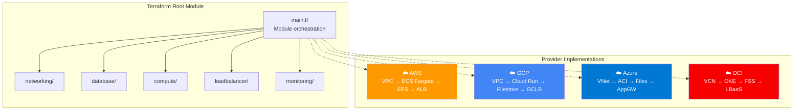

### Modules

| Module | Provisions | Key Features |
|--------|-----------|--------------|
| **networking** | VPC/VNet, subnets, NAT, security groups | Multi-AZ, public/private subnet separation |
| **compute** | Container instances, task definitions | Blue-green dual slots, auto-scaling |
| **database** | Managed file storage (EFS/Filestore/Files/FSS) | Encrypted at rest, NFS mount |
| **loadbalancer** | Application load balancer | TLS 1.3, WebSocket sticky sessions, weighted routing |
| **monitoring** | CloudWatch/Stackdriver/Azure Monitor | Alarms, dashboards, log retention |

### Deploy with Terraform

```bash
cd deployments/terraform

# 1. Select a cloud provider
#    Copy the provider directory as your working root, or symlink:
cp -r providers/aws/* .
#    Or for GCP: cp -r providers/gcp/* .
#    Or for Azure: cp -r providers/azure/* .
#    Or for OCI: cp -r providers/oci/* .

# 2. Configure backend (edit backend.tf — uncomment your provider's backend block)
vim backend.tf

# 3. Initialize
terraform init

# 4. Plan with environment-specific variables
terraform plan -var-file=environments/dev/terraform.tfvars -out=tfplan

# 5. Apply
terraform apply tfplan

# 6. Get outputs
terraform output application_url
```

### Environment Configuration

Each environment has a pre-configured `terraform.tfvars`:

| Environment | Replicas | CPU | Memory | Monitoring | Strategy |
|-------------|:--------:|:---:|:------:|:----------:|----------|
| **dev** | 1 | 256 | 512 | Off | Rolling |
| **staging** | 2 | 512 | 1024 | On | Rolling |
| **production** | 3 | 1024 | 2048 | On | Blue-green |

### Blue-Green with Terraform

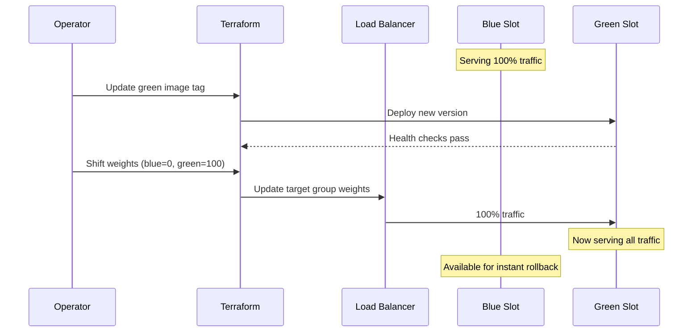

Adjust weights in your tfvars:

```hcl
# Switch traffic from blue to green
blue_weight  = 0
green_weight = 100
```

Then apply:

```bash
terraform plan -var-file=environments/production/terraform.tfvars -out=tfplan
terraform apply tfplan
```

---

## Deployment Strategies

### Rolling Update (Default)

Zero-downtime rolling replacement. One pod at a time is replaced while the rest continue serving.

```mermaid
gantt
  title Rolling Update Timeline
  dateFormat X
  axisFormat %s

  section Pod 1
    Running (old)   :done, 0, 3
    Terminating     :crit, 3, 4
    Running (new)   :active, 4, 10

  section Pod 2
    Running (old)   :done, 0, 5
    Terminating     :crit, 5, 6
    Running (new)   :active, 6, 10

  section Pod 3
    Running (old)   :done, 0, 7
    Terminating     :crit, 7, 8
    Running (new)   :active, 8, 10
```

```bash
# Rolling is the default strategy
./deployments/scripts/deploy.sh --env production --method helm
```

### Blue-Green

Two identical environments. Traffic switches instantly between them. Enables instant rollback.

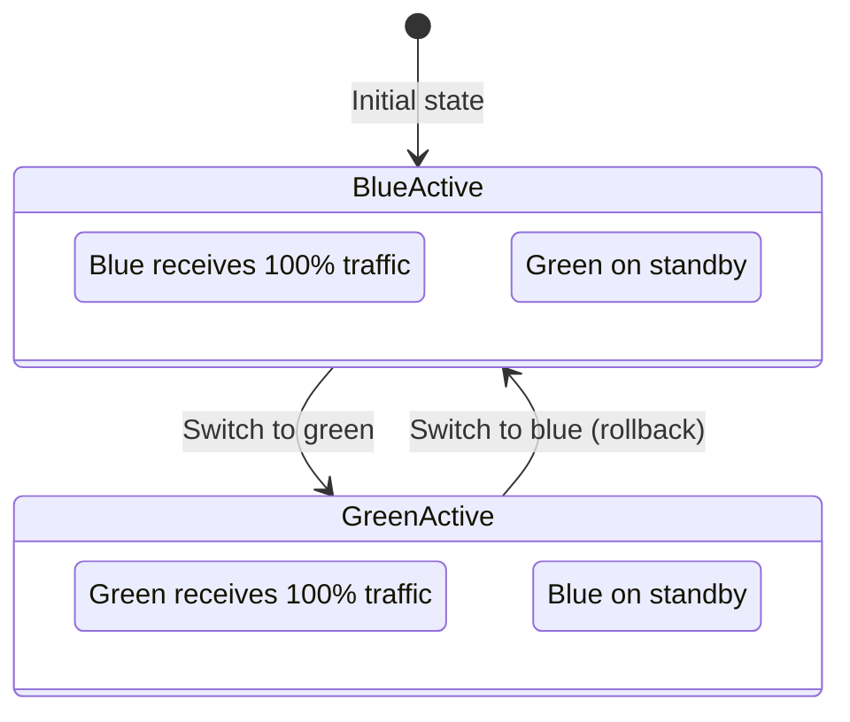

```bash
# Deploy with blue-green strategy
./deployments/scripts/deploy.sh \
  --env production --method helm --strategy blue-green

# Switch traffic to green slot
./deployments/scripts/blue-green-switch.sh \
  --env production --target green

# Instant rollback to blue
./deployments/scripts/blue-green-switch.sh \
  --env production --target blue
```

### Canary

Gradually shift traffic to the new version while monitoring error rates and latency. Automatic rollback if metrics exceed thresholds.

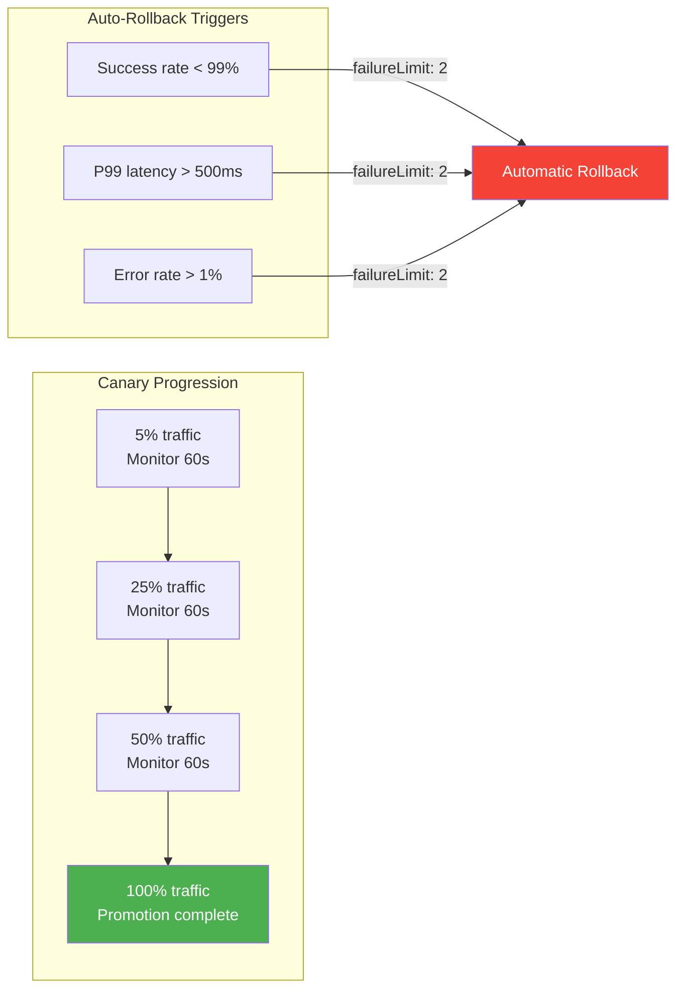

```bash
# Deploy with canary strategy (requires Argo Rollouts)
./deployments/scripts/deploy.sh \
  --env production --method helm --strategy canary
```

Canary analysis is defined in `kubernetes/strategies/canary/canary-analysis.yaml` with three Prometheus queries:

| Metric | Threshold | Window |
|--------|-----------|--------|
| Success rate | ≥ 99% | 60s |
| P99 latency | < 500ms | 60s |
| Error rate | ≤ 1% | 60s |

---

## Operations Scripts

All scripts live in `deployments/scripts/` and share consistent flags:

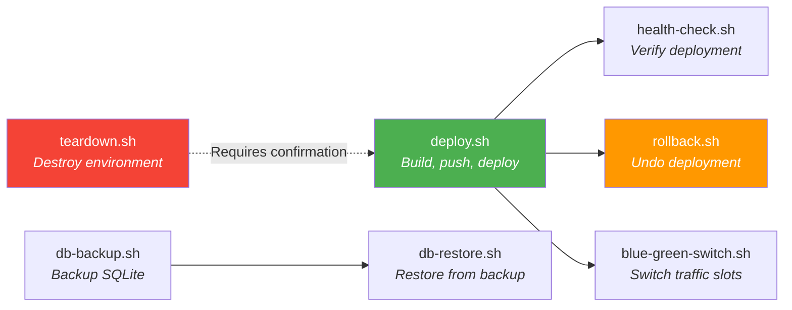

### deploy.sh

The primary deployment orchestrator. Builds images, pushes to registry, and deploys using your chosen method and strategy.

```bash
# Basic deployment
./deployments/scripts/deploy.sh --env dev --method helm

# Production with blue-green
./deployments/scripts/deploy.sh \
  --env production \
  --method helm \
  --strategy blue-green \
  --tag v1.2.3

# Dry run (preview changes)
./deployments/scripts/deploy.sh \
  --env staging --method kustomize --dry-run

# Skip image build (use existing image)
./deployments/scripts/deploy.sh \
  --env production --method helm --skip-build --tag sha-abc1234

# Terraform deployment
./deployments/scripts/deploy.sh --env production --method terraform
```

### health-check.sh

Comprehensive health verification — HTTP endpoint, WebSocket connectivity, and response time thresholds.

```bash
# Basic health check
./deployments/scripts/health-check.sh --url http://localhost:4820

# With custom thresholds
./deployments/scripts/health-check.sh \
  --url https://monitor.example.com \
  --retries 60 \
  --interval 10 \
  --threshold 1000

# JSON output (for CI pipelines)
./deployments/scripts/health-check.sh \
  --url http://localhost:4820 --json

# Skip WebSocket check
./deployments/scripts/health-check.sh \
  --url http://localhost:4820 --no-websocket
```

### rollback.sh

Roll back to a previous deployment version.

```bash
# Roll back Helm to previous release
./deployments/scripts/rollback.sh --env production --method helm

# Roll back to specific revision
./deployments/scripts/rollback.sh --env production --method helm --revision 5

# Roll back Kustomize deployment
./deployments/scripts/rollback.sh --env staging --method kustomize
```

### blue-green-switch.sh

Switch live traffic between blue and green deployment slots.

```bash
# Switch production to green
./deployments/scripts/blue-green-switch.sh --env production --target green

# Instant rollback to blue
./deployments/scripts/blue-green-switch.sh --env production --target blue

# Dry run
./deployments/scripts/blue-green-switch.sh \
  --env production --target green --dry-run
```

### db-backup.sh / db-restore.sh

Back up and restore the SQLite database from Kubernetes PVCs.

```bash
# Backup
./deployments/scripts/db-backup.sh \
  --env production --output ./backups

# Backup with S3 upload
./deployments/scripts/db-backup.sh \
  --env production --output ./backups \
  --upload s3://my-bucket/backups/

# Restore from backup
./deployments/scripts/db-restore.sh \
  --env production --input ./backups/dashboard-20240128-143022.db.gz
```

### teardown.sh

Destroy an entire environment. Requires explicit confirmation for production.

```bash
# Tear down dev environment
./deployments/scripts/teardown.sh --env dev --method helm

# Tear down production (requires typing environment name to confirm)
./deployments/scripts/teardown.sh --env production --method terraform

# Also delete PVCs (permanent data loss)
./deployments/scripts/teardown.sh \
  --env staging --method helm --delete-pvc
```

---

## CI/CD Pipelines

Pre-built pipelines for GitHub Actions and GitLab CI.

### Pipeline Flow

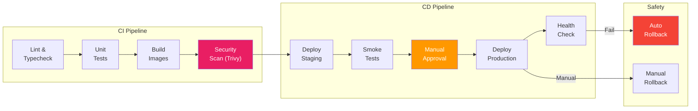

### GitHub Actions

Three workflow files in `deployments/ci/github-actions/`:

| Workflow | Trigger | Actions |
|----------|---------|---------|
| `ci.yaml` | Push, PR | Lint, test, build images, Trivy scan |
| `deploy.yaml` | Tag `v*`, manual | Deploy to staging → approval → production |
| `rollback.yaml` | Manual | Roll back any environment |

```bash
# Copy workflows to your repo
cp -r deployments/ci/github-actions/*.yaml .github/workflows/

# Required GitHub secrets:
# - KUBE_CONFIG         (base64 kubeconfig)
# - REGISTRY_USERNAME   (container registry user)
# - REGISTRY_PASSWORD   (container registry token)
```

### GitLab CI

Single pipeline file in `deployments/ci/gitlab-ci/`:

```bash
# Copy to repo root
cp deployments/ci/gitlab-ci/.gitlab-ci.yml .

# Required CI/CD variables:
# - KUBE_CONFIG         (base64 kubeconfig, type: File)
# - CI_REGISTRY_USER    (auto-provided by GitLab)
# - CI_REGISTRY_PASSWORD (auto-provided by GitLab)
```

---

## Monitoring & Observability

### Stack Overview

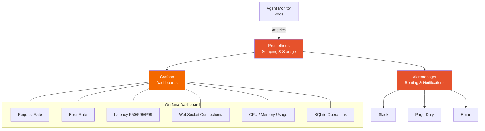

### Setup

```bash
# Import Grafana dashboard
# File: deployments/monitoring/grafana/dashboards/agent-monitor.json
# → Import via Grafana UI: Dashboards → Import → Upload JSON

# Apply Prometheus rules
kubectl apply -f deployments/monitoring/prometheus/rules/agent-monitor.rules.yaml

# Apply Prometheus scrape config
# Merge deployments/monitoring/prometheus/prometheus.yaml into your Prometheus config

# Apply Alertmanager config
# Merge deployments/monitoring/alertmanager/alertmanager.yaml into your Alertmanager config
```

### Alert Rules

13 alert rules organized by category:

| Alert | Severity | Condition |
|-------|----------|-----------|
| `AgentMonitorDown` | critical | Instance unreachable > 2min |
| `HighErrorRate` | critical | 5xx rate > 5% for 5min |
| `HighLatency` | warning | P95 latency > 2s for 5min |
| `WebSocketConnectionSpike` | warning | WS connections > 1000 |
| `HighMemoryUsage` | warning | Memory > 85% of limit |
| `HighCpuUsage` | warning | CPU > 80% for 10min |
| `PVNearlyFull` | critical | PV usage > 90% |
| `PodRestartLooping` | critical | > 5 restarts in 15min |
| `HpaMaxedOut` | warning | Replicas at max for 15min |
| `SlowDatabaseQueries` | warning | DB query time > 1s |

### Grafana Dashboard

The pre-built dashboard (`agent-monitor.json`) includes 16 panels across 6 rows:

- **Overview** — Request rate, active sessions, WebSocket connections
- **HTTP Performance** — Latency histograms, status code distribution, error rate
- **WebSocket** — Connection count, message throughput, connection duration
- **Database** — Query duration, row counts, WAL checkpoint time
- **Resources** — CPU, memory, network I/O, filesystem usage
- **Deployment** — Pod status, restart count, HPA scaling events

---

## Security Model

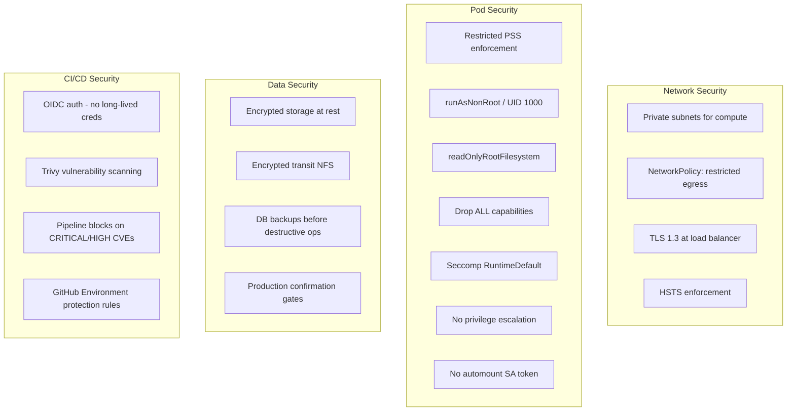

---

## Directory Reference

```
deployments/
├── ci/                          # CI/CD pipeline definitions
│   ├── github-actions/
│   │   ├── ci.yaml              # Build, test, scan
│   │   ├── deploy.yaml          # Staged deployment
│   │   └── rollback.yaml        # Emergency rollback
│   └── gitlab-ci/
│       └── .gitlab-ci.yml       # Full GitLab pipeline
├── helm/
│   └── agent-monitor/           # Helm chart
│       ├── Chart.yaml
│       ├── values.yaml          # Default values
│       ├── values-dev.yaml      # Dev overrides
│       ├── values-staging.yaml  # Staging overrides
│       ├── values-production.yaml # Production overrides
│       └── templates/           # 12 Kubernetes templates
├── kubernetes/                  # Kustomize manifests
│   ├── base/                    # 11 base resources
│   ├── overlays/
│   │   ├── dev/
│   │   ├── staging/
│   │   └── production/
│   ├── components/
│   │   ├── mcp-sidecar/         # Optional MCP sidecar
│   │   └── monitoring/          # Optional ServiceMonitor
│   └── strategies/
│       ├── blue-green/          # Blue-green deployments
│       └── canary/              # Canary with analysis
├── monitoring/
│   ├── alertmanager/            # Alert routing config
│   ├── grafana/
│   │   ├── dashboards/          # Pre-built dashboard JSON
│   │   └── datasources.yaml
│   └── prometheus/
│       ├── prometheus.yaml      # Scrape configuration
│       └── rules/               # 13 alerting rules
├── scripts/                     # Operational scripts
│   ├── deploy.sh                # Primary deploy orchestrator
│   ├── rollback.sh              # Version rollback
│   ├── blue-green-switch.sh     # Traffic slot switching
│   ├── health-check.sh          # Deployment verification
│   ├── db-backup.sh             # Database backup
│   ├── db-restore.sh            # Database restore
│   └── teardown.sh              # Environment teardown
└── terraform/                   # Infrastructure as Code
    ├── main.tf                  # Root module
    ├── variables.tf             # Input variables
    ├── outputs.tf               # Output values
    ├── versions.tf              # Provider version constraints
    ├── backend.tf               # State backend configs
    ├── modules/
    │   ├── networking/          # VPC, subnets, security groups
    │   ├── compute/             # Container orchestration
    │   ├── database/            # Persistent storage
    │   ├── loadbalancer/        # ALB with TLS & WebSocket
    │   └── monitoring/          # Alarms & dashboards
    ├── providers/
    │   ├── aws/                 # ECS Fargate + ALB + EFS
    │   ├── gcp/                 # Cloud Run + GCLB + Filestore
    │   ├── azure/               # ACI + App Gateway + Files
    │   └── oci/                 # OKE + LBaaS + FSS
    └── environments/
        ├── dev/
        ├── staging/
        └── production/
```

---

## Common Workflows

### First Production Deployment

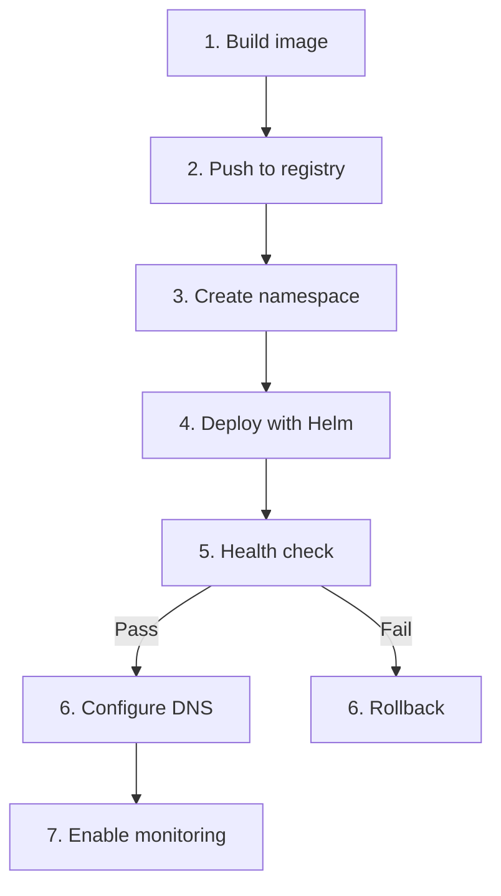

```bash
# 1–2. Build and push
docker build -t ghcr.io/your-org/agent-monitor:v1.0.0 .
docker push ghcr.io/your-org/agent-monitor:v1.0.0

# 3–4. Deploy
./deployments/scripts/deploy.sh \
  --env production \
  --method helm \
  --tag v1.0.0 \
  --skip-build

# 5. Verify
./deployments/scripts/health-check.sh --url https://monitor.example.com

# 7. Enable monitoring
helm upgrade agent-monitor deployments/helm/agent-monitor \
  -f deployments/helm/agent-monitor/values-production.yaml \
  --set monitoring.enabled=true \
  -n agent-monitor-production
```

### Zero-Downtime Release

```bash
# 1. Deploy new version to green slot
./deployments/scripts/deploy.sh \
  --env production --method helm \
  --strategy blue-green --tag v1.1.0

# 2. Verify green is healthy
./deployments/scripts/health-check.sh \
  --url http://green-internal:4820

# 3. Switch traffic
./deployments/scripts/blue-green-switch.sh \
  --env production --target green

# 4. Verify production
./deployments/scripts/health-check.sh \
  --url https://monitor.example.com

# 5. If something goes wrong — instant rollback
./deployments/scripts/blue-green-switch.sh \
  --env production --target blue
```

### Disaster Recovery

```bash
# 1. Backup current state
./deployments/scripts/db-backup.sh \
  --env production --output ./backups

# 2. Restore from backup
./deployments/scripts/db-restore.sh \
  --env production \
  --input ./backups/dashboard-latest.db.gz

# 3. Verify
./deployments/scripts/health-check.sh --url https://monitor.example.com
```

---

## Troubleshooting

### Pod not starting

```bash
# Check pod status
kubectl get pods -n agent-monitor-production

# Check events
kubectl describe pod <pod-name> -n agent-monitor-production

# Check logs
kubectl logs <pod-name> -n agent-monitor-production
```

### WebSocket connections dropping

The dashboard requires WebSocket sticky sessions. Verify:

```bash
# Helm: check service session affinity
kubectl get svc -n agent-monitor-production -o yaml | grep -A5 sessionAffinity

# Ingress: check WebSocket annotations
kubectl get ingress -n agent-monitor-production -o yaml | grep -A10 annotations
```

Required ingress annotations for WebSocket:
```yaml
nginx.ingress.kubernetes.io/proxy-read-timeout: "3600"
nginx.ingress.kubernetes.io/proxy-send-timeout: "3600"
```

### Database locked errors

SQLite supports one writer at a time. Ensure:

1. PVC access mode is `ReadWriteOnce` (not `ReadWriteMany`)
2. Only one pod writes at a time (replica count or leader election)
3. WAL mode is enabled (default in the application)

### Terraform state issues

```bash
# Refresh state
terraform refresh -var-file=environments/production/terraform.tfvars

# Import existing resource
terraform import -var-file=environments/production/terraform.tfvars \
  module.networking.aws_vpc.main vpc-12345

# Unlock state (if locked by a failed run)
terraform force-unlock <lock-id>
```
