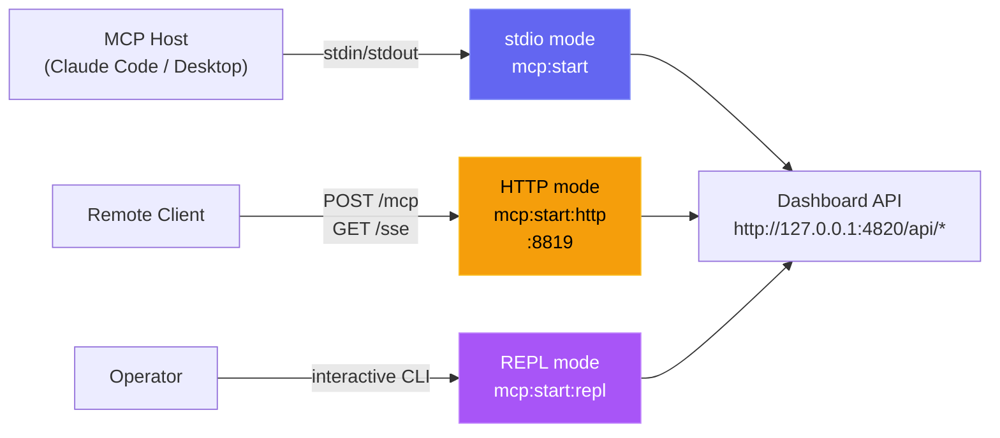

# Installation

## Requirements

| Requirement | Version | Notes |
|---|---|---|
| Node.js | 18+ (22+ recommended) | Required for server and client |
| npm | 9+ | Comes with Node.js |
| Claude Code | 2.x+ | Required for hook integration |
| Python | 3.6+ | Optional — statusline utility only |
| Git | Any | For cloning the repository |

---

## Step 1 — Clone the repository

```bash
git clone https://github.com/hoangsonww/Claude-Code-Agent-Monitor.git
cd Claude-Code-Agent-Monitor
```

---

## Step 2 — Install dependencies

```bash
npm run setup
```

This installs all server and client dependencies in a single command. It is equivalent to:

```bash
npm install
cd client && npm install
```

Or via Makefile (also installs MCP dependencies):

```bash
make setup
```

---

## Step 3 — Start the dashboard

```bash
npm run dev
```

This starts two processes concurrently:

| Process | URL | Description |
|---|---|---|
| Express server | http://localhost:4820 | API, WebSocket, SQLite |
| Vite dev server | http://localhost:5173 | React frontend with HMR |

Open **http://localhost:5173** in your browser.

> [!TIP]
> When you run the dashboard directly on the host with `npm run dev` or `npm start`, the server automatically writes the Claude Code hook configuration to `~/.claude/settings.json`. If you run the dashboard in Docker or Podman, install hooks from the host with `npm run install-hooks` after the container is up.

---

## Step 4 — Start a Claude Code session

Start a new Claude Code session from any directory **after** the dashboard server is running. The hooks will fire automatically and your sessions, agents, and events will appear in real-time.

```bash
# In a separate terminal, from any project directory:
claude
```

---

## Verification

After starting a Claude Code session, you should see:

- **Sessions page** — your session listed with status `Active`
- **Agent Board** — a `Main Agent` card in the `Connected` column
- **Activity Feed** — events streaming in as Claude Code uses tools
- **Dashboard** — stats updating in real-time
- **Settings page** — model pricing rules, hook configuration status, data export and cleanup tools

If nothing appears after 30 seconds, see [SETUP.md](./SETUP.md#troubleshooting).

---

## Production mode

To run as a single process serving the built client:

```bash
npm run build   # Build the React client
npm start       # Start Express serving client/dist on port 4820
```

Open **http://localhost:4820** in your browser.

---

## Optional: Local MCP server

If you want AI agents to call dashboard functionality through MCP tools, run the local MCP server in `mcp/`:

```bash
npm run mcp:install
npm run mcp:build
npm run mcp:start              # stdio (for MCP host integration)
npm run mcp:start:http         # HTTP + SSE server on port 8819
npm run mcp:start:repl         # interactive CLI with tab completion
```

The MCP server supports three transport modes:



See [mcp/README.md](./mcp/README.md) for host config, tool catalog, and safety flags.

To build the MCP server as a container image instead:

```bash
npm run mcp:docker:build
# or
npm run mcp:podman:build
```

---

## Optional: Agent extension packs

This repository includes extension packs for both Claude Code and Codex.

- Claude Code loads project extensions from:
  - `CLAUDE.md`
  - `.claude/rules/`
  - `.claude/skills/`
  - `.claude/agents/`
- Codex project packs live under `.codex/`:
  - `AGENTS.md`
  - `.codex/rules/`
  - `.codex/agents/`
  - `.codex/skills/`

See [`.codex/README.md`](./.codex/README.md) for Codex extension details.

---

## Optional: VS Code extension

The **Claude Code Agent Monitor** is also available as a dedicated VS Code extension for seamless, integrated monitoring.

<p align="center">
  
</p>

### Features
- **Real-time Sidebar**: Monitor agent status, health, and usage stats in the Activity Bar.
- **Pulse Status Bar**: High-level session and agent counts in the bottom status bar.
- **Direct Navigation**: Jump to specific dashboard pages or recent sessions.
- **Embedded Dashboard**: Full dashboard interface within a native VS Code tab.

### Installation
1. Open the [vscode-extension](./vscode-extension) folder in VS Code.
2. Install via the Marketplace or package it manually:
   ```bash
   cd vscode-extension
   npm install
   # Generate .vsix for local install
   npm run package
   ```
3. After installation, ensure the main dashboard server is running (`npm run dev`).
4. Look for the **Radar icon** in your VS Code Activity Bar.

For advanced configuration, refer to the [.vscode](./.vscode) and [vscode-extension](./vscode-extension) directories.

> [!TIP]
> Extension on VS Code Marketplace: [Claude Code Agent Monitor](https://marketplace.visualstudio.com/items?itemName=hoangsonw.claude-code-agent-monitor)

---

## Container mode (Docker / Podman)

The repository includes both a multi-stage `Dockerfile` and a `docker-compose.yml` file. Docker and Podman are both supported.

### Compose

```bash
# Docker Compose
docker compose up -d --build

# Podman Compose
CLAUDE_HOME="$HOME/.claude" podman compose up -d --build
```

Open **http://localhost:4820** in your browser.

### Plain Docker / Podman

```bash
# Docker
docker build -t agent-monitor .
docker run -d --name agent-monitor \
  -p 4820:4820 \
  -v "$HOME/.claude:/root/.claude:ro" \
  -v agent-monitor-data:/app/data \
  agent-monitor

# Podman
podman build -t agent-monitor .
podman run -d --name agent-monitor \
  -p 4820:4820 \
  -v "$HOME/.claude:/root/.claude:ro" \
  -v agent-monitor-data:/app/data \
  agent-monitor
```

### Container notes

| Mount | Purpose |
|---|---|
| `~/.claude:/root/.claude:ro` | Lets the server import legacy Claude session history |
| `agent-monitor-data:/app/data` | Persists the SQLite database across container restarts |

> [!IMPORTANT]
> Claude Code hooks run on the host, not inside the container. After the container is healthy on `http://localhost:4820`, run `npm run install-hooks` on the host so Claude Code posts hook events back to the containerized server.

<p align="center">
  
</p>

<p align="center">
  
</p>

<p align="center">
  
</p>

<p align="center">
  
</p>

<p align="center">
  
</p>

<p align="center">
  
</p>

---

## Troubleshooting

### `npm run setup` shows `better-sqlite3` errors

This is expected and **non-fatal**. `better-sqlite3` is a native C++ module listed as an optional dependency. If prebuilt binaries are not available for your Node version or platform, npm will print gyp/compilation errors but still complete successfully.

At runtime the server uses this fallback chain:

1. **`better-sqlite3`** — used when prebuilt binaries are available (Node 18/20/22 on Windows x64, macOS arm64/x64, Linux x64/arm64)
2. **`node:sqlite`** — Node.js built-in SQLite module, used automatically on Node 22+ when `better-sqlite3` is unavailable

If you see an error box at startup saying *"SQLite backend not available"*, either:

- **Upgrade to Node.js 22+** (recommended — zero native dependencies needed), or
- **Install build tools** so `better-sqlite3` can compile from source:
  - **Windows:** `npm install -g windows-build-tools` or install [Visual Studio Build Tools](https://visualstudio.microsoft.com/visual-cpp-build-tools/) with the C++ workload
  - **macOS:** `xcode-select --install`
  - **Linux:** `sudo apt install python3 make g++` (Debian/Ubuntu) or equivalent

  Then run: `npm rebuild better-sqlite3`

### `npm run dev` fails immediately

Ensure both server and client dependencies are installed:

```bash
npm run setup
```

If the error mentions a missing module like `express` or `react`, dependencies may be incomplete. Delete `node_modules` in both root and `client/`, then re-run setup:

```bash
rm -rf node_modules client/node_modules
npm run setup
```

### Server starts but client shows a blank page

The Vite dev server and Express server run on different ports. Make sure both are running (`npm run dev` starts both). Open **http://localhost:5173**, not `http://localhost:4820`, during development.

### No sessions appearing after starting Claude Code

See [SETUP.md — Troubleshooting](./SETUP.md#troubleshooting) for detailed hook debugging steps.

---

## Ports

| Service | Default | Override |
|---|---|---|
| Dashboard server | `4820` | `DASHBOARD_PORT=xxxx npm run dev` |
| Client dev server | `5173` | Edit `client/vite.config.ts` |
