# Claude Code Agent Dashboard（Agent 监控面板）

### Claude Code Agent 活动实时监控平台

专业的 Dashboard，用于实时追踪和可视化你的 Claude Code Agent 会话、工具使用和子 Agent 编排。基于 Node.js、Express、React 和 SQLite 构建，通过 Claude Code 原生 Hook 系统直接集成，实现无缝的会话追踪和分析。


**语言支持 / Language Support**: English (`en`) · 中文 (`zh`) · 越南语 (`vi`)  

切换文档：[`README.md`](./README.md) · [`README-CN.md`](./README-CN.md) · [`README-VN.md`](./README-VN.md)

---

## 目录

- [概述](#概述)
- [多语言支持（i18n）](#多语言支持i18n)
- [功能特性](#功能特性)
- [快速开始](#快速开始)
- [工作原理](#工作原理)
- [配置](#配置)
- [npm 脚本](#npm-脚本)
- [插件市场](#插件市场)
- [Agent 扩展](#agent-扩展)
- [MCP 集成](#mcp-集成)
- [API 参考](#api-参考)
- [Hook 事件](#hook-事件)
- [浏览器通知](#浏览器通知)
- [VS Code 扩展](#vs-code-扩展)
- [数据存储](#数据存储)
- [状态栏](#状态栏)
- [服务端架构](#服务端架构)
- [客户端路由](#客户端路由)
- [Hook 处理流程](#hook-处理流程)
- [部署模式](#部署模式)
- [项目结构](#项目结构)
- [常见问题](#常见问题)
- [许可证](#许可证)

---

## 概述

通过专业的暗色主题 Web 界面追踪会话、实时监控 Agent、可视化工具使用、观察子 Agent 编排。通过 Claude Code 原生 Hook 系统直接集成。

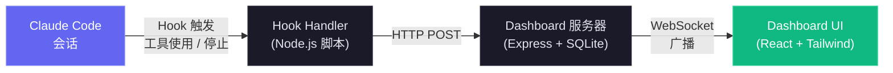

<a href="https://www.star-history.com/?repos=hoangsonww%2FClaude-Code-Agent-Monitor&type=date&legend=top-left">
 <picture>
   <source media="(prefers-color-scheme: dark)" srcset="https://api.star-history.com/chart?repos=hoangsonww/Claude-Code-Agent-Monitor&type=date&theme=dark&legend=top-left" />
   <source media="(prefers-color-scheme: light)" srcset="https://api.star-history.com/chart?repos=hoangsonww/Claude-Code-Agent-Monitor&type=date&legend=top-left" />
   
 </picture>
</a>

### 多语言支持（i18n）

Dashboard 内置多语言界面，支持 `en`、`zh`、`vi` 三种语言，适用于跨语言协作和团队共享。

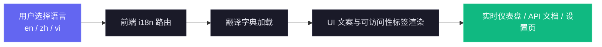

完整实现细节与排障指南请见 [docs/I18N.md](./docs/I18N.md)。

### 用户界面

配有精美的暗色主题、响应式设计和直观的导航，让你轻松浏览 Agent 活动：

<p align="center">
  
</p>

<p align="center">
  
</p>

<p align="center">
  
</p>

<p align="center">
  
</p>

<p align="center">
  
</p>

<p align="center">
  
</p>

<p align="center">
  
</p>

<p align="center">
  
</p>

侧边栏提供快速访问 Dashboard、看板、会话列表、活动流、分析、工作流和设置。每个页面旨在通过实时更新和丰富的可视化，为你提供对 Claude Code Agent 活动的深度洞察。

---

## 功能特性

Dashboard 提供全面的功能来监控和分析你的 Claude Code 会话和 Agent：

| 功能 | 描述 |
|------|------|
| **Dashboard** | 概览统计、可折叠子 Agent 层级的活跃 Agent 卡片、近期活动流 |
| **看板** | 5 列 Agent 状态看板，分页列，按状态独立获取（无人工限制） |
| **会话** | 可搜索、可筛选、分页的 Claude Code 会话列表 |
| **会话详情** | 单会话 Agent 层级树（父/子）和完整事件时间线 |
| **活动流** | 实时流式事件日志，支持暂停/恢复和分页 |
| **分析** | Token 使用量、工具频率、活动热力图（居中显示、按周排列从周日开始、日期名称提示）、会话趋势、在线/离线连接指示器 |
| **实时更新** | WebSocket 推送 — 无轮询，即时 UI 更新 |
| **自动发现** | 会话和 Agent 从 Hook 事件中自动创建 |
| **历史导入** | 启动时从 `~/.claude/` 导入会话。增强的 JSONL 提取：API 错误（配额/速率/无效请求）、回合耗时、入口点（cli/sdk-ts）、权限模式、思考块计数、用量附加信息（service_tier、speed、inference_geo）、工具结果错误，以及子 Agent JSONL 文件（`subagents/agent-*.jsonl` 含 `.meta.json`）。重新导入时回填已有会话。近期 JSONL 文件（< 10 分钟）以"活跃"状态导入 |
| **子 Agent 层级** | Dashboard 和会话详情页可折叠的父子 Agent 树。有子 Agent 的 Agent 显示展开/折叠箭头；叶子 Agent 显示圆点指示器。子 Agent 活跃时自动展开 |
| **后台 Agent** | 正确追踪后台子 Agent，不会提前标记为完成 |
| **成本追踪** | 按模型估算成本，支持可配置定价规则和按会话明细。压缩感知的 Token 核算在上下文压缩过程中保留总量。Transcript 读取通过增量字节偏移更新缓存，实现高效 Token 提取 |
| **Transcript 缓存** | 从 JSONL Transcript 实时提取：Token、压缩、API 错误（`isApiErrorMessage` 条目存储为 `APIError` 事件）、回合耗时（存储为 `TurnDuration` 事件）、思考块计数和用量附加信息（service_tier、speed、inference_geo）。会话元数据实时丰富这些字段 |
| **通知** | 基于 Web Push (VAPID) 的持久化浏览器通知。即使 Dashboard 标签页未聚焦或浏览器已关闭也能送达。特别针对 macOS 音效支持进行了配置。支持按事件配置开关及订阅管理 |
| **设置** | 系统信息、Hook 状态、模型定价管理、通知偏好、数据导出、会话清理 |
| **MCP 服务器（本地）** | 位于 `mcp/` 的企业级本地 MCP 服务器，支持三种传输模式（stdio、HTTP+SSE、交互式 REPL），6 个域共 25 个类型化工具，严格输入 Schema、重试/退避、仅限本地 API 强制执行，以及分层变更/破坏性安全门控。HTTP 模式在可配置端口上提供 Streamable HTTP（2025-11-25）和传统 SSE（2024-11-05）。REPL 模式提供带 Tab 补全和彩色输出的交互式工具调用 |
| **工作流** | 基于 D3.js 的可视化页面，包含 11 个交互式模块：Agent 编排 DAG、工具执行 Sankey 图、协作网络、子 Agent 有效性（含丰富提示的按周图表）、检测到的流程模式、模型委派流、错误传播图（带比率徽章的水平条形图、Agent 类型分解、API/会话错误卡片）、并发时间线、会话复杂度散点图、压缩影响分析和按会话下钻。状态筛选标签（仅活跃 / 已完成 / 全部）可筛选全部 11 个模块。支持交叉筛选、JSON 导出和 3 秒防抖的实时 WebSocket 自动刷新 |
| **压缩追踪** | 从 JSONL Transcript 检测 `/compact` 事件，创建压缩 Agent 和事件。启动时回填历史压缩。周期性扫描器在无 Hook 触发时也能在 2 分钟内捕获压缩。共享 Transcript 缓存，避免重复文件读取 |
| **子会话/恢复会话** | 新事件到达时自动重新激活会话，正确处理 `/resume` 和孤立会话。周期性清理（每 2 分钟）标记遗漏事件检测的废弃会话 |
| **预存会话检测** | 服务器启动时已在运行的会话以"活跃"状态导入（基于近期 JSONL 文件修改时间）。Stop 事件也会重新激活已导入的完成/废弃会话，因此进行中的会话的第一个 Hook 始终会显示在 Dashboard 上 |
| **响应式设计** | 适配移动端的布局，堆叠网格、可滚动表格和可折叠侧边栏 |
| **界面本地化** | 内置语言切换，UI 文案与无障碍标签已覆盖英文（`en`）、中文（`zh`）和越南语（`vi`） |
| **种子数据** | 内置种子脚本，用于演示和开发 |
| **状态栏** | 彩色编码的 CLI 状态栏，显示模型、上下文使用率、Git 分支、Token 数 |
| **插件市场** | 官方 Claude Code 插件市场，包含 5 个插件（ccam-analytics、ccam-productivity、ccam-devtools、ccam-insights、ccam-dashboard）。18 个技能、4 个 Agent、3 个 CLI 工具、2 个 Hook 配置。全部基于实际数据模型 — Token 基线、定价引擎、工作流智能（11 个数据集）、会话元数据。通过 `claude plugin marketplace add` 安装 |

---

## 快速开始

### 前置条件

- **Node.js** >= 18.0.0（推荐 22+）
- **npm** >= 9.0.0

### 1. 安装

```bash
git clone https://github.com/hoangsonww/Claude-Code-Agent-Monitor.git
cd Claude-Code-Agent-Monitor
npm run setup
```

### 2. 配置 Claude Code Hook

```bash
npm run install-hooks
```

此命令会在 `~/.claude/settings.json` 中添加 Hook 条目，将事件转发到 Dashboard。已有的 Hook 配置会被保留。

### 3. 启动

```bash
# 开发模式（服务端和客户端均支持热重载）
npm run dev

# 生产模式（单进程，构建后的客户端）
npm run build && npm start
```

> [!TIP]
> **Makefile 替代方案** — 如果你安装了 `make`，所有命令也可通过 `make` 执行。运行 `make help` 查看所有目标，或使用快捷命令如 `make dev`、`make build`、`make test` 等。

### 4. 访问

| 模式 | 地址 |
| ----------- | ----------------------- |
| 开发 | `http://localhost:5173` |
| 生产 | `http://localhost:4820` |

### 5. 可选：构建并运行本地 MCP 服务器

```bash
npm run mcp:install
npm run mcp:build
npm run mcp:start              # stdio（默认 — 用于 MCP 宿主集成）
npm run mcp:start:http         # HTTP + SSE 服务器，端口 8819
npm run mcp:start:repl         # 带 Tab 补全的交互式 CLI
```

stdio 模式下，配置你的 MCP 宿主（Claude Code / Claude Desktop / 其他 MCP 客户端）：

- command: `node`
- args: `["<绝对路径>/mcp/build/index.js"]`

HTTP 模式下，远程 MCP 客户端连接 `http://127.0.0.1:8819/mcp`（Streamable HTTP）或 `http://127.0.0.1:8819/sse`（传统 SSE）。

详见 [mcp/README.md](./mcp/README.md) 了解完整的宿主配置、传输详情、安全标志和工具目录。

### 可选：生成演示数据

```bash
npm run seed
```

创建 8 个示例会话、23 个 Agent 和 106 个事件，让你可以立即浏览 UI。

### 替代方案：Docker / Podman

项目包含 `Dockerfile` 和 `docker-compose.yml`。同时支持 Docker 和 Podman。

**使用 Docker Compose：**

```bash
docker compose up -d --build
```

**使用 Podman Compose：**

```bash
CLAUDE_HOME="$HOME/.claude" podman compose up -d --build
```

**使用纯 Docker 或 Podman（无 Compose）：**

```bash
# Docker
docker build -t agent-monitor .
docker run -d --name agent-monitor \
  -p 4820:4820 \
  -v "$HOME/.claude:/root/.claude:ro" \
  -v agent-monitor-data:/app/data \
  agent-monitor

# Podman
podman build -t agent-monitor .
podman run -d --name agent-monitor \
  -p 4820:4820 \
  -v "$HOME/.claude:/root/.claude:ro" \
  -v agent-monitor-data:/app/data \
  agent-monitor
```

Dashboard 可通过 `http://localhost:4820` 访问。

**卷挂载：**

| 挂载 | 用途 |
|---|---|
| `~/.claude:/root/.claude:ro` | 读取历史会话用于导入 |
| `agent-monitor-data:/app/data` | 跨重启持久化 SQLite 数据库 |

> [!IMPORTANT]
> **注意：** Claude Code Hook 仍需指向宿主机上运行的 hook-handler 进程。容器本身不接收 Hook — 在宿主机上运行 `npm run install-hooks` 以配置 Hook 将数据 POST 到 `http://localhost:4820`。

---

## 工作原理

Dashboard 通过 Claude Code 原生 Hook 系统集成，提供 Agent 活动的实时监控。以下是架构和数据流概览：

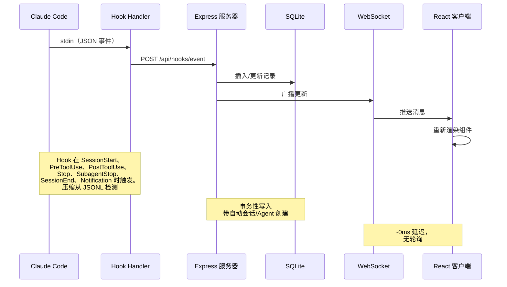

### Hook 生命周期

1. **Claude Code** 在会话开始、工具使用、回合结束、子 Agent 完成和会话退出时触发 Hook
2. **Hook Handler**（`scripts/hook-handler.js`）从 stdin 读取 JSON 事件并 POST 到 API。5 秒超时静默失败，永不阻塞 Claude Code
3. **服务器** 在 SQLite 事务内处理事件：
   - 首次接触时自动创建会话和主 Agent
   - 检测 `Agent` 工具调用以追踪子 Agent 创建
   - `PreToolUse` 时将 Agent 设为"working"，`PostToolUse` 后保持 working 状态
   - `Stop` 时（Claude 完成响应），主 Agent 变为"idle" — 即使在非工具回合（Claude 不调用任何工具直接响应）也是如此，确保时间戳和活动日志保持准确。后台子 Agent 继续运行。会话保持 `active` — 用户可以发送更多消息
   - 通过 `SubagentStop` 单独标记子 Agent 为完成
   - `SessionEnd` 时（CLI 进程退出），将所有 Agent 和会话标记为 `completed`
   - `SessionStart` 时，任何 5 分钟以上无活动的其他活跃会话自动标记为"abandoned"，其 Agent 标记为完成。处理会话内的 `/resume`、Ctrl+C 和其他会话无 `SessionEnd` 而被孤立的场景
   - 新工作事件到达时重新激活 completed/error/abandoned 会话（会话恢复）。Stop 和 SubagentStop 事件也会重新激活 completed/abandoned 会话 — 处理服务器启动前已导入的预存会话，其中第一个 Hook 事件可能是 Stop
   - 检测对话压缩（JSONL Transcript 中的 `isCompactSummary` 条目）并创建 `Compaction` Agent 和事件。Token 基线在压缩中保留，不丢失任何用量。Transcript 读取使用基于 stat 的缓存和增量字节偏移读取 — 仅解析自上次读取后追加的新字节，长会话约提速 50 倍
   - 从 JSONL Transcript 提取 API 错误（`isApiErrorMessage` 条目：配额限制、速率限制、invalid_request）和原始 `type: "error"` 响应，存储为 `APIError` 事件。回合耗时（`system` 子类型 `turn_duration`）存储为 `TurnDuration` 事件。工具结果错误（`toolUseResult.is_error`）追踪为 `ToolError` 事件
   - 周期性服务器清理（每 2 分钟）捕获遗漏事件检测的废弃会话和新压缩（例如 `/compact` 不触发 Hook、会话创建后几秒内 `/resume`）。清理共享 Hook Handler 的 Transcript 缓存，避免重复 I/O。废弃会话清理还会驱逐 Transcript 缓存条目以限制内存使用
4. **WebSocket** 将变更广播到所有已连接客户端
5. **UI** 接收更新并重新渲染受影响的组件

### Agent 状态机

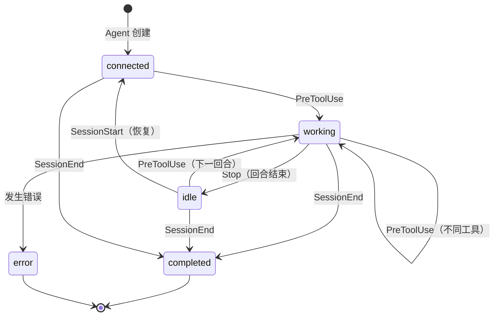

### 会话状态机

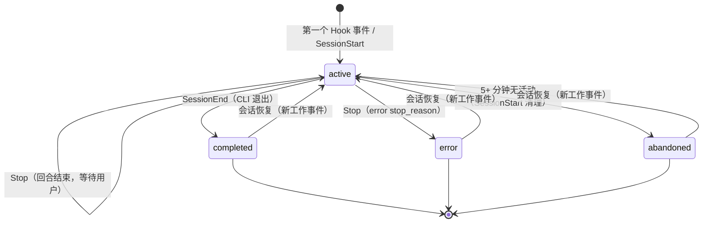

### 成本计算流程

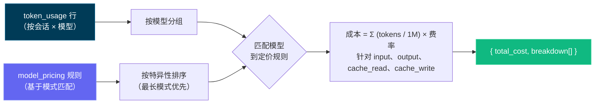

> [!IMPORTANT]
> 成本计算流程基于 Token 使用量和模型定价规则。确保你的定价规则是最新的以反映准确成本。通过设置页面更新模型定价表以保持准确的成本追踪 — Dashboard 不会自动从外部来源获取定价更新。设置定价规则后，Dashboard 会追溯应用于所有会话以保持一致的成本报告。

---

## 配置

| 环境变量 | 默认值 | 描述 |
| ----------------------- | ------------- | --------------------------------------------- |
| `DASHBOARD_PORT` | `4820` | Express 服务器端口 |
| `CLAUDE_DASHBOARD_PORT` | `4820` | Hook Handler 连接服务器使用的端口 |
| `NODE_ENV` | `development` | 设为 `production` 以提供构建后的客户端 |

---

## npm 脚本

| 命令 | 描述 |
| ----------------------- | ---------------------------------------------------------- |
| `npm run setup` | 安装服务端和客户端依赖 |
| `npm run dev` | 同时启动服务端（watch 模式）+ 客户端（Vite HMR） |
| `npm run dev:server` | 仅启动 Express 服务器（`--watch`） |
| `npm run dev:client` | 仅启动 Vite 开发服务器 |
| `npm run build` | 构建 React 客户端到 `client/dist/` |
| `npm start` | 启动生产服务器（提供构建后的客户端） |
| `npm run install-hooks` | 在 `~/.claude/settings.json` 中配置 Claude Code Hook |
| `npm run seed` | 用示例数据填充数据库 |
| `npm run import-history` | 从 `~/.claude/` 导入历史会话（启动时也会运行） |
| `npm run clear-data` | 删除所有会话、Agent、事件和 Token 用量 |
| `npm run mcp:install` | 安装本地 MCP 包（`mcp/`）的依赖 |
| `npm run mcp:build` | 构建 MCP 服务器 TypeScript 到 `mcp/build/` |
| `npm run mcp:start` | 启动 MCP 服务器（stdio 传输 — 用于 MCP 宿主） |
| `npm run mcp:start:http` | 启动 MCP 服务器（HTTP + SSE 传输，端口 8819） |
| `npm run mcp:start:repl` | 启动 MCP 服务器（带 Tab 补全的交互式 REPL） |
| `npm run mcp:dev` | 以开发模式运行 MCP 服务器（`tsx`，stdio） |
| `npm run mcp:dev:http` | 以开发模式运行 MCP 服务器（`tsx`，HTTP + SSE） |
| `npm run mcp:dev:repl` | 以开发模式运行 MCP 服务器（`tsx`，交互式 REPL） |
| `npm run mcp:typecheck` | 类型检查 MCP 源码，不生成构建输出 |
| `npm run mcp:docker:build` | 用 Docker 构建 MCP 容器镜像（`agent-dashboard-mcp:local`） |
| `npm run mcp:podman:build` | 用 Podman 构建 MCP 容器镜像（`localhost/agent-dashboard-mcp:local`） |

---

## Agent 扩展

本仓库包含 Claude Code 和 Codex 的完整扩展层：

- Claude Code：`CLAUDE.md`、`.claude/rules/`、`.claude/skills/`
- Claude 子 Agent：`.claude/agents/`
- Codex：`AGENTS.md`、`.codex/rules/`、`.codex/agents/`、`.codex/skills/`

### 扩展架构

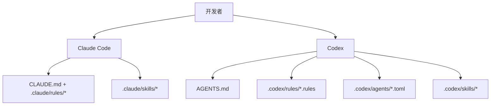

### Claude Code 层

- 持久上下文：
  - [`CLAUDE.md`](./CLAUDE.md)
- 路径作用域规则：
  - [`.claude/rules/backend-node.md`](./.claude/rules/backend-node.md)
  - [`.claude/rules/frontend-react.md`](./.claude/rules/frontend-react.md)
  - [`.claude/rules/mcp-typescript.md`](./.claude/rules/mcp-typescript.md)
  - [`.claude/rules/docs-markdown.md`](./.claude/rules/docs-markdown.md)
- 技能：
  - `repo-onboarding`
  - `ship-feature`
  - `mcp-operations`
  - `debug-live-issue`
- 子 Agent：
  - `backend-reviewer`
  - `frontend-reviewer`
  - `mcp-reviewer`

### Codex 层

- 持久上下文：
  - [`AGENTS.md`](./AGENTS.md)
- 执行策略：
  - [`.codex/rules/default.rules`](./.codex/rules/default.rules)
- 自定义子 Agent 模板：
  - [`.codex/agents/`](./.codex/agents)
- 技能：
  - [`.codex/skills/`](./.codex/skills)
- 设置：
  - [`.codex/README.md`](./.codex/README.md)

---

## MCP 集成

本项目在 `mcp/` 目录下包含一个本地生产级 MCP 服务器，将 Dashboard 操作暴露为 AI Agent 的工具。支持三种传输模式以适应不同的集成场景。

### MCP 传输模式

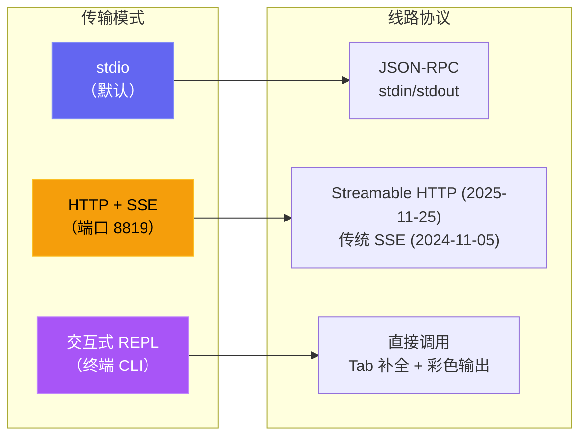

| 模式 | 命令 | 使用场景 |
| --- | --- | --- |
| **stdio** | `npm run mcp:start` | Claude Code、Claude Desktop、IDE MCP 宿主 |
| **HTTP** | `npm run mcp:start:http` | 远程 MCP 客户端、Web 集成、多会话 |
| **REPL** | `npm run mcp:start:repl` | 运维调试、手动工具调用、本地管理 |

<p align="center">
  
</p>

### MCP 架构

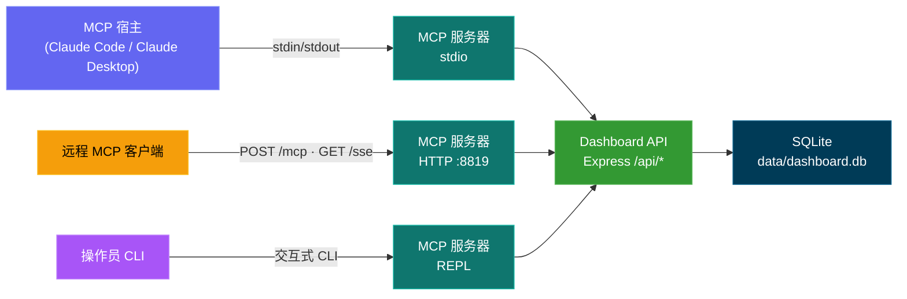

### MCP 工具全景

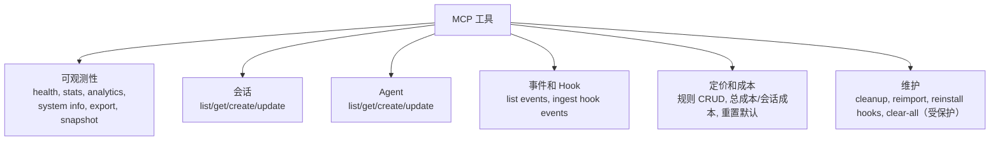

### MCP 安全模型

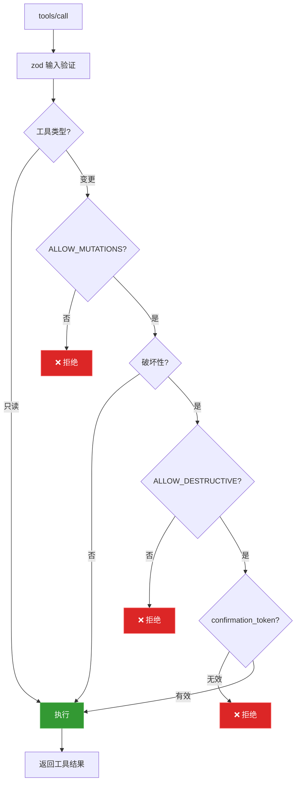

### MCP 运行模式

- 只读模式（默认）：`MCP_DASHBOARD_ALLOW_MUTATIONS=false`
- 管理模式：`MCP_DASHBOARD_ALLOW_MUTATIONS=true`
- 破坏性模式：需要同时满足：
  - `MCP_DASHBOARD_ALLOW_MUTATIONS=true`
  - `MCP_DASHBOARD_ALLOW_DESTRUCTIVE=true`
  - 工具输入 `confirmation_token: "CLEAR_ALL_DATA"`

完整详情：[mcp/README.md](./mcp/README.md)

---

## API 参考

所有端点返回 JSON。错误响应遵循格式 `{ error: { code, message } }`。

### OpenAPI / Swagger

| 方法 | 路径 | 描述 |
| ------ | ------------------- | ----------------------------------- |
| `GET` | `/api/openapi.json` | 原始 OpenAPI 3.0 规范 |
| `GET` | `/api/docs` | 交互式 Swagger UI 文档 |

OpenAPI 文档由 `server/openapi.js` 生成，Swagger UI 由后端直接提供。

<p align="center">
  
</p>

### 健康检查

| 方法 | 路径 | 描述 |
| ------ | ------------- | ------------------------------------- |
| `GET` | `/api/health` | 返回 `{ status: "ok", timestamp }` |

### 会话

| 方法 | 路径 | 查询参数 | 描述 |
| ------- | ------------------- | --------------------------- | ------------------------------------- |
| `GET` | `/api/sessions` | `status`、`limit`、`offset` | 列出会话（含 Agent 计数） |
| `GET` | `/api/sessions/:id` | -- | 会话详情（含 Agent 和事件） |
| `POST` | `/api/sessions` | -- | 创建会话（基于 `id` 幂等） |
| `PATCH` | `/api/sessions/:id` | -- | 更新会话状态/元数据 |

### Agent

| 方法 | 路径 | 查询参数 | 描述 |
| ------- | ----------------- | ----------------------------------------- | ----------------------------- |
| `GET` | `/api/agents` | `status`、`session_id`、`limit`、`offset` | 列出 Agent（支持筛选） |
| `GET` | `/api/agents/:id` | -- | 单个 Agent 详情 |
| `POST` | `/api/agents` | -- | 创建 Agent |
| `PATCH` | `/api/agents/:id` | -- | 更新 Agent 状态/任务/工具 |

### 事件

| 方法 | 路径 | 查询参数 | 描述 |
| ------ | ------------- | ------------------------------- | -------------------------- |
| `GET` | `/api/events` | `session_id`、`limit`、`offset` | 列出事件（最新优先） |

### 统计

| 方法 | 路径 | 描述 |
| ------ | ------------ | ------------------------------------------------------ |
| `GET` | `/api/stats` | 聚合计数、状态分布、WS 连接数 |

### 分析

| 方法 | 路径 | 描述 |
| ------ | ---------------- | ---------------------------------------------------------- |
| `GET` | `/api/analytics` | 用于图表和趋势视图的 Token / 工具 / 会话聚合数据 |

### Hook

| 方法 | 路径 | 描述 |
| ------ | ------------------ | -------------------------------------------- |
| `POST` | `/api/hooks/event` | 接收并处理 Claude Code Hook 事件 |

**Hook 事件载荷：**

```json
{
  "hook_type": "PreToolUse",
  "data": {
    "session_id": "abc-123",
    "tool_name": "Bash",
    "tool_input": { "command": "ls -la" }
  }
}
```

### 定价

| 方法 | 路径 | 描述 |
| -------- | ------------------------ | ---------------------------------------- |
| `GET` | `/api/pricing` | 列出所有定价规则 |
| `PUT` | `/api/pricing` | 创建或更新定价规则 |
| `DELETE` | `/api/pricing/:pattern` | 删除定价规则 |
| `GET` | `/api/pricing/cost` | 所有会话的总成本 |
| `GET` | `/api/pricing/cost/:id` | 指定会话的成本明细 |

### 工作流

| 方法 | 路径 | 描述 |
| ------ | ----------------------------- | ------------------------------------------------------- |
| `GET` | `/api/workflows` | 聚合工作流数据（编排、工具、模式）。可选 `?status=active|completed` 查询参数按会话状态筛选全部 11 个数据模块 |
| `GET` | `/api/workflows/session/:id` | 按会话下钻（Agent 树、工具时间线、事件） |

### 设置

| 方法 | 路径 | 描述 |
| ------ | ------------------------------ | ------------------------------------------------ |
| `GET` | `/api/settings/info` | 系统信息、数据库统计、Hook 状态 |
| `POST` | `/api/settings/clear-data` | 删除所有会话、Agent、事件、Token 用量 |
| `POST` | `/api/settings/reinstall-hooks` | 重新安装 Claude Code Hook |
| `POST` | `/api/settings/reset-pricing` | 重置定价为默认值 |
| `GET` | `/api/settings/export` | 以 JSON 下载方式导出所有数据 |
| `POST` | `/api/settings/cleanup` | 废弃过期会话、清除旧数据 |

### WebSocket

连接 `ws://localhost:4820/ws` 接收实时推送消息：

```json
{
  "type": "agent_updated",
  "data": { "id": "...", "status": "working", "current_tool": "Edit" },
  "timestamp": "2026-03-05T15:43:01.800Z"
}
```

**消息类型：** `session_created`、`session_updated`、`agent_created`、`agent_updated`、`new_event`

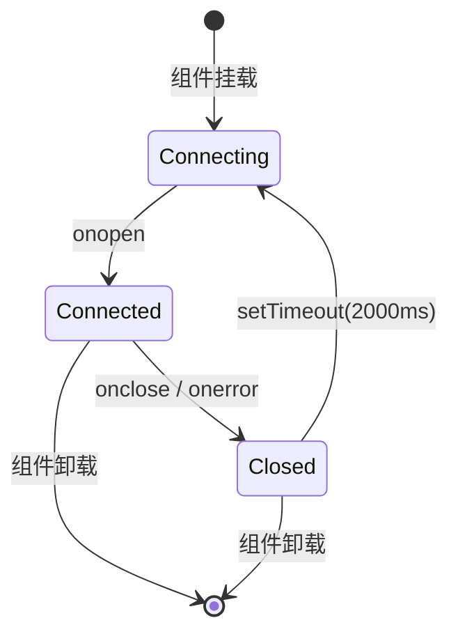

---

## Hook 事件

Dashboard 处理以下 Claude Code Hook 类型：

| Hook 类型 | 触发时机 | Dashboard 操作 |
| -------------- | ------------------------------ | -------------------------------------------------------------------------------------------- |
| `SessionStart` | Claude Code 会话开始 | 创建会话和主 Agent。重新激活恢复的会话。废弃 5 分钟以上无活动的孤立会话 |
| `PreToolUse` | Agent 开始使用工具 | 设置 Agent 为 `working`，设置 `current_tool`。如果工具是 `Agent`，创建子 Agent 记录 |
| `PostToolUse` | 工具执行完成 | 清除 `current_tool`。Agent 保持 `working`（无状态变更） |
| `Stop` | Claude 完成响应 | 主 Agent 变为 `idle`（即使在非工具回合）。后台子 Agent 继续运行。会话保持 `active` |
| `SubagentStop` | 后台 Agent 完成 | 通过描述、类型或任务匹配并完成子 Agent |
| `Notification` | Agent 通知 | 记录事件。压缩相关通知标记为 `Compaction` 事件。如果用户启用了通知，则触发浏览器通知 |
| `SessionEnd` | Claude Code CLI 进程退出 | 将所有 Agent 和会话标记为 `completed` |
| `Compaction` | JSONL 中检测到 `/compact` | 创建压缩子 Agent（类型 `compaction`）和 Compaction 事件。通过 Transcript JSONL 中的 `isCompactSummary` 条目检测。也可由周期性扫描器对活跃会话检测 |
| `APIError` | JSONL Transcript 中的 API 错误 | 从 `isApiErrorMessage` 条目（配额、速率限制、invalid_request）和原始 `type: "error"` 响应中提取。存储为包含错误详情的事件 |
| `TurnDuration` | JSONL Transcript 中的回合计时 | 从 `system` 子类型 `turn_duration` 消息中提取，含 `durationMs`。存储为回合级计时分析事件 |
| `ToolError` | JSONL 中的工具结果错误 | 从 `toolUseResult.is_error` 条目中提取。追踪工具级失败用于错误传播分析 |

---

## 浏览器通知

Dashboard 支持通过 Web Push (VAPID) 实现持久化浏览器通知。即使 Dashboard 标签页未聚焦或浏览器处于后台，也能提供实时警报。

### 工作原理

1. **启用** — 在设置页面通过主开关启用通知
2. **授权** — 在浏览器提示时授予权限 — 这将注册一个 Service Worker 并创建一个推送订阅
3. **配置** — 选择哪些事件触发通知：

| 事件 | 默认 | 描述 |
| ---------------------------- | ------- | --------------------------------------------------------------- |
| 新会话开始 | 开 | 新 Claude Code 会话创建时触发 |
| Claude 完成响应 | 关 | Claude 完成响应回合时 `Stop` 事件触发 |
| 会话关闭 | 关 | CLI 进程退出时 `SessionEnd` 触发 |
| 会话错误 | 开 | 会话以错误结束时触发 |
| 子 Agent 生成 | 关 | 后台子 Agent 创建时触发 |

此外，来自 Claude Code 的任何 `Notification` Hook 事件都会触发浏览器通知（只要主开关启用），不受按事件开关影响。

### 通知架构

- **VAPID 管道：** 服务端使用 `web-push` 进行安全消息传递。VAPID 密钥自动生成并存储在 `data/vapid-keys.json`。
- **Service Worker：** 专用 Worker (`client/public/sw.js`) 处理传入的 `push` 事件，并以 `silent: false` 显示通知，以确保在 macOS 上播放音效。
- **订阅：** 浏览器特定的端点存储在 SQLite 的 `push_subscriptions` 表中。
- **持久性：** 由于 Service Worker 在后台运行，即使浏览器已关闭，通知仍能送达。
- **测试通知：** 设置页面中的按钮可让你验证 VAPID 管道和音效播放。

---

## VS Code 扩展

**Claude Code Agent Monitor** 现已作为官方 VS Code 扩展提供，让你无需离开编辑器即可监控 AI Agent。

<p align="center">
  
</p>

### 🚀 核心功能
- **实时侧边栏**：专用的 Activity Bar 视图，实时显示 Agent 状态（工作、已连接、空闲等）。
- **使用分析**：直接在侧边栏追踪总 Token 消耗、实时美元成本和事件计数。
- **状态栏集成**：底部状态栏显示活跃会话和 Agent 的实时脉搏。
- **深度导航**：一键访问特定的 Dashboard 页面（看板、分析、设置）或近期会话。
- **集成标签页**：作为原生 VS Code Webview 标签页打开完整的监控面板。

### 📦 安装与设置
1. 打开 [vscode-extension](./vscode-extension) 目录。
2. 从 Marketplace 安装或使用 `vsce package` 自行打包安装。
3. 确保本地 Dashboard 服务器正在运行（`npm run dev`）。
4. 点击 VS Code Activity Bar 中的 **雷达图标** 即可开始使用。

有关详细的开发人员配置，请参阅 [.vscode](./.vscode) 和 [vscode-extension](./vscode-extension) 目录。

> [!TIP]
> Extension on VS Code Marketplace: [Claude Code Agent Monitor](https://marketplace.visualstudio.com/items?itemName=hoangsonw.claude-code-agent-monitor)

---

## 数据存储

- **引擎：** SQLite 3，通过 `better-sqlite3`（可选）或 Node.js 内置 `node:sqlite`
- **位置：** `data/dashboard.db`
- **日志模式：** WAL（写入期间支持并发读取）
- **重置：** 删除 `data/dashboard.db` 清除所有数据

### 实体关系图

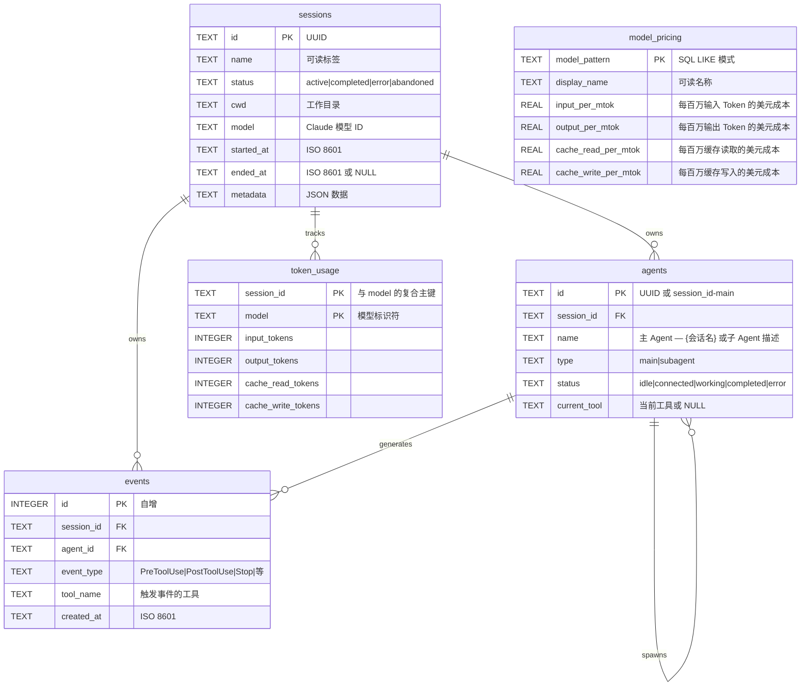

---

## 插件市场

通过官方 Agent Monitor 插件扩展 Claude Code — 分析、生产力工具、开发者工具、AI 洞察和 Dashboard 连接。

### 添加市场

```bash
claude plugin marketplace add hoangsonww/Claude-Code-Agent-Monitor
```

### 可用插件

| 插件 | 安装命令 | 技能 |
|--------|----------------|--------|
| **ccam-analytics** | `claude plugin install ccam-analytics@hoangsonww-claude-code-agent-monitor` | `session-report`、`cost-breakdown`、`usage-trends`、`productivity-score` |
| **ccam-productivity** | `claude plugin install ccam-productivity@hoangsonww-claude-code-agent-monitor` | `daily-standup`、`weekly-report`、`sprint-summary`、`workflow-optimizer` |
| **ccam-devtools** | `claude plugin install ccam-devtools@hoangsonww-claude-code-agent-monitor` | `session-debug`、`hook-diagnostics`、`data-export`、`health-check` |
| **ccam-insights** | `claude plugin install ccam-insights@hoangsonww-claude-code-agent-monitor` | `pattern-detect`、`anomaly-alert`、`optimization-suggest`、`session-compare` |
| **ccam-dashboard** | `claude plugin install ccam-dashboard@hoangsonww-claude-code-agent-monitor` | `dashboard-status`、`quick-stats` + MCP 服务器 |

### 包含的 CLI 工具

- `ccam-stats` — 终端 Dashboard（会话、成本、Token 含压缩基线）
- `ccam-doctor` — 系统诊断（API、数据库、Hook、数据新鲜度）
- `ccam-export` — 数据导出（JSON、CSV）用于会话、事件、分析、成本

### 使用示例

```bash
# 安装插件后在 Claude Code 中：
/ccam-analytics:session-report latest
/ccam-analytics:cost-breakdown this week
/ccam-productivity:daily-standup today
/ccam-insights:pattern-detect tools
/ccam-dashboard:quick-stats
```

📖 完整文档：[docs/plugins.md](docs/PLUGINS.md)

---

## 状态栏

Claude Code 的独立 CLI 状态栏工具，显示模型名称、用户、工作目录、Git 分支、上下文窗口使用率条和 Token 计数 — 全部使用 ANSI 转义序列彩色编码。

```
Sonnet 4.6 | nguyens6 | ~/agent-dashboard/client | main | ████████░░ 79% | 3↑ 2↓ 156586c
```

| 段 | 颜色 | 示例 |
| ----------- | -------------------- | ------------------- |
| 模型 | 青色 | `Sonnet 4.6` |
| 用户 | 绿色 | `nguyens6` |
| 工作目录 | 黄色 | `~/agent-dashboard` |
| Git 分支 | 品红色 | `main` |
| 上下文条 | 绿色 / 黄色 / 红色 | `████████░░ 79%` |
| Token | 暗色 | `3↑ 2↓ 156586c` |

参见 [`statusline/README.md`](statusline/README.md) 了解安装说明。

<p align="center">
  
</p>

---

## 服务端架构

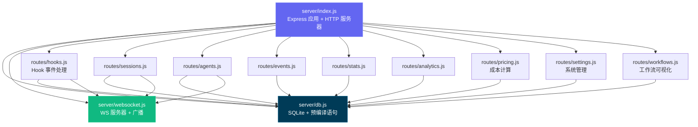

---

## 客户端路由

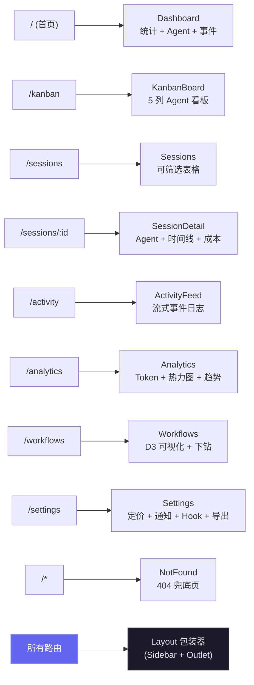

---

## Hook 处理流程

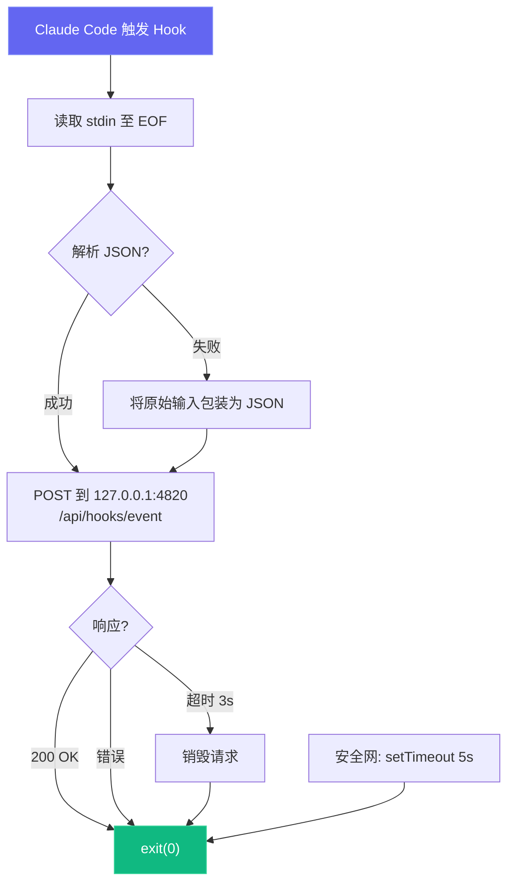

---

## 部署模式

我们支持开发和生产两种部署模式，使用不同的进程架构：

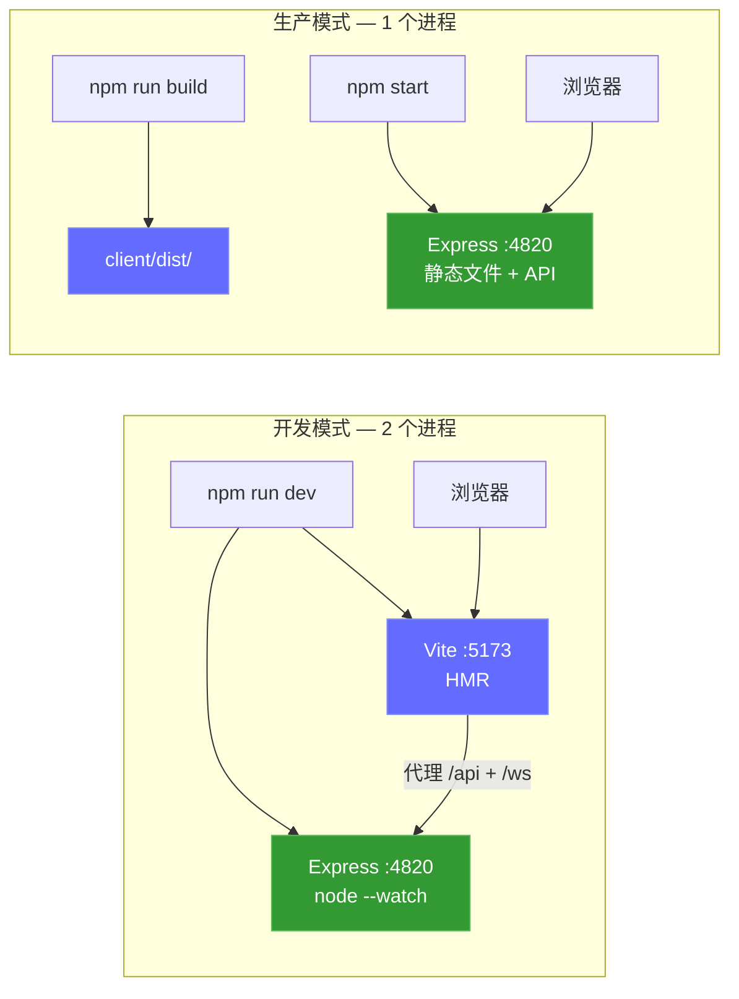

可选的本地 MCP Sidecar（支持 stdio、HTTP+SSE 和 REPL 传输）：

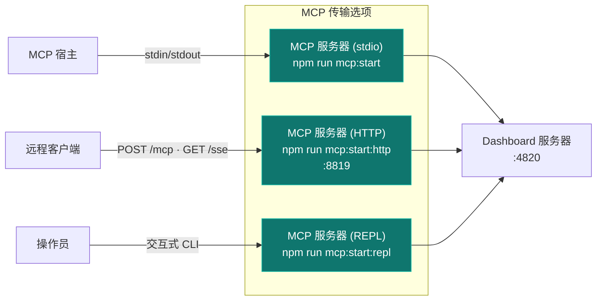

### 云部署

`deployments/` 目录提供了云无关的企业级基础设施，用于将 Dashboard 部署到生产环境。支持 Helm、Kustomize 和 Terraform，覆盖 AWS、GCP、Azure 和 OCI，包含蓝绿部署、金丝雀部署和滚动更新策略。

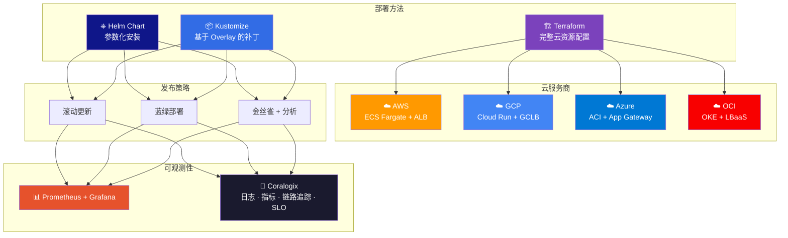

```bash
# Helm（Kubernetes 推荐）
helm install agent-monitor deployments/helm/agent-monitor \
  -f deployments/helm/agent-monitor/values-production.yaml \
  -n agent-monitor --create-namespace

# Kustomize
kubectl apply -k deployments/kubernetes/overlays/production

# Terraform（完整基础设施 + 应用）
cd deployments/terraform/providers/aws
terraform init && terraform apply -var-file=../../environments/production/terraform.tfvars

# 脚本编排器
./deployments/scripts/deploy.sh --env production --method helm --strategy blue-green
```

部署栈包含 CI/CD 管道（GitHub Actions + GitLab CI）、全面的监控（Prometheus、Grafana、含 13 条告警规则的 Alertmanager、配合 OpenTelemetry Collector 实现日志/指标/链路追踪/SLO 追踪的 Coralogix 全栈可观测性）、运维脚本（部署、回滚、蓝绿切换、备份/恢复、拆除），以及完整的安全体系（受限 Pod 安全标准、TLS 1.3、网络策略、Trivy 扫描）。

> [!NOTE]
> 📘 **完整部署指南：** 参见 [DEPLOYMENT.md](DEPLOYMENT.md) 了解分步说明、架构图和运维工作流。

---

## 项目结构

```
agent-dashboard/
|-- CLAUDE.md                   # Claude Code 项目记忆和工作约定
|-- AGENTS.md                   # Codex 项目指令
|-- package.json                # 根脚本（Dashboard + MCP 辅助）+ 服务端依赖
|-- .claude/
|   +-- rules/                  # 路径作用域的 Claude 规则
|   +-- skills/                 # Claude 可复用项目技能
|   +-- agents/                 # Claude 自定义子 Agent
|-- .claude-plugin/
|   +-- marketplace.json        # 插件市场清单（5 个插件）
|-- plugins/
|   |-- ccam-analytics/         # 分析：会话报告、成本明细、使用趋势、生产力评分
|   |   |-- .claude-plugin/plugin.json
|   |   |-- skills/ (4)         # session-report, cost-breakdown, usage-trends, productivity-score
|   |   |-- agents/             # analytics-advisor（Sonnet 模型）
|   |   |-- hooks/hooks.json    # Stop + SubagentStop 事件日志
|   |   +-- bin/ccam-stats      # 终端 Dashboard CLI
|   |-- ccam-productivity/      # 生产力：站会、报告、冲刺、工作流优化
|   |-- ccam-devtools/          # 开发工具：调试、诊断、导出、健康检查
|   |   +-- bin/                # ccam-doctor + ccam-export CLI
|   |-- ccam-insights/          # 洞察：模式、异常、优化、比较
|   +-- ccam-dashboard/         # Dashboard 连接器：状态、快速统计、MCP 集成
|       +-- .mcp.json           # MCP 服务器配置
|-- server/
|   |-- index.js                 # Express 应用、HTTP 服务器、静态文件服务
|   |-- db.js                    # SQLite Schema、迁移、预编译语句
|   |-- websocket.js             # WebSocket 服务器（含心跳）
|   +-- routes/
|       |-- hooks.js             # Hook 事件处理（事务性）
|       |-- sessions.js          # 会话 CRUD
|       |-- agents.js            # Agent CRUD
|       |-- events.js            # 事件列表
|       |-- stats.js             # 聚合统计
|       |-- analytics.js         # Token、工具和趋势分析
|       |-- workflows.js         # 聚合工作流数据和按会话下钻
|       |-- pricing.js           # 模型定价 CRUD 和成本计算
|       +-- settings.js          # 系统信息、数据管理、导出、清理
|   +-- lib/
|       +-- transcript-cache.js  # 基于 stat 的 JSONL Transcript 缓存，增量读取。提取 Token、压缩、API 错误、回合耗时、思考块和用量附加信息（service_tier、speed、inference_geo）
|   +-- compat-sqlite.js         # node:sqlite 兼容性封装（better-sqlite3 的后备方案）
|-- client/
|   |-- package.json             # 客户端依赖
|   |-- index.html               # HTML 入口
|   |-- vite.config.ts           # Vite + 代理配置
|   |-- tailwind.config.js       # 自定义暗色主题
|   |-- tsconfig.json            # 严格 TypeScript
|   +-- src/
|       |-- main.tsx             # React 入口
|       |-- App.tsx              # 路由 + WebSocket Provider
|       |-- index.css            # Tailwind + 自定义工具类
|       |-- lib/
|       |   |-- types.ts         # 共享 TypeScript 接口
|       |   |-- api.ts           # 类型化 fetch 客户端
|       |   |-- format.ts        # 日期/时间格式化工具
|       |   +-- eventBus.ts      # WebSocket 分发的发布/订阅
|       |-- hooks/
|       |   |-- useWebSocket.ts      # 自动重连 WebSocket hook
|       |   +-- useNotifications.ts  # WebSocket 事件触发的浏览器通知
|       |-- components/
|       |   |-- Layout.tsx       # 带 Sidebar + Outlet 的外壳
|       |   |-- Sidebar.tsx      # 导航 + 连接指示器
|       |   |-- AgentCard.tsx    # Agent 信息卡片（含状态）
|       |   |-- StatCard.tsx     # 指标卡片
|       |   |-- StatusBadge.tsx  # 彩色编码状态标签
|       |   |-- EmptyState.tsx   # 空列表占位符
|       |   +-- workflows/       # D3.js 工作流可视化组件
|       |       |-- OrchestrationDAG.tsx            # Agent 生成模式的水平 DAG
|       |       |-- ToolExecutionFlow.tsx           # 工具到工具转换的 d3-sankey 图
|       |       |-- AgentCollaborationNetwork.tsx   # 力导向 Agent 管道图
|       |       |-- SubagentEffectiveness.tsx       # 带 SVG 成功率环的记分卡网格
|       |       |-- WorkflowPatterns.tsx            # 自动检测的编排序列
|       |       |-- ModelDelegationFlow.tsx         # 通过 Agent 层级的模型路由
|       |       |-- ErrorPropagationMap.tsx         # 按层级深度的错误聚类
|       |       |-- ConcurrencyTimeline.tsx         # 泳道式并行 Agent 执行
|       |       |-- SessionComplexityScatter.tsx    # D3 气泡图（耗时 vs Agent vs Token）
|       |       |-- CompactionImpact.tsx            # Token 压缩事件和恢复
|       |       |-- WorkflowStats.tsx               # 聚合工作流统计
|       |       +-- SessionDrillIn.tsx              # 按会话的 Agent 树、工具时间线、事件
|       +-- pages/
|           |-- Dashboard.tsx      # 概览页
|           |-- KanbanBoard.tsx    # Agent 状态列
|           |-- Sessions.tsx       # 会话表格
|           |-- SessionDetail.tsx  # 单会话深入查看
|           |-- ActivityFeed.tsx   # 实时事件流
|           |-- Analytics.tsx      # Token 使用、热力图、趋势
|           |-- Workflows.tsx      # D3.js 工作流可视化和会话下钻
|           |-- Settings.tsx       # 模型定价、通知、Hook、导出、清理
|           +-- NotFound.tsx       # 404 兜底页
|-- scripts/
|   |-- hook-handler.js          # 轻量级 stdin-to-HTTP 转发器
|   |-- install-hooks.js         # 自动配置 ~/.claude/settings.json
|   |-- import-history.js        # 从 ~/.claude/ 导入会话，含增强 JSONL 提取（API 错误、回合耗时、入口点、权限模式、思考块、用量附加信息、工具错误、子 Agent JSONL 文件）
|   +-- seed.js                  # 示例数据生成器
|-- mcp/
|   |-- package.json             # MCP 包脚本 + 依赖
|   |-- README.md                # MCP 设置、宿主配置、工具目录、安全模型
|   |-- src/
|   |   |-- index.ts             # MCP 运行时入口（传输路由器）
|   |   |-- server.ts            # MCP 服务器组装
|   |   |-- clients/             # 带重试/退避的 Dashboard API 客户端
|   |   |-- config/              # 环境/CLI 配置解析
|   |   |-- core/                # 日志器、工具注册、结果辅助
|   |   |-- policy/              # 变更/破坏性守卫
|   |   |-- tools/               # 领域特定工具模块（6 个域）
|   |   |-- transports/          # HTTP+SSE 服务器、REPL、工具收集器
|   |   |-- ui/                  # ANSI 横幅、颜色、格式化器、表格
|   |   +-- types/               # 共享 MCP 类型定义
|   +-- build/                   # 构建后的 MCP 运行时输出
|-- deployments/
|   |-- README.md                # 部署基础设施参考
|   |-- terraform/               # 云资源配置（AWS、GCP、Azure、OCI）
|   |   |-- modules/             # 可复用模块（网络、计算、数据库、负载均衡、监控）
|   |   |-- providers/           # 云特定实现
|   |   +-- environments/        # 按环境的 tfvars（dev、staging、production）
|   |-- kubernetes/              # Kustomize 清单
|   |   |-- base/                # 11 个基础资源（deployment、service、ingress、hpa 等）
|   |   |-- overlays/            # 环境 Overlay（dev、staging、production）
|   |   |-- components/          # 可选附加组件（mcp-sidecar、monitoring）
|   |   +-- strategies/          # 蓝绿和金丝雀部署策略
|   |-- helm/agent-monitor/      # Helm Chart，含 12 个模板和 4 组值
|   |-- scripts/                 # 运维脚本（部署、回滚、备份、拆除）
|   |-- monitoring/              # Prometheus、Grafana、Alertmanager、Coralogix（OTel Collector）
|   +-- ci/                      # CI/CD 管道（GitHub Actions、GitLab CI）
|-- .codex/
|   |-- config.toml              # Codex 运行时配置
|   |-- README.md                # Codex Agent 和技能设置指南
|   |-- rules/                   # Codex 执行策略规则
|   |-- agents/                  # Codex 自定义 Agent 模板
|   +-- skills/                  # Codex 项目技能
|-- statusline/
|   |-- README.md                # 状态栏安装和使用指南
|   |-- statusline.py            # 渲染状态栏的 Python 脚本
|   +-- statusline-command.sh    # Claude Code statusLine 配置的 Shell 包装
+-- data/
    +-- dashboard.db             # SQLite 数据库（gitignored）
```

---

## 常见问题

| 问题 | 解决方案 |
| --------------------------------- | ---------------------------------------------------------------------------------------------------------------------------------------------------------------- |
| `better-sqlite3` 安装失败 | 这是非致命错误 — 服务器会自动回退到 Node.js 内置的 `node:sqlite`（Node 22+）。在旧版 Node 上，安装 Python 3 和 C++ 构建工具，然后运行 `npm rebuild better-sqlite3` |
| Hook 未触发 | 运行 `npm run install-hooks` 并重启 Claude Code。验证 `~/.claude/settings.json` 中存在 Hook 配置 |
| Dashboard 无数据 | 确保服务器正在运行（`npm run dev`）后再启动 Claude Code 会话。检查 `http://localhost:4820/api/health` |
| WebSocket 断开连接 | 客户端每 2 秒自动重连。检查端口 4820 未被防火墙阻止 |
| 重启后数据过期 | 数据库在重启间持久化。运行 `npm run seed` 获取新的演示数据，或删除 `data/dashboard.db` 重置 |
| MCP 工具连接失败 | 确认 Dashboard API 在 `MCP_DASHBOARD_BASE_URL` 上正常运行，并重新构建/启动 MCP（`npm run mcp:build`、`npm run mcp:start`） |

---

## 许可证

MIT。详见 [LICENSE](LICENSE)。
