# Bảng điều khiển Agent cho Claude Code

### Nền tảng giám sát thời gian thực cho hoạt động của Agent Claude Code

Bảng điều khiển chuyên nghiệp để theo dõi và trực quan hóa các phiên tác nhân Claude Code, cách sử dụng công cụ và điều phối tác nhân phụ trong thời gian thực. Được xây dựng bằng Node.js, Express, React và SQLite, nó tích hợp trực tiếp với Claude Code thông qua hệ thống hook gốc để theo dõi và phân tích phiên liền mạch.


**Hỗ trợ ngôn ngữ**: Tiếng Anh (`en`) · 中文 (`zh`) · Tiếng Việt (`vi`)

Tài liệu đã bản địa hóa: [`README.md`](./README.md) · [`README-CN.md`](./README-CN.md) · [`README-VN.md`](./README-VN.md)

---

## Mục lục

- [Tổng quan](#tổng-quan)
- [Quốc tế hóa (i18n)](#quốc-tế-hóa-i18n)
- [Đặc trưng](#đặc-trưng)
- [Bắt đầu nhanh](#bắt-đầu-nhanh)
- [Nó hoạt động như thế nào](#nó-hoạt-động-như-thế-nào)
- [Cấu hình](#cấu-hình)
- [Tập lệnh npm](#tập-lệnh-npm)
- [Thị trường plugin](#thị-trường-plugin)
- [Tiện ích mở rộng Agent](#tiện-ích-mở-rộng-agent)
- [Tích hợp MCP](#tích-hợp-mcp)
- [Tham chiếu API](#tham-chiếu-api)
- [Sự kiện móc nối](#sự-kiện-móc-nối)
- [Thông báo trình duyệt](#thông-báo-trình-duyệt)
- [Tiện ích mở rộng VS Code](#tiện-ích-mở-rộng-vs-code)
- [Lưu trữ dữ liệu](#lưu-trữ-dữ-liệu)
- [Dòng trạng thái](#dòng-trạng-thái)
- [Kiến trúc máy chủ](#kiến-trúc-máy-chủ)
- [Định tuyến khách hàng](#định-tuyến-khách-hàng)
- [Luồng xử lý móc](#luồng-xử-lý-móc)
- [Chế độ triển khai](#chế-độ-triển-khai)
- [Cấu trúc dự án](#cấu-trúc-dự-án)
- [Khắc phục sự cố](#khắc-phục-sự-cố)
- [Giấy phép](#giấy-phép)

---

## Tổng quan

Theo dõi các phiên, giám sát tác nhân trong thời gian thực, trực quan hóa việc sử dụng công cụ và quan sát việc điều phối tác nhân phụ thông qua giao diện web có chủ đề tối chuyên nghiệp. Tích hợp trực tiếp với Claude Code thông qua hệ thống hook gốc của nó.

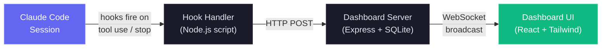

Ngoài bảng thông tin giám sát thời gian thực, nó còn bao gồm triển khai máy chủ MCP cục bộ trong `mcp/` hiển thị danh mục các công cụ để xem xét nội tâm và quản lý bảng thông tin, giúp dễ dàng tích hợp trực tiếp các hoạt động của bảng thông tin vào quy trình làm việc của Claude Code của bạn. Ngoài ra còn có một lớp mở rộng tác nhân, cung cấp các plugin, kỹ năng và tác nhân phụ của Claude Code để tương tác trên trang tổng quan, phân tích và thông tin về quy trình làm việc.

<a href="https://www.star-history.com/?repos=hoangsonww%2FClaude-Code-Agent-Monitor&type=date&legend=top-left">
 <picture>
   <source media="(prefers-color-scheme: dark)" srcset="https://api.star-history.com/chart?repos=hoangsonww/Claude-Code-Agent-Monitor&type=date&theme=dark&legend=top-left" />
   <source media="(prefers-color-scheme: light)" srcset="https://api.star-history.com/chart?repos=hoangsonww/Claude-Code-Agent-Monitor&type=date&legend=top-left" />
   
 </picture>
</a>

### Quốc tế hóa (i18n)

Giao diện người dùng đi kèm với tính năng chuyển đổi ngôn ngữ tích hợp cho tiếng Anh (`en`), tiếng Trung (`zh`) và tiếng Việt (`vi`). Tài nguyên ngôn ngữ được tải theo không gian tên và được lưu giữ trong bộ nhớ của trình duyệt để mang lại ưu tiên người dùng ổn định trong các lần làm mới.

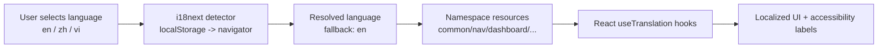

Để biết kiến ​​trúc đầy đủ và hướng dẫn vận hành, hãy xem [tài liệu/I18N.md](./docs/I18N.md).

### Giao diện người dùng

Đi kèm với chủ đề tối đẹp mắt, thiết kế đáp ứng và điều hướng trực quan để khám phá hoạt động của nhân viên hỗ trợ:

<p align="center">
  
</p>

<p align="center">
  
</p>

<p align="center">
  
</p>

<p align="center">
  
</p>

<p align="center">
  
</p>

<p align="center">
  
</p>

<p align="center">
  
</p>

<p align="center">
  
</p>

Thanh bên cung cấp quyền truy cập nhanh vào Trang tổng quan, Bảng Kanban, danh sách Phiên, Nguồn cấp dữ liệu hoạt động, Phân tích, Quy trình công việc và Cài đặt. Mỗi trang được thiết kế để cung cấp cho bạn những hiểu biết sâu sắc về hoạt động Agent Claude Code của bạn với các cập nhật theo thời gian thực và hình ảnh trực quan phong phú.

---

## Đặc trưng

Bảng điều khiển cung cấp một bộ tính năng toàn diện để giám sát và phân tích các phiên và Agent Claude Code của bạn:

| Tính năng                            | Sự miêu tả                                                                                                                                                                                                                                                                  |
|------------------------------------|------------------------------------------------------------------------------------------------------------------------------------------------------------------------------------------------------------------------------------------------------------------------------|
| **Bảng điều khiển**                      | Số liệu thống kê tổng quan, thẻ Agent đang hoạt động với hệ thống phân cấp Subagent có thể thu gọn, nguồn cấp dữ liệu hoạt động gần đây                                                                                                                                                                                 |
| **Bảng Kanban**                   | Bảng trạng thái Agent 5 cột với các cột được phân trang, tìm nạp theo trạng thái (không có giới hạn nhân tạo)                                                                                                                                                                               |
| **Phiên**                       | Bảng có thể tìm kiếm, lọc, phân trang của tất cả các phiên Claude Code                                                                                                                                                                                                          |
| **Chi tiết phiên**                 | Cây phân cấp tác nhân mỗi phiên (mẹ/con) và dòng thời gian sự kiện đầy đủ                                                                                                                                                                                                      |
| **Nguồn cấp dữ liệu hoạt động**                  | Nhật ký sự kiện phát trực tuyến theo thời gian thực với tính năng tạm dừng/tiếp tục và phân trang                                                                                                                                                                                                               |
| **Phân tích**                      | Mức sử dụng mã thông báo, tần suất công cụ, bản đồ nhiệt hoạt động (trung tâm, căn chỉnh ngày trong tuần bắt đầu từ Chủ nhật, chú thích công cụ tên ngày), xu hướng phiên, chỉ báo kết nối trực tiếp/ngoại tuyến                                                                                                           |
| **Cập nhật trực tiếp**                   | Đẩy WebSocket -- không bỏ phiếu, cập nhật giao diện người dùng tức thì                                                                                                                                                                                                                             |
| **Tự động khám phá**                 | Phiên và tác nhân được tạo tự động từ các sự kiện hook                                                                                                                                                                                                               |
| **Nhập lịch sử**                 | Nhập phiên từ `~/.claude/` khi khởi động. Trích xuất JSONL nâng cao: Lỗi API (hạn ngạch/tỷ lệ/không hợp lệ_request), thời lượng lượt, điểm truy cập (cli/sdk-ts), chế độ cấp phép, số khối suy nghĩ, tính năng bổ sung sử dụng (service_tier, tốc độ, inference_geo), lỗi kết quả công cụ và tệp JSONL tác nhân phụ (`subagents/agent-*.jsonl` với `.meta.json`). Chèn lấp các phiên hiện có khi nhập lại. Các tệp JSONL gần đây (< 10 phút) được nhập dưới dạng "hoạt động" |
| **Phân cấp Subagent**             | Cây tác nhân cha-con có thể thu gọn trên Bảng điều khiển và Chi tiết phiên. Các Agent có các Subagent hiển thị các chữ V mở rộng/thu gọn; tác nhân lá hiển thị một chỉ báo dấu chấm. Tự động mở rộng khi các tác nhân phụ đang hoạt động                                                                           |
| **Agent nền**              | Theo dõi chính xác các tác nhân phụ có nền mà không cần hoàn thành sớm                                                                                                                                                                                                         |
| **Theo dõi chi phí**                  | Ước tính chi phí cho mỗi mô hình với các quy tắc định giá có thể định cấu hình và phân tích chi tiết theo từng phiên. Tính toán mã thông báo nhận biết nén sẽ duy trì tổng số trong các lần nén ngữ cảnh. Việc đọc bản ghi được lưu vào bộ nhớ đệm với các bản cập nhật bù byte tăng dần để trích xuất mã thông báo hiệu quả        |
| **Bộ nhớ đệm bản ghi**               | Trích xuất theo thời gian thực từ bản ghi JSONL: mã thông báo, nén, lỗi API (`isApiErrorMessage` được lưu trữ dưới dạng sự kiện `APIError`), thời lượng lượt (được lưu dưới dạng sự kiện `TurnDuration`), số lượng khối suy nghĩ và các tính năng bổ sung sử dụng (service_tier, tốc độ, inference_geo). Siêu dữ liệu phiên được làm phong phú với các trường này trong thời gian thực |
| **Thông báo**                  | Hệ thống Web Push (VAPID) đầy đủ để phân phối đáng tin cậy. Thông báo đến ngay cả khi tab ở chế độ nền hoặc trình duyệt đã đóng. Được cấu hình đặc biệt để hỗ trợ âm thanh trên macOS. Có thể định cấu hình chuyển đổi theo sự kiện với quản lý đăng ký |
| **Cài đặt**                       | Thông tin hệ thống, trạng thái hook, quản lý giá mô hình, tùy chọn thông báo, xuất dữ liệu, dọn dẹp phiên                                                                                                                                                                   |
| **Máy chủ MCP (Cục bộ)**             | Máy chủ MCP cục bộ cấp doanh nghiệp trong `mcp/` với ba chế độ truyền tải (stdio, HTTP+SSE, REPL tương tác), 25 công cụ được nhập trên 6 miền, lược đồ đầu vào nghiêm ngặt, thử lại/ngăn chặn, thực thi API chỉ dành cho máy chủ cục bộ và các cổng an toàn đột biến/phá hủy theo cấp bậc. Chế độ HTTP phục vụ HTTP có thể phát trực tuyến (25/11/2025) và SSE cũ (2024-11-05) trên cổng có thể định cấu hình. Chế độ REPL cung cấp lệnh gọi công cụ tương tác hoàn thành theo tab với đầu ra có màu |
| **Quy trình làm việc**                      | Trang trực quan hóa được hỗ trợ bởi D3.js với 11 phần tương tác: điều phối tác nhân DAG, thực thi công cụ Sơ đồ Sankey, mạng cộng tác, hiệu quả của tác nhân phụ (biểu đồ ngày trong tuần với chú giải công cụ phong phú), mẫu quy trình làm việc được phát hiện, luồng ủy quyền mô hình, bản đồ lan truyền lỗi (thanh ngang với huy hiệu tỷ lệ, phân tích loại tác nhân, thẻ lỗi API/phiên), dòng thời gian đồng thời, độ phức tạp phân tán phiên, phân tích tác động nén và thông tin chi tiết về mỗi phiên. Các tab lọc trạng thái (Chỉ hoạt động / Đã hoàn thành / Tất cả) lọc tất cả 11 phần. Lọc chéo, xuất JSON và tự động làm mới WebSocket theo thời gian thực với khả năng gỡ lỗi trong 3 giây |
| **Theo dõi quá trình nén**            | Phát hiện các sự kiện `/compact` từ bản ghi JSONL, tạo tác nhân và sự kiện nén. Chèn lấp các nén cũ khi khởi động. Máy quét định kỳ sẽ phát hiện các vết nén trong vòng 2 phút ngay cả khi không có lưỡi móc nào cháy. Chia sẻ bộ nhớ đệm của bản ghi để không xảy ra tình trạng đọc tệp trùng lặp |
| **Phiên đăng ký/Phiên tiếp tục**   | Tự động kích hoạt lại các phiên khi có sự kiện mới, xử lý chính xác các phiên `/resume` và phiên mồ côi. Quét định kỳ (2 phút một lần) đánh dấu các phiên bị bỏ qua vượt qua khả năng phát hiện dựa trên sự kiện                                                                     |
| **Phát hiện phiên có sẵn** | Các phiên đã chạy khi máy chủ khởi động được nhập dưới dạng "hoạt động" (dựa trên sửa đổi tệp JSONL gần đây). Các sự kiện dừng cũng kích hoạt lại các phiên đã hoàn thành/bị bỏ rơi đã nhập, do đó, móc đầu tiên từ phiên đang diễn ra luôn hiển thị trên bảng điều khiển     |
| **Thiết kế đáp ứng**              | Bố cục thân thiện với thiết bị di động với lưới xếp chồng, bảng có thể cuộn và thanh bên có thể thu gọn                                                                                                                                                                                      |
| **Bản địa hóa giao diện người dùng**                | Chuyển đổi ngôn ngữ tích hợp với bản sao giao diện người dùng được dịch và nhãn trợ năng cho tiếng Anh (`en`), tiếng Trung (`zh`) và tiếng Việt (`vi`)                                                                                                                                       |
| **Dữ liệu hạt giống**                      | Tập lệnh hạt giống tích hợp cho các bản demo và phát triển                                                                                                                                                                                                                               |
| **Dòng trạng thái**                     | Dòng trạng thái CLI được mã hóa màu hiển thị mô hình, cách sử dụng ngữ cảnh, nhánh git, mã thông báo                                                                                                                                                                                                  |
| **Thị trường plugin**             | Thị trường plugin Claude Code chính thức với 5 plugin (ccam-analytics, ccam-productivity, ccam-devtools, ccam-insights, ccam-dashboard). 18 kỹ năng, 4 tác nhân, 3 công cụ CLI, 2 cấu hình hook. Tất cả đều dựa trên mô hình dữ liệu thực tế — đường cơ sở của mã thông báo, công cụ định giá, thông tin quy trình làm việc (11 bộ dữ liệu), siêu dữ liệu phiên. Cài đặt qua `claude plugin marketplace add` |

---

## Bắt đầu nhanh

### Điều kiện tiên quyết

- **Node.js** >= 18.0.0 (khuyến nghị 22+)
- **npm** >= 9.0.0

### 1. Cài đặt

```bash
git clone https://github.com/hoangsonww/Claude-Code-Agent-Monitor.git
cd Claude-Code-Agent-Monitor
npm run setup
```

### 2. Cấu hình móc Claude Code

```bash
npm run install-hooks
```

Điều này thêm các mục hook vào `~/.claude/settings.json` để chuyển tiếp các sự kiện tới bảng điều khiển. Các móc hiện có được bảo tồn.

### 3. Bắt đầu

```bash
# Development (hot reload on both server and client)
npm run dev

# Production (single process, built client)
npm run build && npm start
```

> [!MẸO]
> **Makefile thay thế** — tất cả các lệnh cũng có sẵn thông qua `make` nếu bạn đã cài đặt nó trên hệ thống của mình. Chạy `make help` để xem mọi mục tiêu hoặc sử dụng các phím tắt như `make dev`, `make build`, `make test`, v.v.

### 4. Mở

| Cách thức        | URL                     |
| ----------- | ----------------------- |
| Phát triển | `http://localhost:5173` |
| Sản xuất  | `http://localhost:4820` |

### 5. Tùy chọn: Xây dựng và chạy máy chủ MCP cục bộ

```bash
npm run mcp:install
npm run mcp:build
npm run mcp:start              # stdio (default — for MCP host integration)
npm run mcp:start:http         # HTTP + SSE server on port 8819
npm run mcp:start:repl         # interactive CLI with tab completion
```

Đối với chế độ stdio, hãy định cấu hình máy chủ MCP của bạn (Claude Code / Claude Desktop / các máy khách MCP khác):

- lệnh: `node`
- lập luận: `["<ABSOLUTE_PATH>/mcp/build/index.js"]`

Đối với chế độ HTTP, hãy trỏ các máy khách MCP từ xa tới `http://127.0.0.1:8819/mcp` (HTTP có thể phát trực tuyến) hoặc `http://127.0.0.1:8819/sse` (SSE kế thừa).

Xem [mcp/README.md](./mcp/README.md) để biết cấu hình máy chủ đầy đủ, chi tiết vận chuyển, cờ an toàn và danh mục công cụ.

### Tùy chọn: Dữ liệu demo hạt giống

```bash
npm run seed
```

Tạo 8 phiên mẫu, 23 nhân viên hỗ trợ và 106 sự kiện để bạn có thể khám phá giao diện người dùng ngay lập tức.

### Thay thế: Docker/Podman

Bao gồm `Dockerfile` và `docker-compose.yml`. Cả Docker và Podman đều được hỗ trợ.

**Với Docker Compose:**

```bash
docker compose up -d --build
```

**Với Podman Compose:**

```bash
CLAUDE_HOME="$HOME/.claude" podman compose up -d --build
```

**Với Docker hoặc Podman đơn giản (không có Compose):**

```bash
# Docker
docker build -t agent-monitor .
docker run -d --name agent-monitor \
  -p 4820:4820 \
  -v "$HOME/.claude:/root/.claude:ro" \
  -v agent-monitor-data:/app/data \
  agent-monitor

# Podman
podman build -t agent-monitor .
podman run -d --name agent-monitor \
  -p 4820:4820 \
  -v "$HOME/.claude:/root/.claude:ro" \
  -v agent-monitor-data:/app/data \
  agent-monitor
```

Bảng điều khiển sau đó có sẵn tại `http://localhost:4820`.

**Gắn kết âm lượng:**

| Gắn kết | Mục đích |
|---|---|
| `~/.claude:/root/.claude:ro` | Đọc lịch sử phiên kế thừa để nhập |
| `agent-monitor-data:/app/data` | Duy trì cơ sở dữ liệu SQLite trong suốt quá trình khởi động lại |

> [!QUAN TRỌNG]
> **Lưu ý:** Các hook của Claude Code vẫn phải trỏ đến một tiến trình xử lý hook đang chạy trên máy chủ. Bản thân vùng chứa không nhận được hook - chạy `npm run install-hooks` trên máy chủ để định cấu hình các hook POST tới `http://localhost:4820`.

---

## Nó hoạt động như thế nào

Bảng điều khiển tích hợp với Claude Code thông qua hệ thống hook gốc của nó để cung cấp khả năng giám sát hoạt động của Agent theo thời gian thực. Dưới đây là tổng quan về kiến ​​trúc và luồng dữ liệu:

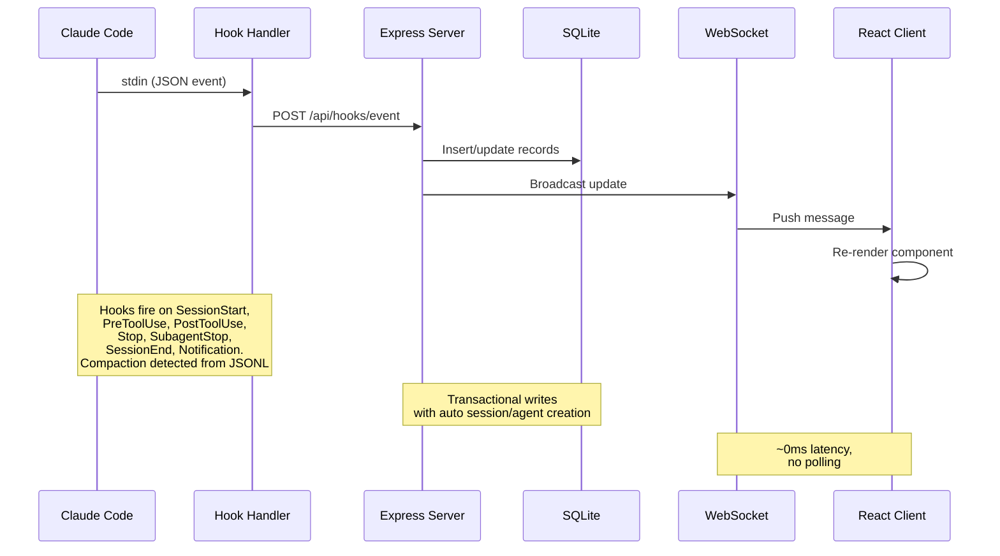

> [!QUAN TRỌNG]
> Xem [KIẾN TRÚC.md](./ARCHITECTURE.md) để tìm hiểu sâu về kiến ​​trúc máy chủ, lược đồ cơ sở dữ liệu, tuyến API, thiết kế WebSocket, định tuyến máy khách, luồng trình xử lý hook, chế độ triển khai và sơ đồ vòng đời chi tiết cho phiên và tác nhân.

### Vòng đời móc

1. **Claude Code** kích hoạt một hook khi bắt đầu phiên, sử dụng công cụ, kết thúc lần lượt, hoàn thành tác nhân phụ và thoát phiên
2. **Hook Handler** (`scripts/hook-handler.js`) đọc sự kiện JSON từ stdin và gửi nó lên API. Lỗi âm thầm với thời gian chờ 5 giây nên nó không bao giờ chặn Claude Code
3. **Máy chủ** xử lý sự kiện bên trong giao dịch SQLite:
   - Tự động tạo phiên và Agent chính trong lần liên hệ đầu tiên
   - Phát hiện lệnh gọi công cụ `Agent` để theo dõi việc tạo tác nhân phụ
   - Đặt tác nhân thành "đang hoạt động" trên `PreToolUse`, giữ cho tác nhân hoạt động thông qua `PostToolUse`
   - Trên `Stop` (Claude trả lời xong), nhân viên chính chuyển sang trạng thái "không hoạt động" — ngay cả ở những lượt không sử dụng công cụ mà Claude phản hồi mà không gọi bất kỳ công cụ nào, đảm bảo dấu thời gian và nhật ký hoạt động luôn chính xác. Các tác nhân phụ nền tiếp tục chạy. Phiên vẫn ở `active` — người dùng có thể gửi thêm tin nhắn
   - Đánh dấu các Subagent được hoàn thành riêng lẻ thông qua `SubagentStop`
   - Trên `SessionEnd` (quy trình CLI thoát), đánh dấu tất cả tổng đài viên và phiên là `completed`
   - Trên `SessionStart`, bất kỳ phiên hoạt động nào khác không có hoạt động nào trong hơn 5 phút sẽ tự động được đánh dấu là "bị bỏ rơi" với các tác nhân đã hoàn thành. Điều này xử lý `/resume` bên trong một phiên, Ctrl+C và các tình huống khác trong đó phiên bị mồ côi mà không có `SessionEnd` sạch
   - Kích hoạt lại các phiên đã hoàn thành/lỗi/bị bỏ rơi khi có sự kiện công việc mới (phiên được tiếp tục). Các sự kiện Stop và SubagentStop cũng kích hoạt lại các phiên đã hoàn thành/bị bỏ rơi - thao tác này xử lý các phiên có sẵn được nhập trước khi máy chủ khởi động, trong đó sự kiện hook đầu tiên có thể là Stop
   - Phát hiện quá trình nén cuộc hội thoại (`isCompactSummary` trong bản ghi JSONL) và tạo tác nhân + sự kiện `Compaction`. Đường cơ sở của mã thông báo được bảo toàn qua các lần nén nên không bị mất việc sử dụng. Việc đọc bản ghi sử dụng bộ đệm dựa trên thống kê được chia sẻ với các lần đọc bù byte tăng dần - chỉ các byte mới được thêm vào kể từ lần đọc cuối cùng được phân tích cú pháp, giúp tăng tốc ~ 50 lần cho các phiên dài
   - Trích xuất các lỗi API (`isApiErrorMessage` các mục nhập: giới hạn hạn ngạch, giới hạn tỷ lệ, không hợp lệ_request) và phản hồi `type: "error"` thô từ bản ghi JSONL, được lưu trữ dưới dạng sự kiện `APIError`. Thời lượng lượt (`system` subtype `turn_duration`) được lưu trữ dưới dạng sự kiện `TurnDuration`. Lỗi kết quả công cụ (`toolUseResult.is_error`) được theo dõi dưới dạng sự kiện `ToolError`
   - Quét máy chủ định kỳ (2 phút một lần) sẽ phát hiện các phiên bị bỏ qua và các lần nén mới vượt qua khả năng phát hiện dựa trên sự kiện (ví dụ: `/compact` không kích hoạt hook, `/resume` trong vài giây sau khi tạo phiên). Quá trình quét chia sẻ bộ nhớ đệm bản ghi với trình xử lý hook, tránh I/O trùng lặp. Việc dọn dẹp phiên bị bỏ dở cũng sẽ loại bỏ mục nhập bộ nhớ đệm bản ghi vào bộ nhớ bị ràng buộc
4. **WebSocket** thông báo thay đổi tới tất cả các máy khách được kết nối
5. **UI** nhận bản cập nhật và hiển thị lại các thành phần bị ảnh hưởng trong thời gian thực mà không cần thăm dò ý kiến.

### Máy trạng thái Agent

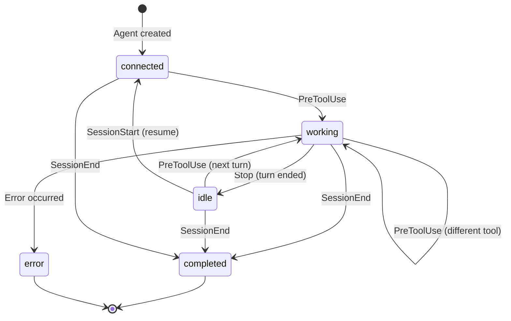

### Máy trạng thái phiên

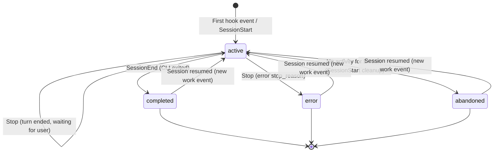

### Luồng tính toán chi phí

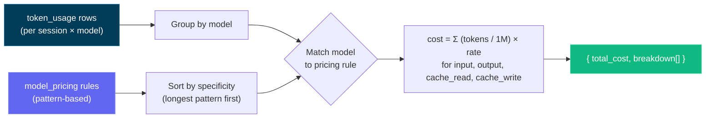

> [!QUAN TRỌNG]
> Luồng tính toán chi phí dựa trên việc sử dụng mã thông báo và quy tắc định giá mô hình. Đảm bảo quy tắc đặt giá của bạn được cập nhật để phản ánh chi phí chính xác. Cập nhật bảng giá mô hình thông qua trang Cài đặt để duy trì theo dõi chi phí chính xác - bảng thông tin không tự động tìm nạp thông tin cập nhật về giá từ các nguồn bên ngoài. Sau khi bạn đặt quy tắc đặt giá, trang tổng quan sẽ áp dụng chúng cho tất cả các phiên để báo cáo chi phí nhất quán.

---

## Cấu hình

| Biến môi trường    | Mặc định       | Sự miêu tả                                   |
| ----------------------- | ------------- | --------------------------------------------- |
| `DASHBOARD_PORT`        | `4820`        | Cổng dành cho máy chủ Express                   |
| `CLAUDE_DASHBOARD_PORT` | `4820`        | Cổng được trình xử lý hook sử dụng để đến máy chủ |
| `NODE_ENV`              | `development` | Đặt thành `production` để phục vụ ứng dụng khách đã xây dựng |

---

## Tập lệnh npm

| Yêu cầu                 | Sự miêu tả                                                |
| ----------------------- | ---------------------------------------------------------- |
| `npm run setup`         | Cài đặt phụ thuộc máy chủ và máy khách                     |
| `npm run dev`           | Khởi động đồng thời máy chủ (chế độ xem) + máy khách (Vite HMR) |
| `npm run dev:server`    | Chỉ khởi động máy chủ Express với `--watch`               |
| `npm run dev:client`    | Chỉ khởi động máy chủ Vite dev                             |
| `npm run build`         | Xây dựng ứng dụng khách React thành `client/dist/`                   |
| `npm start`             | Bắt đầu máy chủ sản xuất (phục vụ máy khách được xây dựng)              |
| `npm run install-hooks` | Định cấu hình móc Claude Code trong `~/.claude/settings.json`   |
| `npm run seed`          | Điền vào cơ sở dữ liệu với dữ liệu mẫu                         |
| `npm run import-history`| Nhập các phiên kế thừa từ `~/.claude/` (cũng chạy khi khởi động) |
| `npm run clear-data`    | Xóa tất cả các phiên, tác nhân, sự kiện và việc sử dụng mã thông báo            |
| `npm run mcp:install`   | Cài đặt các phần phụ thuộc cho gói MCP cục bộ (`mcp/`)       |
| `npm run mcp:build`     | Xây dựng TypeScript của máy chủ MCP thành `mcp/build/`             |
| `npm run mcp:start`     | Khởi động máy chủ MCP (stdio Transport - dành cho máy chủ MCP)        |
| `npm run mcp:start:http`| Khởi động máy chủ MCP (truyền tải HTTP + SSE trên cổng 8819)      |
| `npm run mcp:start:repl`| Khởi động máy chủ MCP (REPL tương tác khi hoàn thành tab)   |
| `npm run mcp:dev`       | Chạy máy chủ MCP ở chế độ dev (`tsx`, stdio)                 |
| `npm run mcp:dev:http`  | Chạy máy chủ MCP ở chế độ dev (`tsx`, HTTP + SSE)            |
| `npm run mcp:dev:repl`  | Chạy máy chủ MCP ở chế độ dev (`tsx`, REPL tương tác)      |
| `npm run mcp:typecheck` | Kiểm tra kiểu nguồn MCP mà không phát ra đầu ra bản dựng        |
| `npm run mcp:docker:build` | Xây dựng hình ảnh vùng chứa MCP bằng Docker (`agent-dashboard-mcp:local`) |
| `npm run mcp:podman:build` | Xây dựng hình ảnh vùng chứa MCP bằng Podman (`localhost/agent-dashboard-mcp:local`) |

---

## Tiện ích mở rộng Agent

Kho lưu trữ này bao gồm lớp mở rộng toàn diện cho cả Claude Code và Codex:

- Claude Code: `CLAUDE.md`, `.claude/rules/`, `.claude/skills/`
- Subagent của Claude: `.claude/agents/`
- Codex: `AGENTS.md`, `.codex/rules/`, `.codex/agents/`, `.codex/skills/`

### Kiến trúc mở rộng

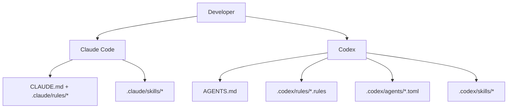

### Lớp Claude Code

- Bối cảnh liên tục:
  - [`CLAUDE.md`](./CLAUDE.md)
- Quy tắc trong phạm vi đường dẫn:
  - [`.claude/rules/backend-node.md`](./.claude/rules/backend-node.md)
  - [`.claude/rules/frontend-react.md`](./.claude/rules/frontend-react.md)
  - [`.claude/rules/mcp-typescript.md`](./.claude/rules/mcp-typescript.md)
  - [`.claude/rules/docs-markdown.md`](./.claude/rules/docs-markdown.md)
- Kỹ năng:
  - `repo-onboarding`
  - `ship-feature`
  - `mcp-operations`
  - `debug-live-issue`
- Chất phụ:
  - `backend-reviewer`
  - `frontend-reviewer`
  - `mcp-reviewer`

### Lớp Codex

- Bối cảnh liên tục:
  - [`AGENTS.md`](./AGENTS.md)
- Chính sách thực hiện:
  - [`.codex/rules/default.rules`](./.codex/rules/default.rules)
- Mẫu đại diện phụ tùy chỉnh:
  - [`.codex/agents/`](./.codex/agents)
- Kỹ năng:
  - [`.codex/skills/`](./.codex/skills)
- Cài đặt:
  - [`.codex/README.md`](./.codex/README.md)

---

## Tích hợp MCP

Dự án này bao gồm một máy chủ MCP cấp sản xuất cục bộ tại `mcp/` hiển thị các hoạt động trên bảng điều khiển dưới dạng công cụ cho các tác nhân AI. Nó hỗ trợ ba chế độ vận chuyển để phù hợp với các kịch bản tích hợp khác nhau.

### Chế độ vận chuyển MCP

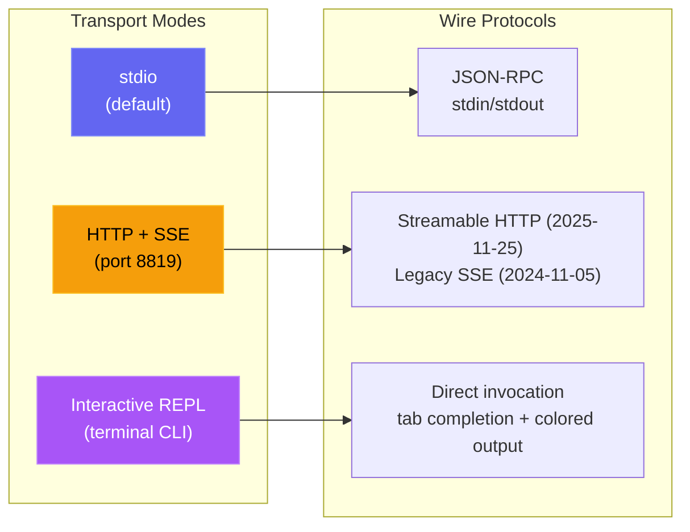

| Cách thức | Yêu cầu | Trường hợp sử dụng |
| --- | --- | --- |
| **stdio** | `npm run mcp:start` | Claude Code, Claude Desktop, máy chủ IDE MCP |
| **HTTP** | `npm run mcp:start:http` | Máy khách MCP từ xa, tích hợp web, nhiều phiên |
| **REPL** | `npm run mcp:start:repl` | Gỡ lỗi hoạt động, gọi công cụ thủ công, quản trị viên cục bộ |

<p align="center">
  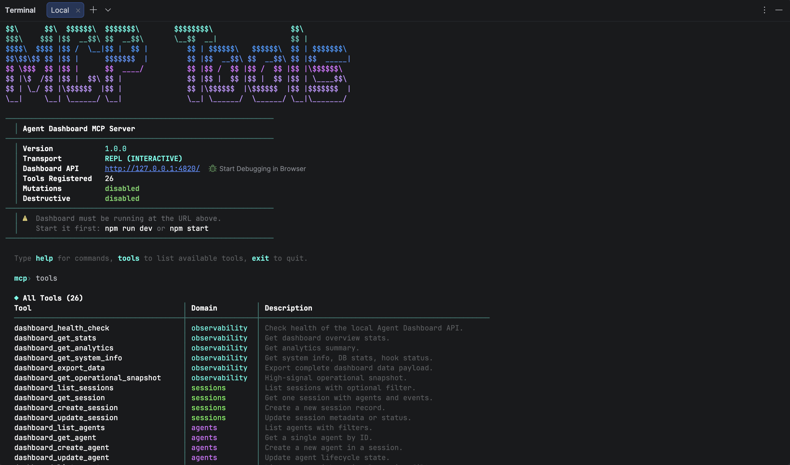
</p>

### Kiến trúc MCP

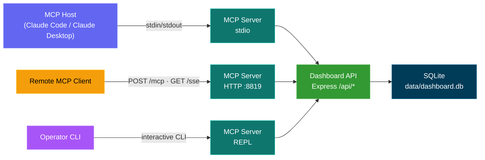

### Bề mặt công cụ MCP

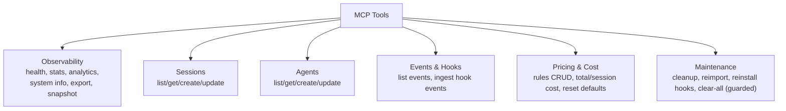

### Mô hình An toàn MCP

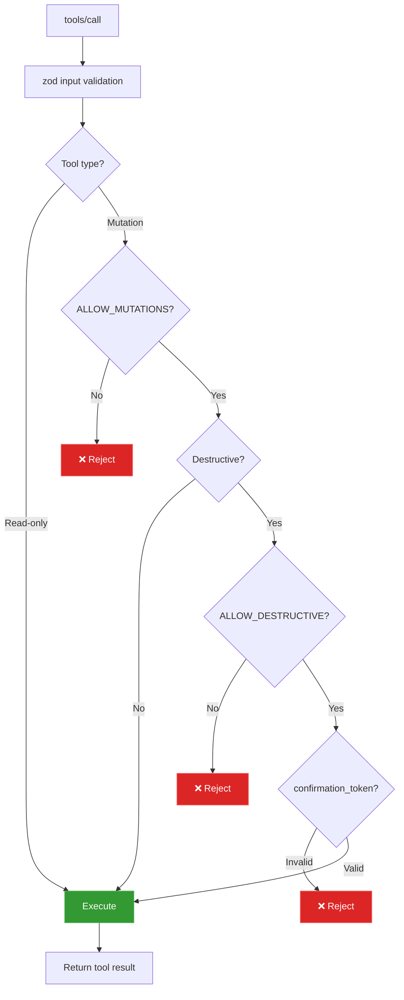

### Chế độ hoạt động MCP

- Chế độ chỉ đọc (mặc định): `MCP_DASHBOARD_ALLOW_MUTATIONS=false`
- Chế độ quản trị viên: `MCP_DASHBOARD_ALLOW_MUTATIONS=true`
- Chế độ hủy diệt: yêu cầu cả hai:
  - `MCP_DASHBOARD_ALLOW_MUTATIONS=true`
  - `MCP_DASHBOARD_ALLOW_DESTRUCTIVE=true`
  - đầu vào công cụ `confirmation_token: "CLEAR_ALL_DATA"`

Chi tiết đầy đủ: [mcp/README.md](./mcp/README.md)

---

## Tham chiếu API

Tất cả các điểm cuối đều trả về JSON. Phản hồi lỗi có dạng `{ error: { code, message } }`.

### OpenAPI / Swagger

| Phương pháp | Con đường                | Sự miêu tả                         |
| ------ | ------------------- | ----------------------------------- |
| `GET`  | `/api/openapi.json` | Thông số OpenAPI 3.0 thô                |
| `GET`  | `/api/docs`         | Tài liệu giao diện người dùng Swagger tương tác |

Tài liệu OpenAPI được tạo từ `server/openapi.js` và giao diện người dùng Swagger được phân phối trực tiếp bởi chương trình phụ trợ.

<p align="center">
  
</p>

### Sức khỏe

| Phương pháp | Con đường          | Sự miêu tả                           |
| ------ | ------------- | ------------------------------------- |
| `GET`  | `/api/health` | Trả về `{ status: "ok", timestamp }` |

### Phiên

| Phương pháp  | Con đường                | Thông số truy vấn                | Sự miêu tả                           |
| ------- | ------------------- | --------------------------- | ------------------------------------- |
| `GET`   | `/api/sessions`     | `status`, `limit`, `offset` | Liệt kê các phiên có số lượng Agent       |
| `GET`   | `/api/sessions/:id` | --                          | Chi tiết phiên với các Agent và sự kiện |
| `POST`  | `/api/sessions`     | --                          | Tạo phiên (idempotent trên `id`)   |
| `PATCH` | `/api/sessions/:id` | --                          | Cập nhật trạng thái/siêu dữ liệu phiên        |

### Agent

| Phương pháp  | Con đường              | Thông số truy vấn                              | Sự miêu tả                   |
| ------- | ----------------- | ----------------------------------------- | ----------------------------- |
| `GET`   | `/api/agents`     | `status`, `session_id`, `limit`, `offset` | Liệt kê các Agent có bộ lọc      |
| `GET`   | `/api/agents/:id` | --                                        | Chi tiết Agent duy nhất           |
| `POST`  | `/api/agents`     | --                                        | Tạo Agent                  |
| `PATCH` | `/api/agents/:id` | --                                        | Cập nhật trạng thái/nhiệm vụ/công cụ của Agent |

### Sự kiện

| Phương pháp | Con đường          | Thông số truy vấn                    | Sự miêu tả                |
| ------ | ------------- | ------------------------------- | -------------------------- |
| `GET`  | `/api/events` | `session_id`, `limit`, `offset` | Liệt kê các sự kiện (mới nhất trước) |

### Thống kê

| Phương pháp | Con đường         | Sự miêu tả                                            |
| ------ | ------------ | ------------------------------------------------------ |
| `GET`  | `/api/stats` | Số lượng tổng hợp, phân phối trạng thái, kết nối WS |

### Phân tích

| Phương pháp | Con đường             | Sự miêu tả                                                |
| ------ | ---------------- | ---------------------------------------------------------- |
| `GET`  | `/api/analytics` | Tổng hợp mã thông báo/công cụ/phiên cho biểu đồ và chế độ xem xu hướng   |

### móc

| Phương pháp | Con đường               | Sự miêu tả                                  |
| ------ | ------------------ | -------------------------------------------- |
| `POST` | `/api/hooks/event` | Nhận và xử lý sự kiện hook Claude Code |

**Tải trọng sự kiện móc:**

```json
{
  "hook_type": "PreToolUse",
  "data": {
    "session_id": "abc-123",
    "tool_name": "Bash",
    "tool_input": { "command": "ls -la" }
  }
}
```

### Định giá

| Phương pháp   | Con đường                     | Sự miêu tả                              |
| -------- | ------------------------ | ---------------------------------------- |
| `GET`    | `/api/pricing`           | Liệt kê tất cả các quy tắc định giá                   |
| `PUT`    | `/api/pricing`           | Tạo hoặc cập nhật quy tắc đặt giá          |
| `DELETE` | `/api/pricing/:pattern`  | Xóa quy tắc đặt giá                    |
| `GET`    | `/api/pricing/cost`      | Tổng chi phí trên tất cả các phiên           |
| `GET`    | `/api/pricing/cost/:id`  | Phân tích chi phí cho một phiên cụ thể    |

### Quy trình làm việc

| Phương pháp | Con đường                          | Sự miêu tả                                             |
| ------ | ----------------------------- | ------------------------------------------------------- |
| `GET`  | `/api/workflows`              | Dữ liệu quy trình công việc tổng hợp (điều phối, công cụ, mẫu). Tùy chọn `?status=active\|thông số truy vấn đã hoàn thành lọc tất cả 11 phần dữ liệu theo trạng thái phiên |
| `GET`  | `/api/workflows/session/:id`  | Thông tin chi tiết mỗi phiên (cây tác nhân, dòng thời gian công cụ, sự kiện) |

### Cài đặt

| Phương pháp | Con đường                           | Sự miêu tả                                      |
| ------ | ------------------------------ | ------------------------------------------------ |
| `GET`  | `/api/settings/info`           | Thông tin hệ thống, số liệu thống kê DB, trạng thái hook               |
| `POST` | `/api/settings/clear-data`     | Xóa tất cả các phiên, Agent, sự kiện, sử dụng token |
| `POST` | `/api/settings/reimport`       | Nhập lại các phiên kế thừa từ `~/.claude/`      |
| `POST` | `/api/settings/reinstall-hooks`| Cài đặt lại móc Claude Code                      |
| `POST` | `/api/settings/reset-pricing`  | Đặt lại giá về mặc định                        |
| `GET`  | `/api/settings/export`         | Xuất tất cả dữ liệu dưới dạng tải xuống JSON                 |
| `POST` | `/api/settings/cleanup`        | Bỏ các phiên cũ, xóa dữ liệu cũ           |

### WebSocket

Kết nối với `ws://localhost:4820/ws` để nhận tin nhắn đẩy theo thời gian thực:

```json
{
  "type": "agent_updated",
  "data": { "id": "...", "status": "working", "current_tool": "Edit" },
  "timestamp": "2026-03-05T15:43:01.800Z"
}
```

**Các loại tin nhắn:** `session_created`, `session_updated`, `agent_created`, `agent_updated`, `new_event`

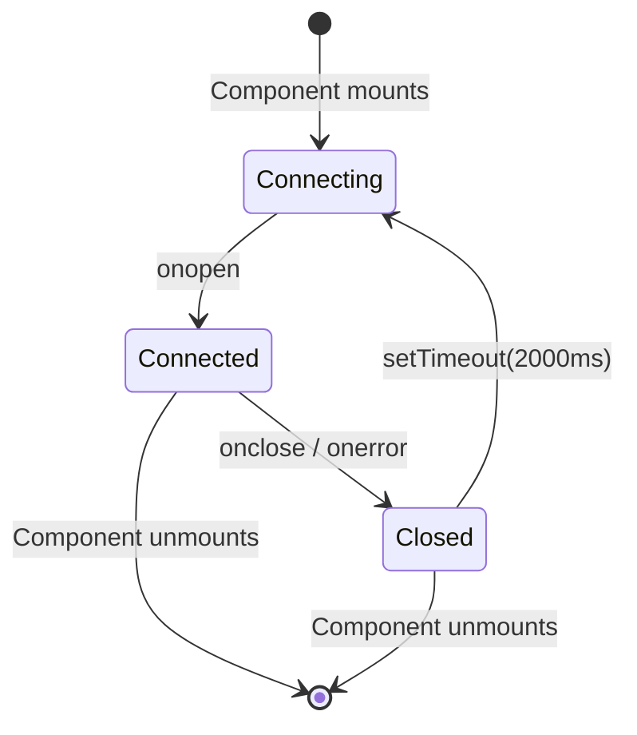

---

## Sự kiện móc nối

Bảng điều khiển xử lý các loại hook Claude Code này:

| Loại móc      | Cò súng                        | Hành động trên trang tổng quan                                                                             |
| -------------- | ------------------------------ | -------------------------------------------------------------------------------------------- |
| `SessionStart` | Phiên Claude Code bắt đầu     | Tạo phiên và tác nhân chính. Kích hoạt lại các phiên đã tiếp tục. Bỏ các phiên mồ côi không có hoạt động nào trong hơn 5 phút |
| `PreToolUse`   | Agent bắt đầu sử dụng một công cụ      | Đặt tác nhân thành `working`, đặt `current_tool`. Nếu công cụ là `Agent`, tạo bản ghi tác nhân phụ    |
| `PostToolUse`  | Thực hiện công cụ đã hoàn tất       | Xóa `current_tool`. Agent ở lại `working` (không thay đổi trạng thái)                              |
| `Stop`         | Claude trả lời xong     | Tác nhân chính tới `idle` (ngay cả trên các vòng quay không có công cụ). Các tác nhân phụ nền tiếp tục chạy. Phiên ở lại `active` |
| `SubagentStop` | Tác nhân nền đã hoàn tất      | Khớp và hoàn thành tác nhân phụ theo mô tả, loại hoặc nhiệm vụ                             |
| `Notification` | Thông báo Agent             | Nhật ký sự kiện. Thông báo liên quan đến nén được gắn thẻ dưới dạng sự kiện `Compaction`. Kích hoạt thông báo trình duyệt nếu người dùng đã bật thông báo |
| `SessionEnd`   | Quá trình Claude Code CLI thoát  | Đánh dấu tất cả các tổng đài viên và phiên là `completed`                                              |
| `Compaction`   | `/compact` được phát hiện trong JSONL   | Tạo một tác nhân phụ nén (loại `compaction`) và sự kiện Nén. Được phát hiện qua các mục `isCompactSummary` trong bản ghi JSONL. Cũng được phát hiện bởi máy quét định kỳ cho các phiên hoạt động |
| `APIError`     | Lỗi API trong bản ghi JSONL  | Được trích xuất từ ​​các mục nhập `isApiErrorMessage` (hạn ngạch, giới hạn tỷ lệ, yêu cầu không hợp lệ) và phản hồi thô `type: "error"`. Được lưu trữ dưới dạng sự kiện với chi tiết lỗi |
| `TurnDuration` | Xoay thời gian trong bảng điểm JSONL| Trích xuất từ ​​​​các tin nhắn `system` kiểu con `turn_duration` có `durationMs`. Được lưu trữ dưới dạng sự kiện để phân tích thời gian theo cấp độ |
| `ToolError`    | Lỗi kết quả công cụ trong JSONL     | Trích xuất từ ​​​​các mục `toolUseResult.is_error`. Theo dõi lỗi cấp công cụ để phân tích lan truyền lỗi |

---

## Thông báo trình duyệt

Bảng điều khiển hỗ trợ thông báo trình duyệt liên tục thông qua Web Push (VAPID) để cảnh báo theo thời gian thực ngay cả khi tab bảng điều khiển không được tập trung hoặc trình duyệt đang ở chế độ nền.

### Nó hoạt động như thế nào

1. **Bật** thông báo trong trang Cài đặt thông qua nút chuyển đổi chính
2. **Cấp** quyền cho trình duyệt khi được nhắc — điều này sẽ đăng ký một Service Worker và tạo một đăng ký đẩy
3. **Định cấu hình** sự kiện nào kích hoạt thông báo:

| Sự kiện                        | Mặc định | Sự miêu tả                                                     |
| ---------------------------- | ------- | --------------------------------------------------------------- |
| Phiên mới bắt đầu           | Bật      | Kích hoạt khi phiên Claude Code mới được tạo                 |
| Claude trả lời xong   | Tắt     | Kích hoạt các sự kiện `Stop` khi Claude kết thúc lượt phản hồi     |
| Phiên đã đóng               | Tắt     | Kích hoạt `SessionEnd` khi quá trình CLI thoát                |
| Lỗi phiên               | Bật      | Kích hoạt khi phiên kết thúc có lỗi                         |
| Subagent sinh ra             | Tắt     | Kích hoạt khi tác nhân phụ nền được tạo                     |

Ngoài ra, bất kỳ sự kiện hook `Notification` nào từ Claude Code đều kích hoạt thông báo trình duyệt bất kể nút chuyển đổi cho mỗi sự kiện (miễn là nút chuyển đổi chính được bật).

### Kiến trúc thông báo

- **Hệ thống VAPID:** Sử dụng `web-push` trên máy chủ để phân phối tin nhắn an toàn. Các khóa VAPID được tạo tự động và lưu trữ trong `data/vapid-keys.json`.
- **Service Worker:** Một worker chuyên dụng (`client/public/sw.js`) xử lý các sự kiện `push` đến và hiển thị thông báo với `silent: false` để đảm bảo phát lại âm thanh trên macOS.
- **Đăng ký:** Các điểm cuối dành riêng cho trình duyệt được lưu trữ trong bảng `push_subscriptions` trong SQLite.
- **Tính liên tục:** Thông báo vẫn đến ngay cả khi trình duyệt đã đóng, vì Service Worker hoạt động ở chế độ nền.
- **Thông báo kiểm tra:** Nút trong Cài đặt cho phép bạn xác minh hệ thống VAPID và phát lại âm thanh.

---

## Tiện ích mở rộng VS Code

**Claude Code Agent Monitor** hiện đã có sẵn dưới dạng tiện ích mở rộng VS Code chính thức, cho phép bạn giám sát các tác nhân AI của mình mà không cần rời khỏi trình chỉnh sửa.

<p align="center">
  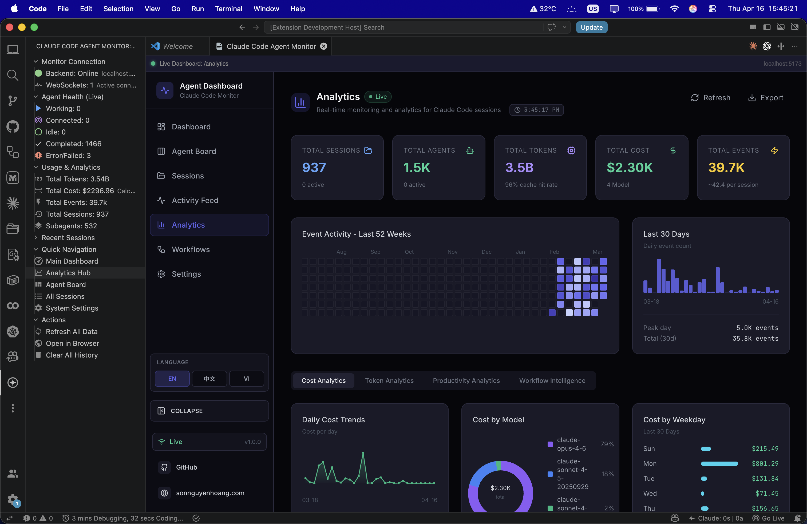
</p>

### 🚀 Tính năng chính
- **Thanh bên trực tiếp**: Chế độ xem Activity Bar chuyên dụng hiển thị Sức khỏe Tác nhân (Đang hoạt động, Đã kết nối, Chờ, v.v.) theo thời gian thực.
- **Phân tích sử dụng**: Theo dõi tổng số token, chi phí USD trực tiếp và số lượng sự kiện ngay trong thanh bên.
- **Tích hợp thanh trạng thái**: Theo dõi nhanh ở thanh dưới cùng hiển thị số lượng phiên và tác nhân đang hoạt động.
- **Điều hướng sâu**: Truy cập bằng một cú nhấp chuột vào các chế độ xem bảng điều khiển cụ thể (Kanban, Analytics, Settings) hoặc các phiên gần đây.
- **Tab tích hợp**: Mở bảng điều khiển giám sát đầy đủ dưới dạng một tab webview VS Code gốc.

### 📦 Cài đặt & Thiết lập
1. Mở thư mục [vscode-extension](./vscode-extension).
2. Cài đặt tiện ích từ Marketplace hoặc tự đóng gói bằng `vsce package`.
3. Đảm bảo máy chủ bảng điều khiển cục bộ của bạn đang chạy (`npm run dev`).
4. Nhấp vào **biểu tượng Radar** trong VS Code Activity Bar để bắt đầu.

Để biết cấu hình chi tiết cho nhà phát triển, hãy xem các thư mục [.vscode](./.vscode) và [vscode-extension](./vscode-extension).

> [!TIP]
> Extension on VS Code Marketplace: [Claude Code Agent Monitor](https://marketplace.visualstudio.com/items?itemName=hoangsonw.claude-code-agent-monitor)

---

## Lưu trữ dữ liệu

- **Công cụ:** SQLite 3 qua `better-sqlite3` (tùy chọn) hoặc tích hợp sẵn Node.js `node:sqlite`
- **Vị trí:** `data/dashboard.db`
- **Chế độ nhật ký:** WAL (đọc đồng thời trong khi ghi)
- **Đặt lại:** Xóa `data/dashboard.db` để xóa tất cả dữ liệu

### Sơ đồ mối quan hệ thực thể

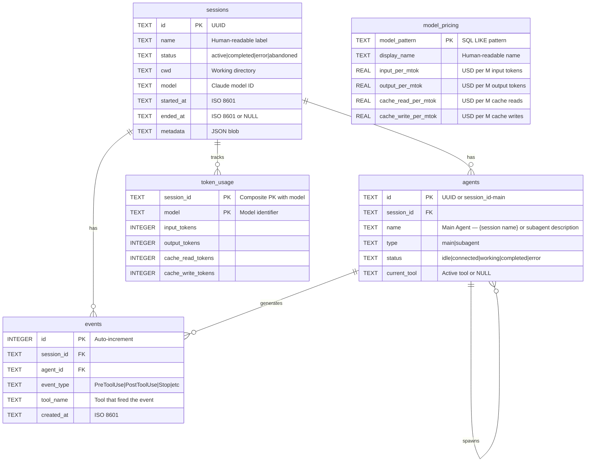

---

## Thị trường plugin

Mở rộng Claude Code bằng các plugin Giám sát tác nhân chính thức — phân tích, công cụ năng suất, tiện ích dành cho nhà phát triển, thông tin chi tiết được hỗ trợ bởi AI và kết nối bảng điều khiển.

### Thêm thị trường

```bash
claude plugin marketplace add hoangsonww/Claude-Code-Agent-Monitor
```

### Các plugin có sẵn

| Trình cắm | Lệnh cài đặt | Kỹ năng |
|--------|----------------|--------|
| **phân tích ccam** | `claude plugin install ccam-analytics@hoangsonww-claude-code-agent-monitor` | `session-report`, `cost-breakdown`, `usage-trends`, `productivity-score` |
| **năng suất ccam** | `claude plugin install ccam-productivity@hoangsonww-claude-code-agent-monitor` | `daily-standup`, `weekly-report`, `sprint-summary`, `workflow-optimizer` |
| **ccam-devtools** | `claude plugin install ccam-devtools@hoangsonww-claude-code-agent-monitor` | `session-debug`, `hook-diagnostics`, `data-export`, `health-check` |
| **thông tin chi tiết về ccam** | `claude plugin install ccam-insights@hoangsonww-claude-code-agent-monitor` | `pattern-detect`, `anomaly-alert`, `optimization-suggest`, `session-compare` |
| **bảng điều khiển ccam** | `claude plugin install ccam-dashboard@hoangsonww-claude-code-agent-monitor` | `dashboard-status`, `quick-stats` + máy chủ MCP |

### Bao gồm các công cụ CLI

- `ccam-stats` — Bảng điều khiển thiết bị đầu cuối (phiên, chi phí, mã thông báo có đường cơ sở nén)
- `ccam-doctor` — Chẩn đoán hệ thống (API, cơ sở dữ liệu, hook, làm mới dữ liệu)
- `ccam-export` — Xuất dữ liệu (JSON, CSV) cho phiên, sự kiện, phân tích, chi phí

### Cách sử dụng ví dụ

```bash
# In Claude Code, after installing a plugin:
/ccam-analytics:session-report latest
/ccam-analytics:cost-breakdown this week
/ccam-productivity:daily-standup today
/ccam-insights:pattern-detect tools
/ccam-dashboard:quick-stats
```

📖 Giấy tờ đầy đủ: [tài liệu/plugin.md](docs/PLUGINS.md)

---

## Dòng trạng thái

Tiện ích dòng trạng thái CLI độc lập dành cho Claude Code hiển thị tên mô hình, người dùng, thư mục làm việc, nhánh git, thanh sử dụng cửa sổ ngữ cảnh và số lượng mã thông báo -- tất cả đều được mã hóa màu bằng các chuỗi thoát ANSI.

```
Sonnet 4.6 | nguyens6 | ~/agent-dashboard/client | main | ████████░░ 79% | 3↑ 2↓ 156586c
```

| Phân đoạn     | Màu sắc                | Ví dụ             |
| ----------- | -------------------- | ------------------- |
| Người mẫu       | lục lam                 | `Sonnet 4.6`        |
| người dùng        | Màu xanh lá                | `nguyens6`          |
| CWD         | Màu vàng               | `~/agent-dashboard` |
| Nhánh Git  | Màu đỏ tươi              | `main`              |
| Thanh ngữ cảnh | Xanh / Vàng / Đỏ | `████████░░ 79%`    |
| Mã thông báo      | mờ                  | `3↑ 2↓ 156586c`     |

Xem [`statusline/README.md`](statusline/README.md) để biết hướng dẫn cài đặt.

<p align="center">
  
</p>

---

## Kiến trúc máy chủ

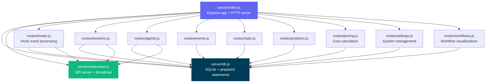

---

## Định tuyến khách hàng

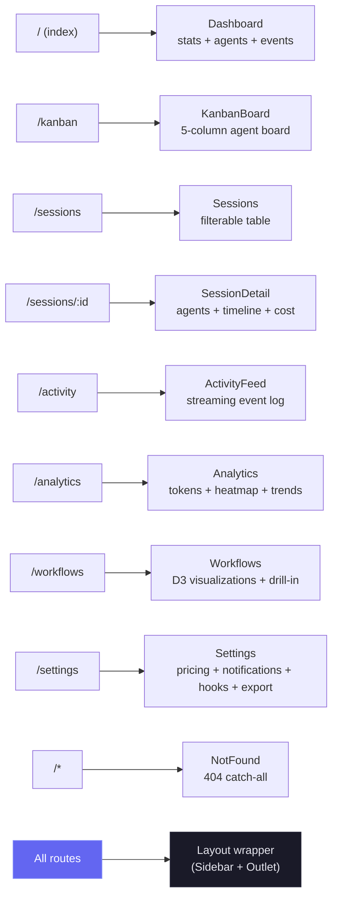

---

## Luồng xử lý móc

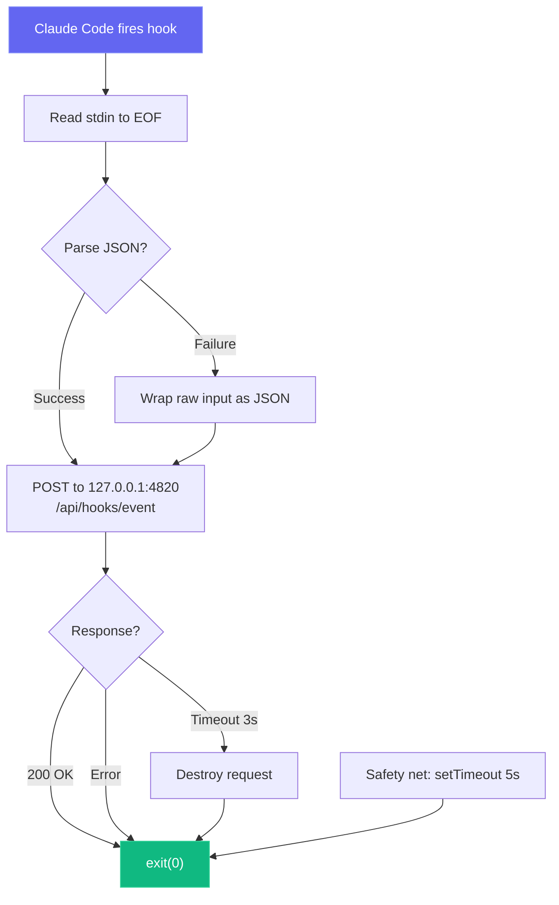

---

## Chế độ triển khai

Chúng tôi hỗ trợ cả hai chế độ triển khai phát triển và sản xuất với các kiến ​​trúc quy trình khác nhau:

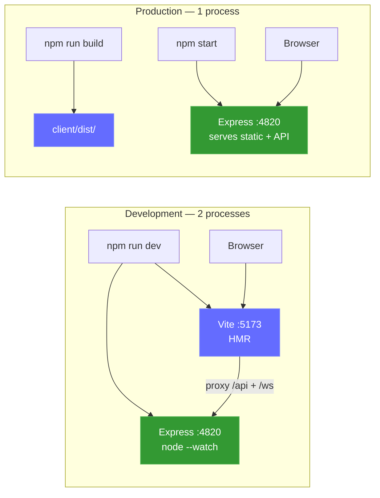

Sidecar MCP cục bộ tùy chọn (hỗ trợ truyền tải stdio, HTTP+SSE và REPL):

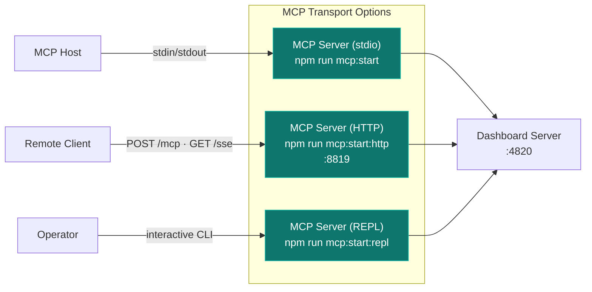

### Triển khai đám mây

Thư mục `deployments/` cung cấp cơ sở hạ tầng cấp doanh nghiệp, không phụ thuộc vào đám mây để triển khai bảng thông tin vào sản xuất. Hỗ trợ Helm, Kustomize và Terraform trên AWS, GCP, Azure và OCI với các chiến lược phát hành xanh lam, xanh hoàng yến và luân phiên.

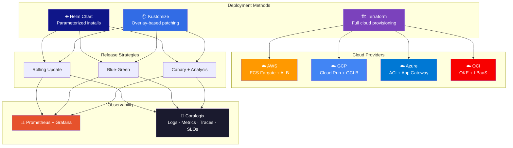

```bash
# Helm (recommended for Kubernetes)
helm install agent-monitor deployments/helm/agent-monitor \
  -f deployments/helm/agent-monitor/values-production.yaml \
  -n agent-monitor --create-namespace

# Kustomize
kubectl apply -k deployments/kubernetes/overlays/production

# Terraform (full infra + app)
cd deployments/terraform/providers/aws
terraform init && terraform apply -var-file=../../environments/production/terraform.tfvars

# Script orchestrator
./deployments/scripts/deploy.sh --env production --method helm --strategy blue-green
```

Ngăn triển khai bao gồm các quy trình CI/CD (GitHub Actions + GitLab CI), giám sát toàn diện (Prometheus, Grafana, Alertmanager với 13 quy tắc cảnh báo, khả năng quan sát toàn bộ ngăn xếp Coralogix với OpenTelemetry Collector để ghi nhật ký, số liệu, dấu vết và theo dõi SLO), tập lệnh vận hành (triển khai, khôi phục, chuyển đổi xanh lam, sao lưu/khôi phục, phá bỏ) và chế độ bảo mật đầy đủ (Tiêu chuẩn bảo mật Pod bị hạn chế, TLS 1.3, mạng chính sách, quét Trivy).

> [!GHI CHÚ]
> 📘 **Hướng dẫn triển khai đầy đủ:** Xem [TRIỂN KHAI.md](DEPLOYMENT.md) để biết hướng dẫn từng bước, sơ đồ kiến ​​trúc và quy trình vận hành.

---

## Cấu trúc dự án

```
agent-dashboard/
|-- CLAUDE.md                   # Claude Code project memory and working agreements
|-- AGENTS.md                   # Codex project instructions
|-- package.json                # Root scripts (dashboard + MCP helpers) + server dependencies
|-- .claude/
|   +-- rules/                  # Path-scoped Claude rules
|   +-- skills/                 # Claude reusable project skills
|   +-- agents/                 # Claude custom subagents
|-- .claude-plugin/
|   +-- marketplace.json        # Plugin marketplace manifest (5 plugins)
|-- plugins/
|   |-- ccam-analytics/         # Analytics: session reports, cost breakdown, usage trends, productivity score
|   |   |-- .claude-plugin/plugin.json
|   |   |-- skills/ (4)         # session-report, cost-breakdown, usage-trends, productivity-score
|   |   |-- agents/             # analytics-advisor (Sonnet model)
|   |   |-- hooks/hooks.json    # Stop + SubagentStop event logging
|   |   +-- bin/ccam-stats      # Terminal dashboard CLI
|   |-- ccam-productivity/      # Productivity: standups, reports, sprints, workflow optimizer
|   |-- ccam-devtools/          # DevTools: debug, diagnostics, export, health checks
|   |   +-- bin/                # ccam-doctor + ccam-export CLIs
|   |-- ccam-insights/          # Insights: patterns, anomalies, optimization, comparison
|   +-- ccam-dashboard/         # Dashboard connector: status, quick stats, MCP integration
|       +-- .mcp.json           # MCP server configuration
|-- server/
|   |-- index.js                 # Express app, HTTP server, static serving
|   |-- db.js                    # SQLite schema, migrations, prepared statements
|   |-- websocket.js             # WebSocket server with heartbeat
|   +-- routes/
|       |-- hooks.js             # Hook event processing (transactional)
|       |-- sessions.js          # Session CRUD
|       |-- agents.js            # Agent CRUD
|       |-- events.js            # Event listing
|       |-- stats.js             # Aggregate statistics
|       |-- analytics.js         # Token, tool, and trend analytics
|       |-- workflows.js         # Aggregate workflow data and per-session drill-in
|       |-- pricing.js           # Model pricing CRUD and cost calculation
|       +-- settings.js          # System info, data management, export, cleanup
|   +-- lib/
|       +-- transcript-cache.js  # Stat-based JSONL transcript cache with incremental reads. Extracts tokens, compactions, API errors, turn durations, thinking blocks, and usage extras (service_tier, speed, inference_geo)
|   +-- compat-sqlite.js         # node:sqlite compatibility wrapper (fallback for better-sqlite3)
|-- client/
|   |-- package.json             # Client dependencies
|   |-- index.html               # HTML entry point
|   |-- vite.config.ts           # Vite + proxy config
|   |-- tailwind.config.js       # Custom dark theme
|   |-- tsconfig.json            # Strict TypeScript
|   +-- src/
|       |-- main.tsx             # React entry
|       |-- App.tsx              # Router + WebSocket provider
|       |-- index.css            # Tailwind + custom utilities
|       |-- lib/
|       |   |-- types.ts         # Shared TypeScript interfaces
|       |   |-- api.ts           # Typed fetch client
|       |   |-- format.ts        # Date/time formatting utilities
|       |   +-- eventBus.ts      # Pub/sub for WebSocket distribution
|       |-- hooks/
|       |   |-- useWebSocket.ts      # Auto-reconnecting WebSocket hook
|       |   +-- useNotifications.ts  # Browser notification triggers from WebSocket events
|       |-- components/
|       |   |-- Layout.tsx       # Shell with sidebar + outlet
|       |   |-- Sidebar.tsx      # Navigation + connection indicator
|       |   |-- AgentCard.tsx    # Agent info card with status
|       |   |-- StatCard.tsx     # Metric card
|       |   |-- StatusBadge.tsx  # Color-coded status pills
|       |   |-- EmptyState.tsx   # Placeholder for empty lists
|       |   +-- workflows/       # D3.js workflow visualization components
|       |       |-- OrchestrationDAG.tsx            # Horizontal DAG of agent spawning patterns
|       |       |-- ToolExecutionFlow.tsx           # d3-sankey diagram of tool-to-tool transitions
|       |       |-- AgentCollaborationNetwork.tsx   # Force-directed agent pipeline graph
|       |       |-- SubagentEffectiveness.tsx       # Scorecard grid with SVG success rings
|       |       |-- WorkflowPatterns.tsx            # Auto-detected orchestration sequences
|       |       |-- ModelDelegationFlow.tsx         # Model routing through agent hierarchies
|       |       |-- ErrorPropagationMap.tsx         # Error clustering by hierarchy depth
|       |       |-- ConcurrencyTimeline.tsx         # Swim-lane parallel agent execution
|       |       |-- SessionComplexityScatter.tsx    # D3 bubble chart (duration vs agents vs tokens)
|       |       |-- CompactionImpact.tsx            # Token compression events and recovery
|       |       |-- WorkflowStats.tsx               # Aggregate workflow statistics
|       |       +-- SessionDrillIn.tsx              # Per-session agent tree, tool timeline, events
|       +-- pages/
|           |-- Dashboard.tsx      # Overview page
|           |-- KanbanBoard.tsx    # Agent status columns
|           |-- Sessions.tsx       # Sessions table
|           |-- SessionDetail.tsx  # Single session deep dive
|           |-- ActivityFeed.tsx   # Real-time event stream
|           |-- Analytics.tsx      # Token usage, heatmap, trends
|           |-- Workflows.tsx      # D3.js workflow visualizations and session drill-in
|           |-- Settings.tsx       # Model pricing, notifications, hooks, export, cleanup
|           +-- NotFound.tsx       # 404 catch-all page
|-- scripts/
|   |-- hook-handler.js          # Lightweight stdin-to-HTTP forwarder
|   |-- install-hooks.js         # Auto-configures ~/.claude/settings.json
|   |-- import-history.js        # Imports sessions from ~/.claude/ with enhanced JSONL extraction (API errors, turn durations, entrypoint, permission modes, thinking blocks, usage extras, tool errors, subagent JSONL files)
|   +-- seed.js                  # Sample data generator
|-- mcp/
|   |-- package.json             # MCP package scripts + dependencies
|   |-- README.md                # MCP setup, host config, tool catalog, safety model
|   |-- src/
|   |   |-- index.ts             # MCP runtime entrypoint (transport router)
|   |   |-- server.ts            # MCP server assembly
|   |   |-- clients/             # Dashboard API client with retry/backoff
|   |   |-- config/              # Environment/CLI config parsing
|   |   |-- core/                # Logger, tool registry, result helpers
|   |   |-- policy/              # Mutation/destructive guards
|   |   |-- tools/               # Domain-specific tool modules (6 domains)
|   |   |-- transports/          # HTTP+SSE server, REPL, tool collector
|   |   |-- ui/                  # ANSI banner, colors, formatter, tables
|   |   +-- types/               # Shared MCP type definitions
|   +-- build/                   # Built MCP runtime output
|-- deployments/
|   |-- README.md                # Deployment infrastructure reference
|   |-- terraform/               # Cloud provisioning (AWS, GCP, Azure, OCI)
|   |   |-- modules/             # Reusable modules (networking, compute, db, lb, monitoring)
|   |   |-- providers/           # Cloud-specific implementations
|   |   +-- environments/        # Per-env tfvars (dev, staging, production)
|   |-- kubernetes/              # Kustomize manifests
|   |   |-- base/                # 11 base resources (deployment, service, ingress, hpa, etc.)
|   |   |-- overlays/            # Environment overlays (dev, staging, production)
|   |   |-- components/          # Optional add-ons (mcp-sidecar, monitoring)
|   |   +-- strategies/          # Blue-green and canary deployment strategies
|   |-- helm/agent-monitor/      # Helm chart with 12 templates and 4 value sets
|   |-- scripts/                 # Operational scripts (deploy, rollback, backup, teardown)
|   |-- monitoring/              # Prometheus, Grafana, Alertmanager, Coralogix (OTel Collector)
|   +-- ci/                      # CI/CD pipelines (GitHub Actions, GitLab CI)
|-- .codex/
|   |-- config.toml              # Codex runtime configuration
|   |-- README.md                # Codex setup guide for agents and skills
|   |-- rules/                   # Codex execution policy rules
|   |-- agents/                  # Codex custom agent templates
|   +-- skills/                  # Codex project skills
|-- statusline/
|   |-- README.md                # Statusline installation & usage guide
|   |-- statusline.py            # Python script that renders the statusline
|   +-- statusline-command.sh    # Shell wrapper for Claude Code's statusLine config
+-- data/
    +-- dashboard.db             # SQLite database (gitignored)
```

---

## Khắc phục sự cố

| Vấn đề                           | Giải pháp                                                                                                                                                         |
| --------------------------------- | ---------------------------------------------------------------------------------------------------------------------------------------------------------------- |
| `better-sqlite3` không cài đặt được | Điều này không gây tử vong - máy chủ sẽ tự động quay trở lại trạng thái `node:sqlite` tích hợp của Node.js (Node 22+). Trên các phiên bản Node cũ hơn, hãy cài đặt công cụ xây dựng Python 3 và C++, sau đó chạy `npm rebuild better-sqlite3` |
| Móc không bắn                  | Chạy `npm run install-hooks` và khởi động lại Claude Code. Xác minh hook tồn tại trong `~/.claude/settings.json`                                                             |
| Bảng điều khiển không hiển thị dữ liệu           | Đảm bảo máy chủ đang chạy (`npm run dev`) trước khi bắt đầu phiên Claude Code. Kiểm tra `http://localhost:4820/api/health`                                     |
| WebSocket bị ngắt kết nối            | Máy khách tự động kết nối lại sau mỗi 2 giây. Kiểm tra xem cổng 4820 có bị tường lửa chặn không                                                                    |
| Dữ liệu cũ sau khi khởi động lại          | Cơ sở dữ liệu vẫn tồn tại trong suốt quá trình khởi động lại. Chạy `npm run seed` để có dữ liệu demo mới hoặc xóa `data/dashboard.db` để đặt lại                                            |
| Công cụ MCP không kết nối được         | Xác nhận API bảng điều khiển đã hoạt động trên `MCP_DASHBOARD_BASE_URL` và xây dựng lại/khởi động MCP (`npm run mcp:build`, `npm run mcp:start`)                                         |

---

## Giấy phép

MIT. Xem [GIẤY PHÉP](LICENSE) để biết chi tiết.
