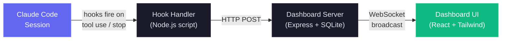
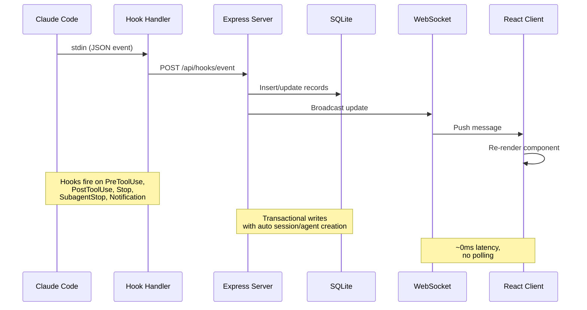
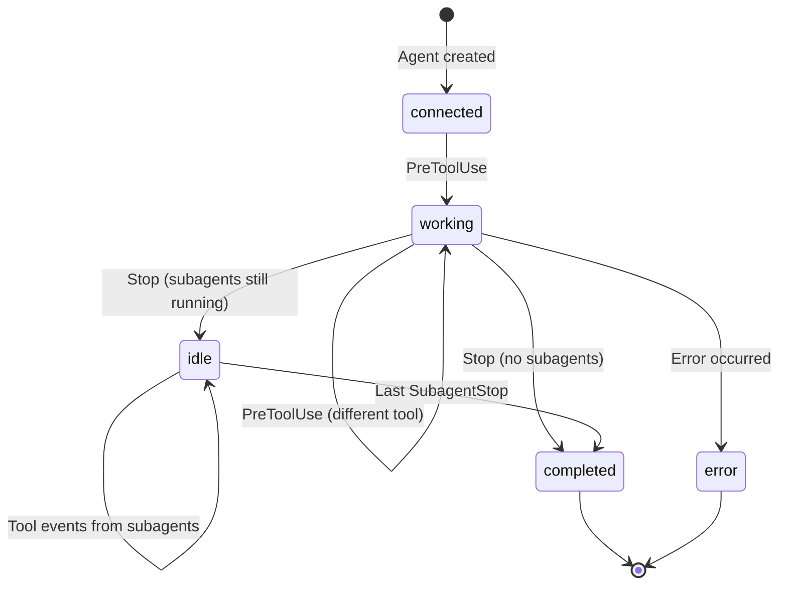
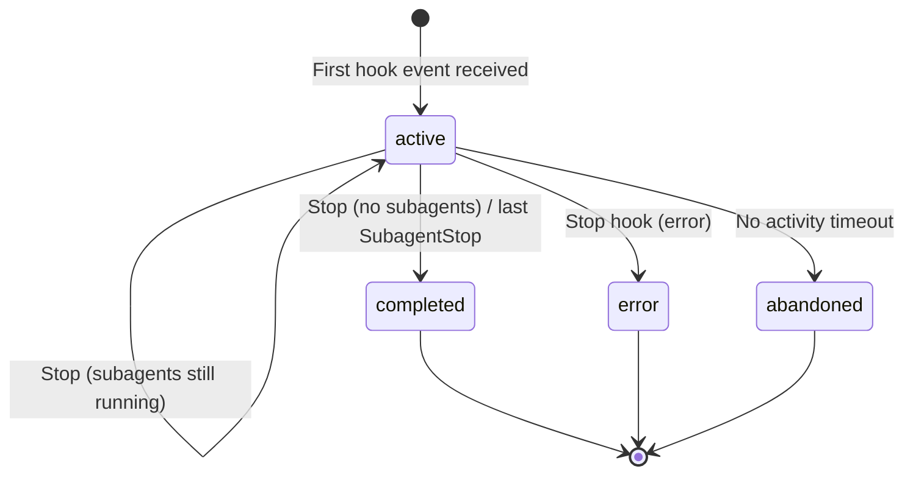

# Agent Dashboard

### Real-time monitoring platform for Claude Code agent activity


---

Track sessions, monitor agents in real-time, visualize tool usage, and observe subagent orchestration through a professional dark-themed web interface. Integrates directly with Claude Code via its native hook system.



<p align="center">
  
</p>

<p align="center">
  
</p>

<p align="center">
  
</p>

<p align="center">
  
</p>

<p align="center">
  
</p>

<p align="center">
  
</p>

<p align="center">
  
</p>

---

## Features

| Feature               | Description                                                                  |
| --------------------- | ---------------------------------------------------------------------------- |
| **Dashboard**         | Overview stats, active agent cards, recent activity feed                     |
| **Kanban Board**      | 5-column agent status board with paginated columns (10 per page)             |
| **Sessions**          | Searchable, filterable, paginated table of all Claude Code sessions          |
| **Session Detail**    | Per-session agent cards and full event timeline                              |
| **Activity Feed**     | Real-time streaming event log with pause/resume and pagination               |
| **Analytics**         | Token usage, tool frequency, activity heatmap, session trends                |
| **Live Updates**      | WebSocket push -- no polling, instant UI updates                             |
| **Auto-Discovery**    | Sessions and agents are created automatically from hook events               |
| **History Import**    | Automatically imports legacy sessions from `~/.claude/` on server startup    |
| **Background Agents** | Correctly tracks backgrounded subagents without premature completion         |
| **Seed Data**         | Built-in seed script for demos and development                               |
| **Statusline**        | Color-coded CLI statusline showing model, context usage, git branch, tokens  |

---

## Quick Start

### Prerequisites

- **Node.js** >= 18.0.0
- **npm** >= 9.0.0

### 1. Install

```bash
git clone https://github.com/hoangsonww/Claude-Code-Agent-Monitor.git
cd Claude-Code-Agent-Monitor
npm run setup
```

### 2. Configure Claude Code Hooks

```bash
npm run install-hooks
```

This adds hook entries to `~/.claude/settings.json` that forward events to the dashboard. Existing hooks are preserved.

### 3. Start

```bash
# Development (hot reload on both server and client)
npm run dev

# Production (single process, built client)
npm run build && npm start
```

### 4. Open

| Mode        | URL                     |
| ----------- | ----------------------- |
| Development | `http://localhost:5173` |
| Production  | `http://localhost:4820` |

### Optional: Seed Demo Data

```bash
npm run seed
```

Creates 8 sample sessions, 23 agents, and 106 events so you can explore the UI immediately.

---

## How It Works



### Hook Lifecycle

1. **Claude Code** fires a hook when a tool is used, a session ends, or a subagent completes
2. **Hook Handler** (`scripts/hook-handler.js`) reads the JSON event from stdin and POSTs it to the API. Fails silently with a 5s timeout so it never blocks Claude Code
3. **Server** processes the event inside a SQLite transaction:
   - Auto-creates sessions and main agents on first contact
   - Detects `Agent` tool calls to track subagent creation
   - Sets agent to "working" on `PreToolUse`, keeps it working through `PostToolUse`
   - Preserves running background subagents on `Stop` (main agent goes "idle")
   - Marks subagents completed individually via `SubagentStop`
   - Auto-completes session when the last subagent finishes
4. **WebSocket** broadcasts the change to all connected clients
5. **UI** receives the update and re-renders the affected components

### Agent State Machine



### Session State Machine



---

## Configuration

| Environment Variable    | Default       | Description                                   |
| ----------------------- | ------------- | --------------------------------------------- |
| `DASHBOARD_PORT`        | `4820`        | Port for the Express server                   |
| `CLAUDE_DASHBOARD_PORT` | `4820`        | Port used by hook handler to reach the server |
| `NODE_ENV`              | `development` | Set to `production` to serve the built client |

---

## npm Scripts

| Command                 | Description                                                |
| ----------------------- | ---------------------------------------------------------- |
| `npm run setup`         | Install server and client dependencies                     |
| `npm run dev`           | Start server (watch mode) + client (Vite HMR) concurrently |
| `npm run dev:server`    | Start only the Express server with `--watch`               |
| `npm run dev:client`    | Start only the Vite dev server                             |
| `npm run build`         | TypeScript check + Vite production build                   |
| `npm start`             | Start production server (serves built client)              |
| `npm run install-hooks` | Configure Claude Code hooks in `~/.claude/settings.json`   |
| `npm run seed`          | Populate database with sample data                         |
| `npm run import-history`| Import legacy sessions from `~/.claude/` (also runs on startup) |

---

## API Reference

All endpoints return JSON. Error responses follow the shape `{ error: { code, message } }`.

### Health

| Method | Path          | Description                           |
| ------ | ------------- | ------------------------------------- |
| `GET`  | `/api/health` | Returns `{ status: "ok", timestamp }` |

### Sessions

| Method  | Path                | Query Params                | Description                           |
| ------- | ------------------- | --------------------------- | ------------------------------------- |
| `GET`   | `/api/sessions`     | `status`, `limit`, `offset` | List sessions with agent counts       |
| `GET`   | `/api/sessions/:id` | --                          | Session detail with agents and events |
| `POST`  | `/api/sessions`     | --                          | Create session (idempotent on `id`)   |
| `PATCH` | `/api/sessions/:id` | --                          | Update session status/metadata        |

### Agents

| Method  | Path              | Query Params                              | Description                   |
| ------- | ----------------- | ----------------------------------------- | ----------------------------- |
| `GET`   | `/api/agents`     | `status`, `session_id`, `limit`, `offset` | List agents with filters      |
| `GET`   | `/api/agents/:id` | --                                        | Single agent detail           |
| `POST`  | `/api/agents`     | --                                        | Create agent                  |
| `PATCH` | `/api/agents/:id` | --                                        | Update agent status/task/tool |

### Events

| Method | Path          | Query Params                    | Description                |
| ------ | ------------- | ------------------------------- | -------------------------- |
| `GET`  | `/api/events` | `session_id`, `limit`, `offset` | List events (newest first) |

### Stats

| Method | Path         | Description                                            |
| ------ | ------------ | ------------------------------------------------------ |
| `GET`  | `/api/stats` | Aggregate counts, status distributions, WS connections |

### Hooks

| Method | Path               | Description                                  |
| ------ | ------------------ | -------------------------------------------- |
| `POST` | `/api/hooks/event` | Receive and process a Claude Code hook event |

**Hook event payload:**

```json
{
  "hook_type": "PreToolUse",
  "data": {
    "session_id": "abc-123",
    "tool_name": "Bash",
    "tool_input": { "command": "ls -la" }
  }
}
```

### WebSocket

Connect to `ws://localhost:4820/ws` to receive real-time push messages:

```json
{
  "type": "agent_updated",
  "data": { "id": "...", "status": "working", "current_tool": "Edit" },
  "timestamp": "2026-03-05T15:43:01.800Z"
}
```

**Message types:** `session_created`, `session_updated`, `agent_created`, `agent_updated`, `new_event`

---

## Hook Events

The dashboard processes these Claude Code hook types:

| Hook Type      | Trigger                   | Dashboard Action                                                                             |
| -------------- | ------------------------- | -------------------------------------------------------------------------------------------- |
| `PreToolUse`   | Agent starts using a tool | Sets agent to `working`, sets `current_tool`. If tool is `Agent`, creates subagent record    |
| `PostToolUse`  | Tool execution completed  | Clears `current_tool`. Agent stays `working` (no status change)                              |
| `Stop`         | Session/turn ended        | Main agent to `idle` if subagents running, else `completed`. Session stays active if subagents remain |
| `SubagentStop` | Background agent finished | Matches and completes the subagent. Auto-completes session when last subagent finishes       |
| `Notification` | Agent notification        | Logs event                                                                                   |

---

## Data Storage

- **Engine:** SQLite 3 via `better-sqlite3`
- **Location:** `data/dashboard.db`
- **Journal mode:** WAL (concurrent reads during writes)
- **Reset:** Delete `data/dashboard.db` to clear all data

---

## Statusline

A standalone CLI statusline utility for Claude Code that displays model name, user, working directory, git branch, context window usage bar, and token counts -- all color-coded with ANSI escape sequences.

```
Sonnet 4.6 | nguyens6 | ~/agent-dashboard/client | main | ████████░░ 79% | 3↑ 2↓ 156586c
```

| Segment     | Color                | Example             |
| ----------- | -------------------- | ------------------- |
| Model       | Cyan                 | `Sonnet 4.6`        |
| User        | Green                | `nguyens6`          |
| CWD         | Yellow               | `~/agent-dashboard` |
| Git branch  | Magenta              | `main`              |
| Context bar | Green / Yellow / Red | `████████░░ 79%`    |
| Tokens      | Dim                  | `3↑ 2↓ 156586c`     |

See [`statusline/README.md`](statusline/README.md) for installation instructions.

<p align="center">
  
</p>

---

## Project Structure

```
agent-dashboard/
|-- package.json                 # Root scripts + server dependencies
|-- server/
|   |-- index.js                 # Express app, HTTP server, static serving
|   |-- db.js                    # SQLite schema, migrations, prepared statements
|   |-- websocket.js             # WebSocket server with heartbeat
|   +-- routes/
|       |-- hooks.js             # Hook event processing (transactional)
|       |-- sessions.js          # Session CRUD
|       |-- agents.js            # Agent CRUD
|       |-- events.js            # Event listing
|       |-- stats.js             # Aggregate statistics
|       +-- analytics.js        # Token, tool, and trend analytics
|-- client/
|   |-- package.json             # Client dependencies
|   |-- index.html               # HTML entry point
|   |-- vite.config.ts           # Vite + proxy config
|   |-- tailwind.config.js       # Custom dark theme
|   |-- tsconfig.json            # Strict TypeScript
|   +-- src/
|       |-- main.tsx             # React entry
|       |-- App.tsx              # Router + WebSocket provider
|       |-- index.css            # Tailwind + custom utilities
|       |-- lib/
|       |   |-- types.ts         # Shared TypeScript interfaces
|       |   |-- api.ts           # Typed fetch client
|       |   |-- format.ts        # Date/time formatting utilities
|       |   +-- eventBus.ts      # Pub/sub for WebSocket distribution
|       |-- hooks/
|       |   +-- useWebSocket.ts  # Auto-reconnecting WebSocket hook
|       |-- components/
|       |   |-- Layout.tsx       # Shell with sidebar + outlet
|       |   |-- Sidebar.tsx      # Navigation + connection indicator
|       |   |-- AgentCard.tsx    # Agent info card with status
|       |   |-- StatCard.tsx     # Metric card
|       |   |-- StatusBadge.tsx  # Color-coded status pills
|       |   +-- EmptyState.tsx   # Placeholder for empty lists
|       +-- pages/
|           |-- Dashboard.tsx    # Overview page
|           |-- KanbanBoard.tsx  # Agent status columns
|           |-- Sessions.tsx     # Sessions table
|           |-- SessionDetail.tsx # Single session deep dive
|           |-- ActivityFeed.tsx # Real-time event stream
|           +-- Analytics.tsx   # Token usage, heatmap, trends
|-- scripts/
|   |-- hook-handler.js          # Lightweight stdin-to-HTTP forwarder
|   |-- install-hooks.js         # Auto-configures ~/.claude/settings.json
|   |-- import-history.js        # Imports legacy sessions from ~/.claude/
|   +-- seed.js                  # Sample data generator
|-- statusline/
|   |-- README.md                # Statusline installation & usage guide
|   |-- statusline.py            # Python script that renders the statusline
|   +-- statusline-command.sh    # Shell wrapper for Claude Code's statusLine config
+-- data/
    +-- dashboard.db             # SQLite database (gitignored)
```

---

## Troubleshooting

| Problem                           | Solution                                                                                                                                                         |
| --------------------------------- | ---------------------------------------------------------------------------------------------------------------------------------------------------------------- |
| `better-sqlite3` fails to install | Ensure you have Node.js >= 18. On Windows, you may need the [Visual Studio Build Tools](https://visualstudio.microsoft.com/visual-cpp-build-tools/) C++ workload |
| Hooks not firing                  | Run `npm run install-hooks` and restart Claude Code. Verify hooks exist in `~/.claude/settings.json`                                                             |
| Dashboard shows no data           | Ensure the server is running (`npm run dev`) before starting a Claude Code session. Check `http://localhost:4820/api/health`                                     |
| WebSocket disconnected            | The client auto-reconnects every 2 seconds. Check that port 4820 is not blocked by a firewall                                                                    |
| Stale data after restart          | The database persists across restarts. Run `npm run seed` for fresh demo data, or delete `data/dashboard.db` to reset                                            |

---

## License

MIT. See [LICENSE](LICENSE) for details.
