# Agent Dashboard for Claude Code

### Real-time monitoring platform for Claude Code agent activity

A professional dashboard to track and visualize your Claude Code agent sessions, tool usage, and subagent orchestration in real-time. Built with Node.js, Express, React, and SQLite, it integrates directly with Claude Code via its native hook system for seamless session tracking and analytics.


-003B57?style=flat-square&logo=sqlite&logoColor=white)


---

## Table of Contents

- [Overview](#overview)
- [Features](#features)
- [Quick Start](#quick-start)
- [How It Works](#how-it-works)
- [Configuration](#configuration)
- [npm Scripts](#npm-scripts)
- [Agent Extensions](#agent-extensions)
- [MCP Integration](#mcp-integration)
- [API Reference](#api-reference)
- [Hook Events](#hook-events)
- [Browser Notifications](#browser-notifications)
- [Data Storage](#data-storage)
- [Statusline](#statusline)
- [Server Architecture](#server-architecture)
- [Client Routing](#client-routing)
- [Hook Handler Flow](#hook-handler-flow)
- [Deployment Modes](#deployment-modes)
- [Project Structure](#project-structure)
- [Troubleshooting](#troubleshooting)
- [License](#license)

---

## Overview

Track sessions, monitor agents in real-time, visualize tool usage, and observe subagent orchestration through a professional dark-themed web interface. Integrates directly with Claude Code via its native hook system.

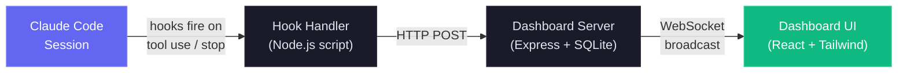

### User Interface

Comes with a sleek dark theme, responsive design, and intuitive navigation to explore your agent activity:

<p align="center">
  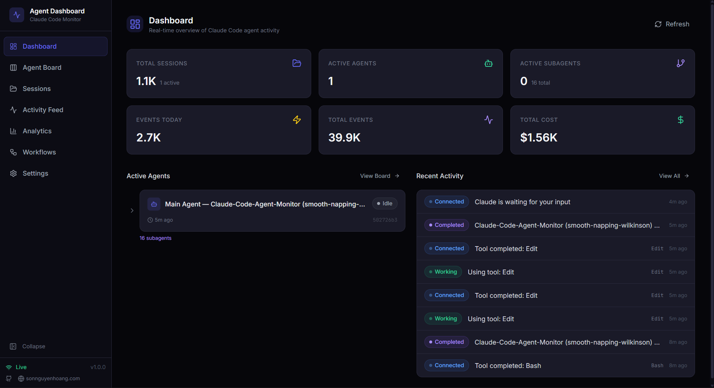
</p>

<p align="center">
  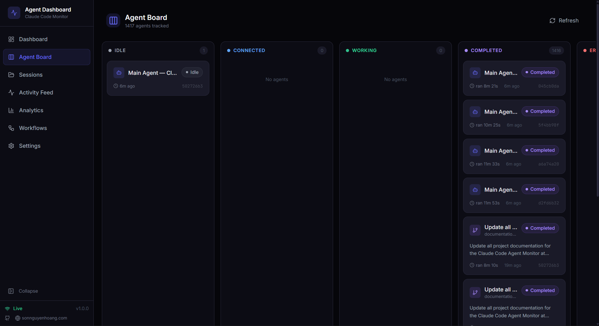
</p>

<p align="center">
  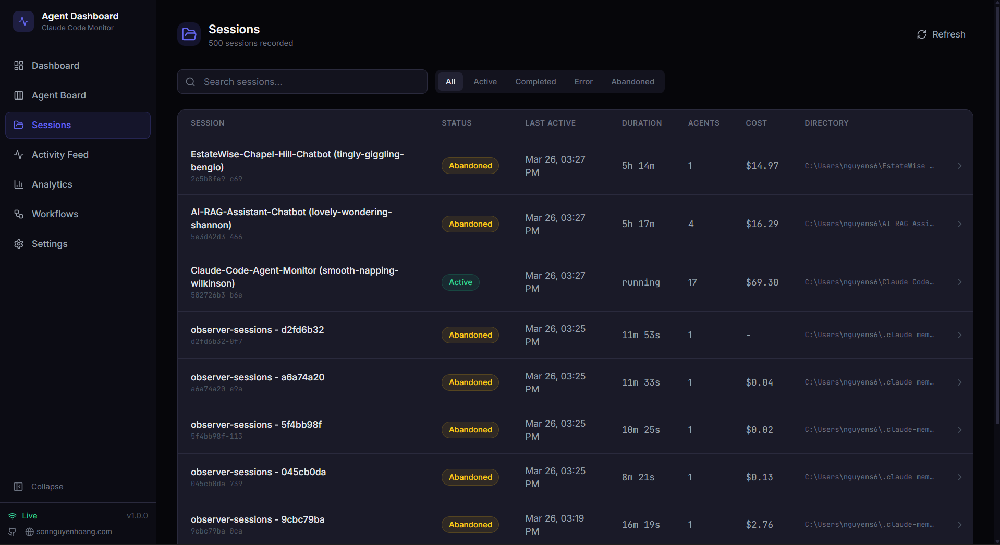
</p>

<p align="center">
  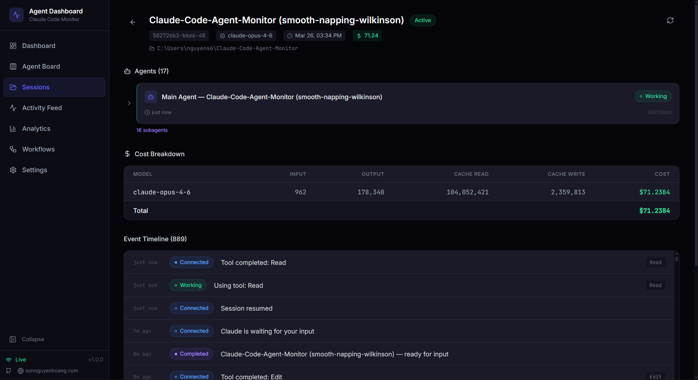
</p>

<p align="center">
  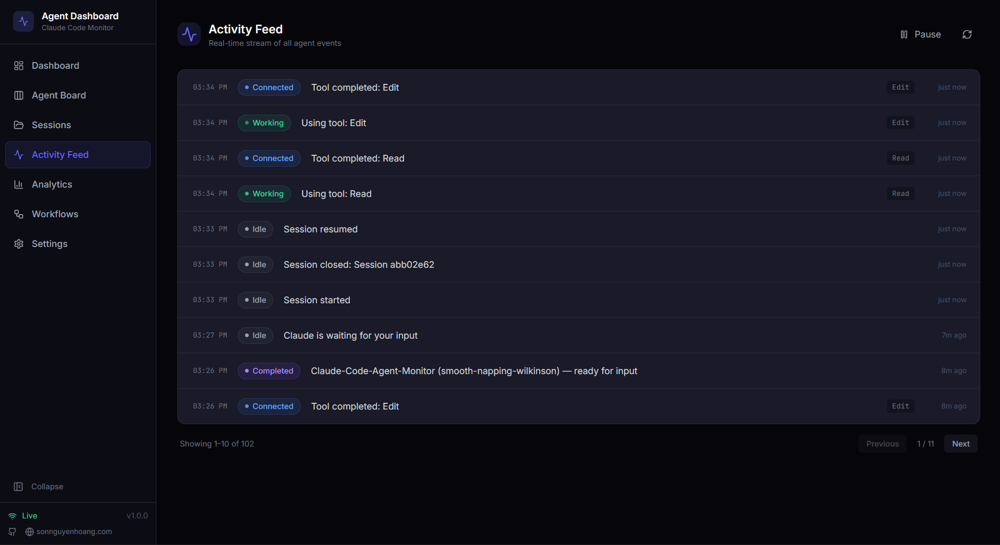
</p>

<p align="center">
  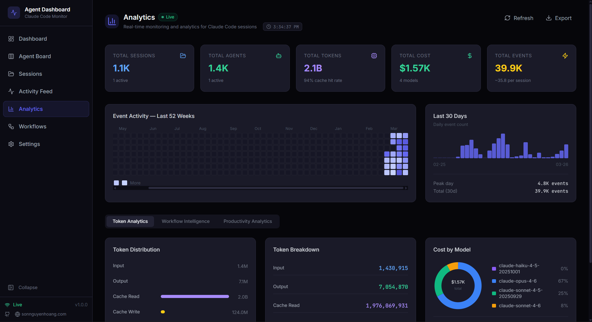
</p>

<p align="center">
  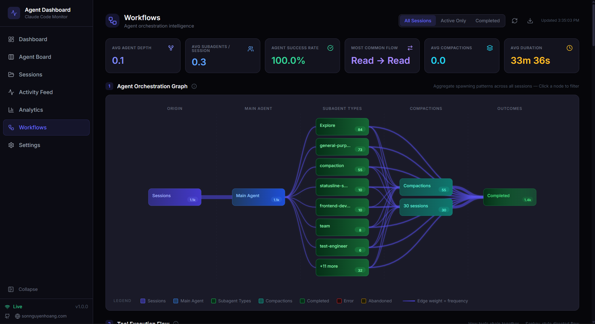
</p>

<p align="center">
  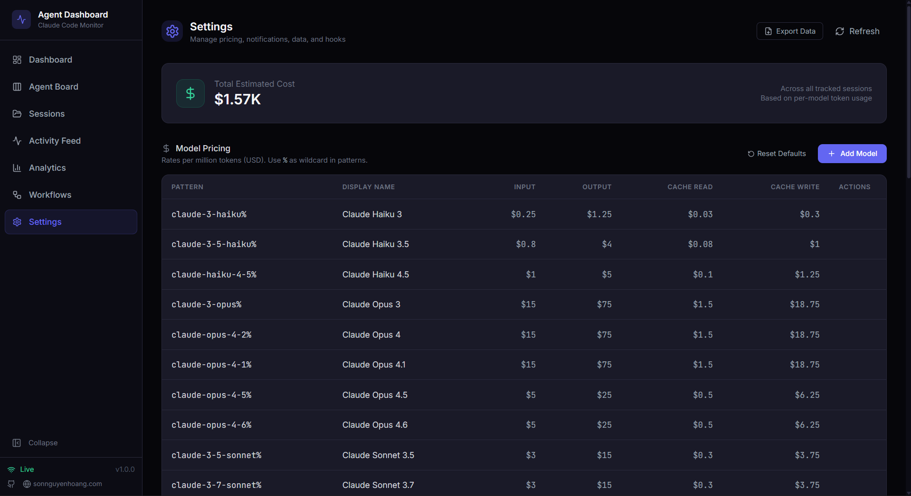
</p>

The sidebar provides quick access to the Dashboard, Kanban Board, Sessions list, Activity Feed, Analytics, Workflows, and Settings. Each page is designed to give you deep insights into your Claude Code agent activity with real-time updates and rich visualizations.

---

## Features

The dashboard offers a comprehensive set of features to monitor and analyze your Claude Code sessions and agents:

| Feature                            | Description                                                                                                                                                                                                                                                                  |
|------------------------------------|------------------------------------------------------------------------------------------------------------------------------------------------------------------------------------------------------------------------------------------------------------------------------|
| **Dashboard**                      | Overview stats, active agent cards with collapsible subagent hierarchy, recent activity feed                                                                                                                                                                                 |
| **Kanban Board**                   | 5-column agent status board with paginated columns, per-status fetching (no artificial limits)                                                                                                                                                                               |
| **Sessions**                       | Searchable, filterable, paginated table of all Claude Code sessions                                                                                                                                                                                                          |
| **Session Detail**                 | Per-session agent hierarchy tree (parent/child) and full event timeline                                                                                                                                                                                                      |
| **Activity Feed**                  | Real-time streaming event log with pause/resume and pagination                                                                                                                                                                                                               |
| **Analytics**                      | Token usage, tool frequency, activity heatmap, session trends, live/offline connection indicator                                                                                                                                                                             |
| **Live Updates**                   | WebSocket push -- no polling, instant UI updates                                                                                                                                                                                                                             |
| **Auto-Discovery**                 | Sessions and agents are created automatically from hook events                                                                                                                                                                                                               |
| **History Import**                 | Automatically imports legacy sessions from `~/.claude/` on server startup. Recently-modified JSONL files (< 10 min) are imported as "active" with idle agents, so sessions running before the server started appear immediately                                              |
| **Subagent Hierarchy**             | Collapsible parent-child agent tree on Dashboard and Session Detail. Agents with subagents show expand/collapse chevrons; leaf agents show a dot indicator. Auto-expands when subagents are active                                                                           |
| **Background Agents**              | Correctly tracks backgrounded subagents without premature completion                                                                                                                                                                                                         |
| **Cost Tracking**                  | Per-model cost estimation with configurable pricing rules and per-session breakdowns. Compaction-aware token accounting preserves totals across context compressions. Transcript reads are cached with incremental byte-offset updates for efficient token extraction        |
| **Notifications**                  | Browser notifications for session starts, completions, errors, and subagent spawns. Configurable per-event toggles with permission management                                                                                                                                |
| **Settings**                       | System info, hook status, model pricing management, notification preferences, data export, session cleanup                                                                                                                                                                   |
| **MCP Server (Local)**             | Enterprise-grade local MCP server in `mcp/` exposing dashboard operations as tools for Claude Code and other MCP hosts, with strict input schemas, retries/timeouts, localhost-only API target enforcement, and mutation/destructive safety gates                            |
| **Workflows**                      | D3.js-powered visualization page with 11 interactive sections: agent orchestration DAG, tool execution Sankey diagram, collaboration network, subagent effectiveness scorecards, detected workflow patterns, model delegation flow, error propagation map, concurrency timeline, session complexity scatter, compaction impact analysis, and per-session drill-in with agent tree and tool timeline. Cross-filtering, JSON export, and real-time WebSocket auto-refresh with 3-second debounce |
| **Compaction Tracking**            | Detects `/compact` events from JSONL transcripts, creates compaction agents and events. Backfills legacy compactions on startup. Periodic scanner catches compactions within 2 minutes even when no hooks fire. Shares the transcript cache so no duplicate file reads occur |
| **Subsessions/Resumed Sessions**   | Automatically reactivates sessions when new events arrive, correctly handles `/resume` and orphaned sessions. Periodic sweep (every 2 min) marks abandoned sessions that slip past event-based detection                                                                     |
| **Pre-Existing Session Detection** | Sessions already running when the server starts are imported as "active" (based on recent JSONL file modification). Stop events also reactivate imported completed/abandoned sessions, so the first hook from an in-progress session always surfaces it on the dashboard     |
| **Responsive Design**              | Mobile-friendly layouts with stacking grids, scrollable tables, and collapsible sidebar                                                                                                                                                                                      |
| **Seed Data**                      | Built-in seed script for demos and development                                                                                                                                                                                                                               |
| **Statusline**                     | Color-coded CLI statusline showing model, context usage, git branch, tokens                                                                                                                                                                                                  |

---

## Quick Start

### Prerequisites

- **Node.js** >= 18.0.0 (22+ recommended)
- **npm** >= 9.0.0

### 1. Install

```bash
git clone https://github.com/hoangsonww/Claude-Code-Agent-Monitor.git
cd Claude-Code-Agent-Monitor
npm run setup
```

### 2. Configure Claude Code Hooks

```bash
npm run install-hooks
```

This adds hook entries to `~/.claude/settings.json` that forward events to the dashboard. Existing hooks are preserved.

### 3. Start

```bash
# Development (hot reload on both server and client)
npm run dev

# Production (single process, built client)
npm run build && npm start
```

### 4. Open

| Mode        | URL                     |
| ----------- | ----------------------- |
| Development | `http://localhost:5173` |
| Production  | `http://localhost:4820` |

### 5. Optional: Build and run the local MCP server

```bash
npm run mcp:install
npm run mcp:build
npm run mcp:start
```

Then configure your MCP host (Claude Code / Claude Desktop / other MCP clients) to run:

- command: `node`
- args: `["<ABSOLUTE_PATH>/mcp/build/index.js"]`

See [mcp/README.md](./mcp/README.md) for full host configuration, safety flags, and tool catalog.

### Optional: Seed Demo Data

```bash
npm run seed
```

Creates 8 sample sessions, 23 agents, and 106 events so you can explore the UI immediately.

### Alternative: Docker / Podman

A `Dockerfile` and `docker-compose.yml` are included. Both Docker and Podman are supported.

**With Docker Compose:**

```bash
docker compose up -d --build
```

**With Podman Compose:**

```bash
CLAUDE_HOME="$HOME/.claude" podman compose up -d --build
```

**With plain Docker or Podman (no Compose):**

```bash
# Docker
docker build -t agent-monitor .
docker run -d --name agent-monitor \
  -p 4820:4820 \
  -v "$HOME/.claude:/root/.claude:ro" \
  -v agent-monitor-data:/app/data \
  agent-monitor

# Podman
podman build -t agent-monitor .
podman run -d --name agent-monitor \
  -p 4820:4820 \
  -v "$HOME/.claude:/root/.claude:ro" \
  -v agent-monitor-data:/app/data \
  agent-monitor
```

The dashboard is then available at `http://localhost:4820`.

**Volume mounts:**

| Mount | Purpose |
|---|---|
| `~/.claude:/root/.claude:ro` | Read legacy session history for import |
| `agent-monitor-data:/app/data` | Persist the SQLite database across restarts |

> [!IMPORTANT]
> **Note:** Claude Code hooks must still point to a running hook-handler process on the host. The container itself does not receive hooks — run `npm run install-hooks` on the host to configure hooks that POST to `http://localhost:4820`.

---

## How It Works

The dashboard integrates with Claude Code via its native hook system to provide real-time monitoring of agent activity. Here's an overview of the architecture and data flow:

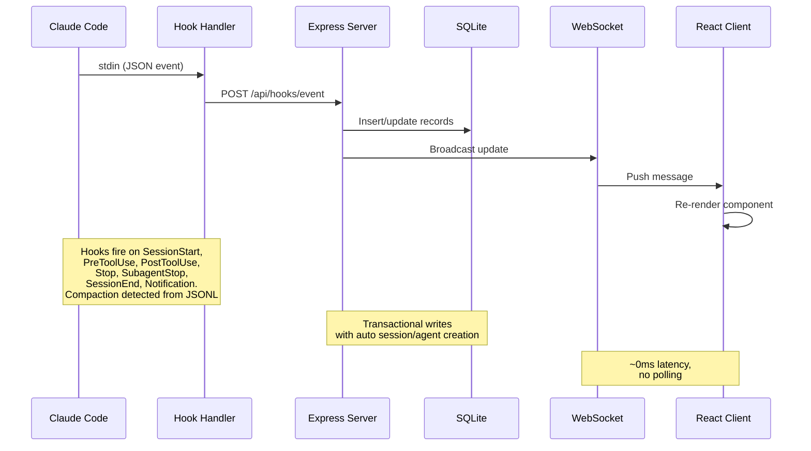

### Hook Lifecycle

1. **Claude Code** fires a hook on session start, tool use, turn end, subagent completion, and session exit
2. **Hook Handler** (`scripts/hook-handler.js`) reads the JSON event from stdin and POSTs it to the API. Fails silently with a 5s timeout so it never blocks Claude Code
3. **Server** processes the event inside a SQLite transaction:
   - Auto-creates sessions and main agents on first contact
   - Detects `Agent` tool calls to track subagent creation
   - Sets agent to "working" on `PreToolUse`, keeps it working through `PostToolUse`
   - On `Stop` (Claude finishes responding), main agent goes to "idle" — even on non-tool turns where Claude responds without invoking any tools, ensuring timestamps and activity logs stay accurate. Background subagents continue running. Session stays `active` — the user can send more messages
   - Marks subagents completed individually via `SubagentStop`
   - On `SessionEnd` (CLI process exits), marks all agents and the session as `completed`
   - On `SessionStart`, any other active session with no activity for 5+ minutes is automatically marked "abandoned" with its agents completed. This handles `/resume` inside a session, Ctrl+C, and other scenarios where a session is orphaned without a clean `SessionEnd`
   - Reactivates completed/error/abandoned sessions when new work events arrive (session resumed). Stop and SubagentStop events also reactivate completed/abandoned sessions — this handles pre-existing sessions imported before the server started, where the first hook event may be a Stop
   - Detects conversation compaction (`isCompactSummary` entries in the JSONL transcript) and creates `Compaction` agents + events. Token baselines are preserved across compactions so no usage is lost. Transcript reads use a shared stat-based cache with incremental byte-offset reads — only new bytes appended since the last read are parsed, giving ~50x speedup for long sessions
   - A periodic server sweep (every 2 min) catches abandoned sessions and new compactions that slipped past event-based detection (e.g., `/compact` fires no hook, `/resume` within seconds of session creation). The sweep shares the transcript cache with the hook handler, avoiding duplicate I/O. Abandoned session cleanup also evicts the transcript cache entry to bound memory
4. **WebSocket** broadcasts the change to all connected clients
5. **UI** receives the update and re-renders the affected components

### Agent State Machine

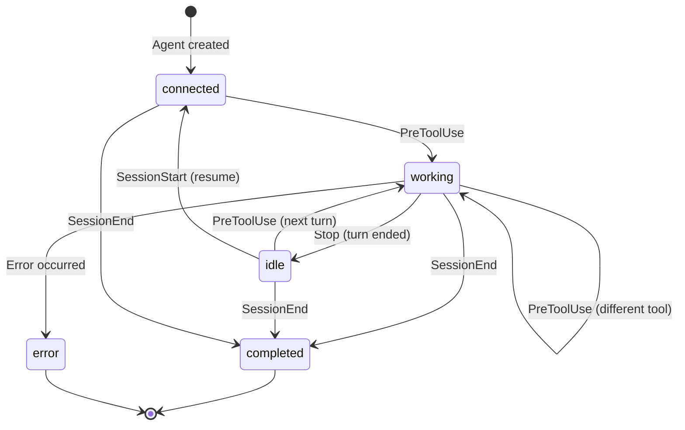

### Session State Machine

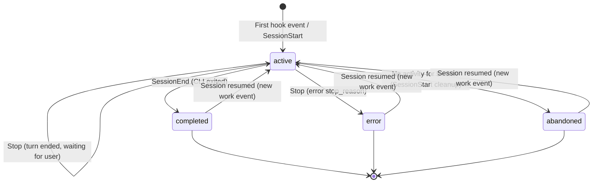

### Cost Calculation Flow

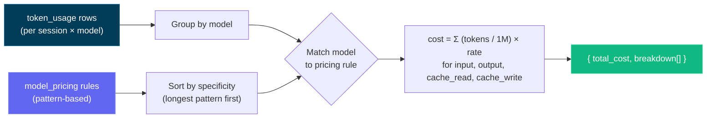

> [!IMPORTANT]
> The cost calculation flow is based on token usage and model pricing rules. Ensure your pricing rules are up-to-date to reflect accurate costs. Update the model pricing table via the Settings page to maintain accurate cost tracking - the dashboard does not automatically fetch pricing updates from external sources. Once you set the pricing rules, the dashboard applies them retroactively to all sessions for consistent cost reporting.

---

## Configuration

| Environment Variable    | Default       | Description                                   |
| ----------------------- | ------------- | --------------------------------------------- |
| `DASHBOARD_PORT`        | `4820`        | Port for the Express server                   |
| `CLAUDE_DASHBOARD_PORT` | `4820`        | Port used by hook handler to reach the server |
| `NODE_ENV`              | `development` | Set to `production` to serve the built client |

---

## npm Scripts

| Command                 | Description                                                |
| ----------------------- | ---------------------------------------------------------- |
| `npm run setup`         | Install server and client dependencies                     |
| `npm run dev`           | Start server (watch mode) + client (Vite HMR) concurrently |
| `npm run dev:server`    | Start only the Express server with `--watch`               |
| `npm run dev:client`    | Start only the Vite dev server                             |
| `npm run build`         | Build the React client to `client/dist/`                   |
| `npm start`             | Start production server (serves built client)              |
| `npm run install-hooks` | Configure Claude Code hooks in `~/.claude/settings.json`   |
| `npm run seed`          | Populate database with sample data                         |
| `npm run import-history`| Import legacy sessions from `~/.claude/` (also runs on startup) |
| `npm run clear-data`    | Delete all sessions, agents, events, and token usage            |
| `npm run mcp:install`   | Install dependencies for local MCP package (`mcp/`)       |
| `npm run mcp:build`     | Build MCP server TypeScript into `mcp/build/`             |
| `npm run mcp:start`     | Start MCP server from `mcp/build/index.js`                |
| `npm run mcp:dev`       | Run MCP server in dev mode (`tsx`)                        |
| `npm run mcp:typecheck` | Type-check MCP source without emitting build output        |
| `npm run mcp:docker:build` | Build MCP container image with Docker (`agent-dashboard-mcp:local`) |
| `npm run mcp:podman:build` | Build MCP container image with Podman (`localhost/agent-dashboard-mcp:local`) |
| `npm run codex:sync`    | Sync `codex/agents` + `codex/skills` into `.codex/agents` + `.agents/skills` |

---

## Agent Extensions

This repository now includes a comprehensive extension layer for both Claude Code and Codex:

- Claude Code: `CLAUDE.md`, `.claude/rules/`, `.claude/skills/`
- Claude subagents: `.claude/agents/`
- Codex: `AGENTS.md`, `codex/rules/`, `codex/agents/`, `codex/skills/`

### Extension Architecture

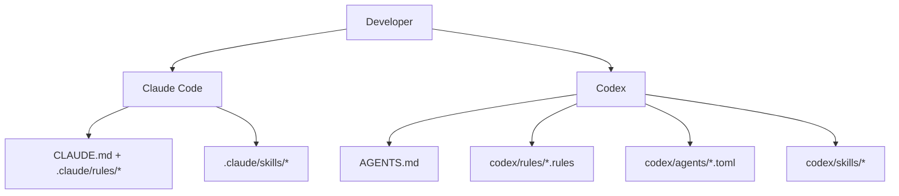

### Claude Code Layer

- Persistent context:
  - [`CLAUDE.md`](./CLAUDE.md)
- Path-scoped rules:
  - [`.claude/rules/backend-node.md`](./.claude/rules/backend-node.md)
  - [`.claude/rules/frontend-react.md`](./.claude/rules/frontend-react.md)
  - [`.claude/rules/mcp-typescript.md`](./.claude/rules/mcp-typescript.md)
  - [`.claude/rules/docs-markdown.md`](./.claude/rules/docs-markdown.md)
- Skills:
  - `repo-onboarding`
  - `ship-feature`
  - `mcp-operations`
  - `debug-live-issue`
- Subagents:
  - `backend-reviewer`
  - `frontend-reviewer`
  - `mcp-reviewer`

### Codex Layer

- Persistent context:
  - [`AGENTS.md`](./AGENTS.md)
- Execution policy:
  - [`codex/rules/default.rules`](./codex/rules/default.rules)
- Custom subagent templates:
  - [`codex/agents/`](./codex/agents)
- Skills:
  - [`codex/skills/`](./codex/skills)
- Activation instructions:
  - [`codex/README.md`](./codex/README.md)
  - quick sync: `npm run codex:sync`

---

## MCP Integration

This project includes a local, production-grade MCP server at `mcp/` that exposes dashboard operations as tools for AI agents.

### MCP Architecture

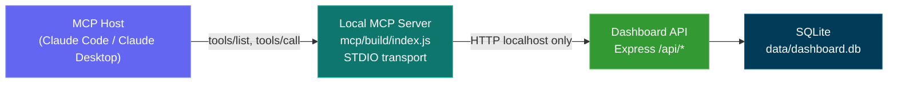

### MCP Tool Surface

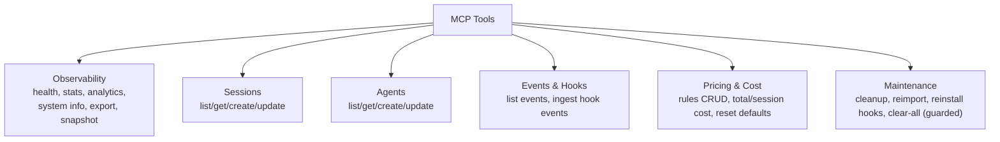

### MCP Operational Modes

- Read-only mode (default): `MCP_DASHBOARD_ALLOW_MUTATIONS=false`
- Admin mode: `MCP_DASHBOARD_ALLOW_MUTATIONS=true`
- Destructive mode: requires both:
  - `MCP_DASHBOARD_ALLOW_MUTATIONS=true`
  - `MCP_DASHBOARD_ALLOW_DESTRUCTIVE=true`
  - tool input `confirmation_token: "CLEAR_ALL_DATA"`

Full details: [mcp/README.md](./mcp/README.md)

---

## API Reference

All endpoints return JSON. Error responses follow the shape `{ error: { code, message } }`.

### Health

| Method | Path          | Description                           |
| ------ | ------------- | ------------------------------------- |
| `GET`  | `/api/health` | Returns `{ status: "ok", timestamp }` |

### Sessions

| Method  | Path                | Query Params                | Description                           |
| ------- | ------------------- | --------------------------- | ------------------------------------- |
| `GET`   | `/api/sessions`     | `status`, `limit`, `offset` | List sessions with agent counts       |
| `GET`   | `/api/sessions/:id` | --                          | Session detail with agents and events |
| `POST`  | `/api/sessions`     | --                          | Create session (idempotent on `id`)   |
| `PATCH` | `/api/sessions/:id` | --                          | Update session status/metadata        |

### Agents

| Method  | Path              | Query Params                              | Description                   |
| ------- | ----------------- | ----------------------------------------- | ----------------------------- |
| `GET`   | `/api/agents`     | `status`, `session_id`, `limit`, `offset` | List agents with filters      |
| `GET`   | `/api/agents/:id` | --                                        | Single agent detail           |
| `POST`  | `/api/agents`     | --                                        | Create agent                  |
| `PATCH` | `/api/agents/:id` | --                                        | Update agent status/task/tool |

### Events

| Method | Path          | Query Params                    | Description                |
| ------ | ------------- | ------------------------------- | -------------------------- |
| `GET`  | `/api/events` | `session_id`, `limit`, `offset` | List events (newest first) |

### Stats

| Method | Path         | Description                                            |
| ------ | ------------ | ------------------------------------------------------ |
| `GET`  | `/api/stats` | Aggregate counts, status distributions, WS connections |

### Hooks

| Method | Path               | Description                                  |
| ------ | ------------------ | -------------------------------------------- |
| `POST` | `/api/hooks/event` | Receive and process a Claude Code hook event |

**Hook event payload:**

```json
{
  "hook_type": "PreToolUse",
  "data": {
    "session_id": "abc-123",
    "tool_name": "Bash",
    "tool_input": { "command": "ls -la" }
  }
}
```

### Pricing

| Method   | Path                     | Description                              |
| -------- | ------------------------ | ---------------------------------------- |
| `GET`    | `/api/pricing`           | List all pricing rules                   |
| `PUT`    | `/api/pricing`           | Create or update a pricing rule          |
| `DELETE` | `/api/pricing/:pattern`  | Delete a pricing rule                    |
| `GET`    | `/api/pricing/cost`      | Total cost across all sessions           |
| `GET`    | `/api/pricing/cost/:id`  | Cost breakdown for a specific session    |

### Workflows

| Method | Path                          | Description                                             |
| ------ | ----------------------------- | ------------------------------------------------------- |
| `GET`  | `/api/workflows`              | Aggregate workflow data (orchestration, tools, patterns) |
| `GET`  | `/api/workflows/session/:id`  | Per-session drill-in (agent tree, tool timeline, events) |

### Settings

| Method | Path                           | Description                                      |
| ------ | ------------------------------ | ------------------------------------------------ |
| `GET`  | `/api/settings/info`           | System info, DB stats, hook status               |
| `POST` | `/api/settings/clear-data`     | Delete all sessions, agents, events, token usage |
| `POST` | `/api/settings/reinstall-hooks`| Reinstall Claude Code hooks                      |
| `POST` | `/api/settings/reset-pricing`  | Reset pricing to defaults                        |
| `GET`  | `/api/settings/export`         | Export all data as JSON download                 |
| `POST` | `/api/settings/cleanup`        | Abandon stale sessions, purge old data           |

### WebSocket

Connect to `ws://localhost:4820/ws` to receive real-time push messages:

```json
{
  "type": "agent_updated",
  "data": { "id": "...", "status": "working", "current_tool": "Edit" },
  "timestamp": "2026-03-05T15:43:01.800Z"
}
```

**Message types:** `session_created`, `session_updated`, `agent_created`, `agent_updated`, `new_event`

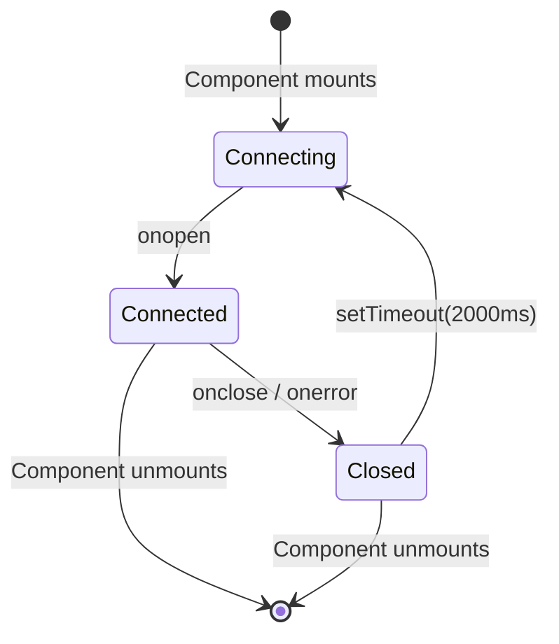

---

## Hook Events

The dashboard processes these Claude Code hook types:

| Hook Type      | Trigger                        | Dashboard Action                                                                             |
| -------------- | ------------------------------ | -------------------------------------------------------------------------------------------- |
| `SessionStart` | Claude Code session begins     | Creates session and main agent. Reactivates resumed sessions. Abandons orphaned sessions with no activity for 5+ minutes |
| `PreToolUse`   | Agent starts using a tool      | Sets agent to `working`, sets `current_tool`. If tool is `Agent`, creates subagent record    |
| `PostToolUse`  | Tool execution completed       | Clears `current_tool`. Agent stays `working` (no status change)                              |
| `Stop`         | Claude finishes responding     | Main agent to `idle` (even on non-tool turns). Background subagents keep running. Session stays `active` |
| `SubagentStop` | Background agent finished      | Matches and completes the subagent by description, type, or task                             |
| `Notification` | Agent notification             | Logs event. Compaction-related notifications are tagged as `Compaction` events. Triggers a browser notification if the user has notifications enabled |
| `SessionEnd`   | Claude Code CLI process exits  | Marks all agents and the session as `completed`                                              |
| `Compaction`   | `/compact` detected in JSONL   | Creates a compaction subagent (type `compaction`) and Compaction event. Detected via `isCompactSummary` entries in the transcript JSONL. Also detected by periodic scanner for active sessions |

---

## Browser Notifications

The dashboard supports native browser notifications for real-time alerts when you're not actively viewing the dashboard tab.

### How It Works

1. **Enable** notifications in the Settings page via the master toggle
2. **Grant** browser permission when prompted (required by the Web Notifications API)
3. **Configure** which events trigger notifications:

| Event                        | Default | Description                                                     |
| ---------------------------- | ------- | --------------------------------------------------------------- |
| New session starts           | On      | Fires when a new Claude Code session is created                 |
| Claude finished responding   | Off     | Fires on `Stop` events when Claude finishes a response turn     |
| Session closed               | Off     | Fires on `SessionEnd` when the CLI process exits                |
| Session errors               | On      | Fires when a session ends with an error                         |
| Subagent spawned             | Off     | Fires when a background subagent is created                     |

Additionally, any `Notification` hook event from Claude Code triggers a browser notification regardless of the per-event toggles (as long as the master toggle is enabled).

### Architecture

- **Preferences** are stored in `localStorage` under the key `agent-monitor-notifications`
- **`useNotifications` hook** subscribes to the WebSocket event bus at the app root level (`App.tsx`) and fires `new Notification()` calls based on the saved preferences
- **Permission management** is handled in the Settings page with visual indicators for granted/denied/prompt states
- **Test notification** button in Settings lets you verify the setup works
- No server-side component - notifications are entirely client-side, triggered by WebSocket messages

---

## Data Storage

- **Engine:** SQLite 3 via `better-sqlite3` (optional) or Node.js built-in `node:sqlite`
- **Location:** `data/dashboard.db`
- **Journal mode:** WAL (concurrent reads during writes)
- **Reset:** Delete `data/dashboard.db` to clear all data

### Entity Relationship Diagram

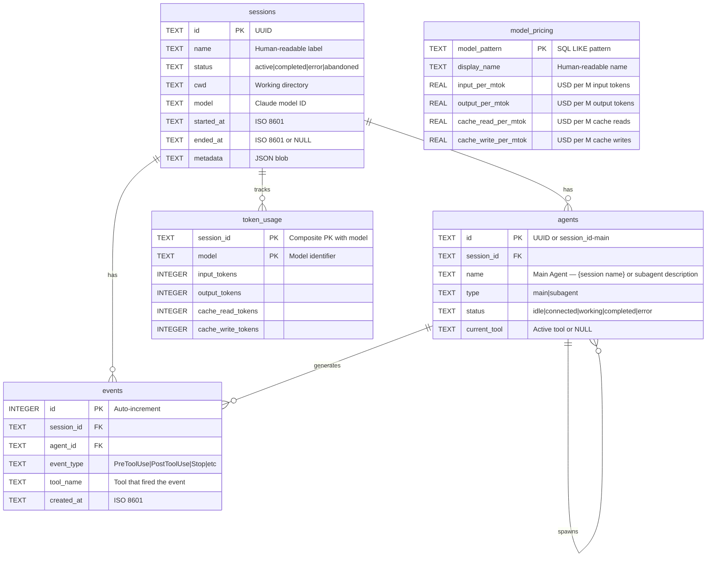

---

## Statusline

A standalone CLI statusline utility for Claude Code that displays model name, user, working directory, git branch, context window usage bar, and token counts -- all color-coded with ANSI escape sequences.

```
Sonnet 4.6 | nguyens6 | ~/agent-dashboard/client | main | ████████░░ 79% | 3↑ 2↓ 156586c
```

| Segment     | Color                | Example             |
| ----------- | -------------------- | ------------------- |
| Model       | Cyan                 | `Sonnet 4.6`        |
| User        | Green                | `nguyens6`          |
| CWD         | Yellow               | `~/agent-dashboard` |
| Git branch  | Magenta              | `main`              |
| Context bar | Green / Yellow / Red | `████████░░ 79%`    |
| Tokens      | Dim                  | `3↑ 2↓ 156586c`     |

See [`statusline/README.md`](statusline/README.md) for installation instructions.

<p align="center">
  
</p>

---

## Server Architecture

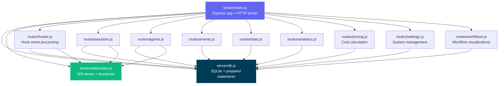

---

## Client Routing

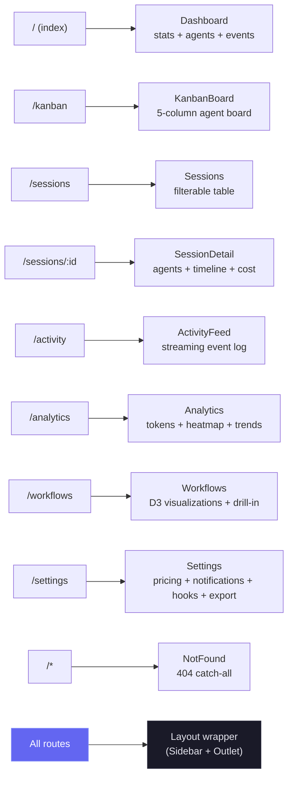

---

## Hook Handler Flow

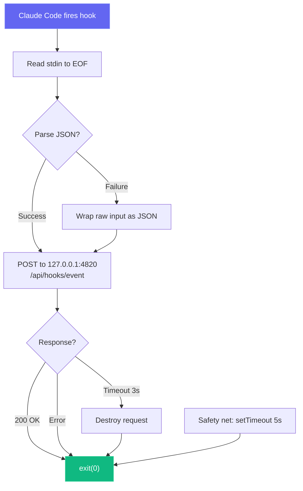

---

## Deployment Modes

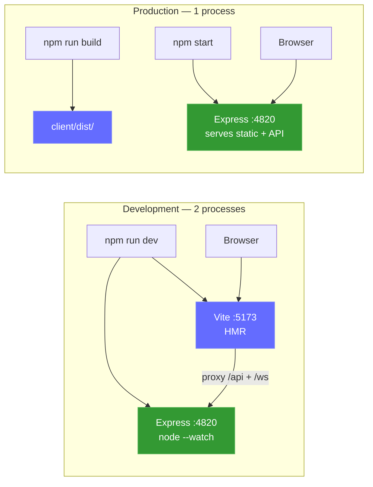

Optional local MCP sidecar:

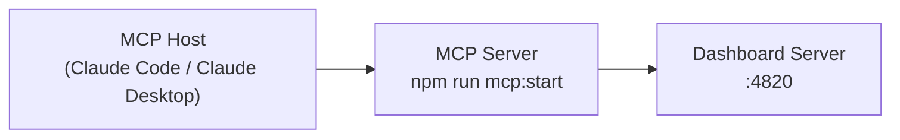

---

## Project Structure

```
agent-dashboard/
|-- CLAUDE.md                   # Claude Code project memory and working agreements
|-- AGENTS.md                   # Codex project instructions
|-- package.json                 # Root scripts (dashboard + MCP helpers) + server dependencies
|-- .claude/
|   +-- rules/                  # Path-scoped Claude rules
|   +-- skills/                 # Claude reusable project skills
|   +-- agents/                 # Claude custom subagents
|-- server/
|   |-- index.js                 # Express app, HTTP server, static serving
|   |-- db.js                    # SQLite schema, migrations, prepared statements
|   |-- websocket.js             # WebSocket server with heartbeat
|   +-- routes/
|       |-- hooks.js             # Hook event processing (transactional)
|       |-- sessions.js          # Session CRUD
|       |-- agents.js            # Agent CRUD
|       |-- events.js            # Event listing
|       |-- stats.js             # Aggregate statistics
|       |-- analytics.js         # Token, tool, and trend analytics
|       |-- workflows.js         # Aggregate workflow data and per-session drill-in
|       |-- pricing.js           # Model pricing CRUD and cost calculation
|       +-- settings.js          # System info, data management, export, cleanup
|   +-- lib/
|       +-- transcript-cache.js  # Stat-based JSONL transcript cache with incremental reads
|   +-- compat-sqlite.js         # node:sqlite compatibility wrapper (fallback for better-sqlite3)
|-- client/
|   |-- package.json             # Client dependencies
|   |-- index.html               # HTML entry point
|   |-- vite.config.ts           # Vite + proxy config
|   |-- tailwind.config.js       # Custom dark theme
|   |-- tsconfig.json            # Strict TypeScript
|   +-- src/
|       |-- main.tsx             # React entry
|       |-- App.tsx              # Router + WebSocket provider
|       |-- index.css            # Tailwind + custom utilities
|       |-- lib/
|       |   |-- types.ts         # Shared TypeScript interfaces
|       |   |-- api.ts           # Typed fetch client
|       |   |-- format.ts        # Date/time formatting utilities
|       |   +-- eventBus.ts      # Pub/sub for WebSocket distribution
|       |-- hooks/
|       |   |-- useWebSocket.ts     # Auto-reconnecting WebSocket hook
|       |   +-- useNotifications.ts # Browser notification triggers from WebSocket events
|       |-- components/
|       |   |-- Layout.tsx       # Shell with sidebar + outlet
|       |   |-- Sidebar.tsx      # Navigation + connection indicator
|       |   |-- AgentCard.tsx    # Agent info card with status
|       |   |-- StatCard.tsx     # Metric card
|       |   |-- StatusBadge.tsx  # Color-coded status pills
|       |   |-- EmptyState.tsx   # Placeholder for empty lists
|       |   +-- workflows/       # D3.js workflow visualization components
|       |       |-- OrchestrationDAG.tsx           # Horizontal DAG of agent spawning patterns
|       |       |-- ToolExecutionFlow.tsx           # d3-sankey diagram of tool-to-tool transitions
|       |       |-- AgentCollaborationNetwork.tsx   # Force-directed agent pipeline graph
|       |       |-- SubagentEffectiveness.tsx       # Scorecard grid with SVG success rings
|       |       |-- WorkflowPatterns.tsx            # Auto-detected orchestration sequences
|       |       |-- ModelDelegationFlow.tsx         # Model routing through agent hierarchies
|       |       |-- ErrorPropagationMap.tsx         # Error clustering by hierarchy depth
|       |       |-- ConcurrencyTimeline.tsx         # Swim-lane parallel agent execution
|       |       |-- SessionComplexityScatter.tsx    # D3 bubble chart (duration vs agents vs tokens)
|       |       |-- CompactionImpact.tsx            # Token compression events and recovery
|       |       |-- WorkflowStats.tsx               # Aggregate workflow statistics
|       |       +-- SessionDrillIn.tsx              # Per-session agent tree, tool timeline, events
|       +-- pages/
|           |-- Dashboard.tsx      # Overview page
|           |-- KanbanBoard.tsx    # Agent status columns
|           |-- Sessions.tsx       # Sessions table
|           |-- SessionDetail.tsx  # Single session deep dive
|           |-- ActivityFeed.tsx   # Real-time event stream
|           |-- Analytics.tsx      # Token usage, heatmap, trends
|           |-- Workflows.tsx      # D3.js workflow visualizations and session drill-in
|           |-- Settings.tsx       # Model pricing, notifications, hooks, export, cleanup
|           +-- NotFound.tsx       # 404 catch-all page
|-- scripts/
|   |-- hook-handler.js          # Lightweight stdin-to-HTTP forwarder
|   |-- install-hooks.js         # Auto-configures ~/.claude/settings.json
|   |-- import-history.js        # Imports legacy sessions from ~/.claude/
|   +-- seed.js                  # Sample data generator
|-- mcp/
|   |-- package.json             # MCP package scripts + dependencies
|   |-- README.md                # MCP setup, host config, tool catalog, safety model
|   |-- src/
|   |   |-- index.ts             # MCP runtime entrypoint
|   |   |-- server.ts            # MCP server assembly
|   |   |-- clients/             # Dashboard API client
|   |   |-- config/              # Environment/config parsing
|   |   |-- core/                # Logger/tool registry/result helpers
|   |   |-- policy/              # Mutation/destructive guards
|   |   |-- tools/               # Domain-specific tool modules
|   |   +-- types/               # Shared MCP type definitions
|   +-- build/                   # Built MCP runtime output
|-- codex/
|   |-- README.md                # Codex activation guide for agents and skills
|   |-- rules/                   # Codex execution policy rules
|   |-- agents/                  # Codex custom agent templates
|   +-- skills/                  # Codex project skills
|-- statusline/
|   |-- README.md                # Statusline installation & usage guide
|   |-- statusline.py            # Python script that renders the statusline
|   +-- statusline-command.sh    # Shell wrapper for Claude Code's statusLine config
+-- data/
    +-- dashboard.db             # SQLite database (gitignored)
```

---

## Troubleshooting

| Problem                           | Solution                                                                                                                                                         |
| --------------------------------- | ---------------------------------------------------------------------------------------------------------------------------------------------------------------- |
| `better-sqlite3` fails to install | This is non-fatal — the server falls back to Node.js built-in `node:sqlite` automatically (Node 22+). On older Node versions, install Python 3 and C++ build tools, then run `npm rebuild better-sqlite3` |
| Hooks not firing                  | Run `npm run install-hooks` and restart Claude Code. Verify hooks exist in `~/.claude/settings.json`                                                             |
| Dashboard shows no data           | Ensure the server is running (`npm run dev`) before starting a Claude Code session. Check `http://localhost:4820/api/health`                                     |
| WebSocket disconnected            | The client auto-reconnects every 2 seconds. Check that port 4820 is not blocked by a firewall                                                                    |
| Stale data after restart          | The database persists across restarts. Run `npm run seed` for fresh demo data, or delete `data/dashboard.db` to reset                                            |
| MCP tools fail to connect         | Confirm dashboard API is up on `MCP_DASHBOARD_BASE_URL` and rebuild/start MCP (`npm run mcp:build`, `npm run mcp:start`)                                         |

---

## License

MIT. See [LICENSE](LICENSE) for details.
