# Agent Dashboard for Claude Code

### Real-time monitoring platform for Claude Code agent activity

A professional dashboard to track and visualize your Claude Code agent sessions, tool usage, and subagent orchestration in real-time. Built with Node.js, Express, React, and SQLite, it integrates directly with Claude Code via its native hook system for seamless session tracking and analytics.


> [!TIP]
> See also: [README-CN.md](./README-CN.md) (中文版本) and [README-VI.md](./README-VI.md) (Phiên bản tiếng Việt) for localized documentation with region-specific tips and best practices.

---

## Table of Contents

- [Overview](#overview)
- [Internationalization (i18n)](#internationalization-i18n)
- [Features](#features)
- [Quick Start](#quick-start)
- [How It Works](#how-it-works)
- [Configuration](#configuration)
- [npm Scripts](#npm-scripts)
- [Plugin Marketplace](#plugin-marketplace)
- [Agent Extensions](#agent-extensions)
- [MCP Integration](#mcp-integration)
- [API Reference](#api-reference)
- [Hook Events](#hook-events)
- [Browser Notifications](#browser-notifications)
- [Update Notifier](#update-notifier)
- [VS Code Extension](#vs-code-extension)
- [Data Storage](#data-storage)
- [Statusline](#statusline)
- [Server Architecture](#server-architecture)
- [Client Routing](#client-routing)
- [Hook Handler Flow](#hook-handler-flow)
- [Deployment Modes](#deployment-modes)
- [Project Structure](#project-structure)
- [Troubleshooting](#troubleshooting)
- [License](#license)

---

## Overview

Track sessions, monitor agents in real-time, visualize tool usage, and observe subagent orchestration through a professional dark-themed web interface. Integrates directly with Claude Code via its native hook system.

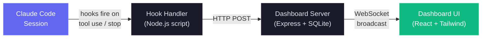

In addition to the real-time monitoring dashboard, it also includes a local MCP server implementation in `mcp/` that exposes a catalog of tools for introspecting and managing the dashboard itself, making it easy to integrate dashboard operations directly into your Claude Code workflows. There is also an agent extension layer, which provides Claude Code plugins, skills, and subagents for dashboard interaction, analytics, and workflow intelligence.

<a href="https://www.star-history.com/?repos=hoangsonww%2FClaude-Code-Agent-Monitor&type=date&legend=top-left">
 <picture>
   <source media="(prefers-color-scheme: dark)" srcset="https://api.star-history.com/chart?repos=hoangsonww/Claude-Code-Agent-Monitor&type=date&theme=dark&legend=top-left" />
   <source media="(prefers-color-scheme: light)" srcset="https://api.star-history.com/chart?repos=hoangsonww/Claude-Code-Agent-Monitor&type=date&legend=top-left" />
   
 </picture>
</a>

### Internationalization (i18n)

The UI ships with built-in locale switching for English (`en`), Chinese (`zh`), and Vietnamese (`vi`). Language resources are loaded by namespace and persisted through browser storage for stable user preference across refreshes.

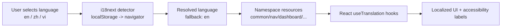

For full architecture and operational guidance, see [docs/I18N.md](./docs/I18N.md).

### User Interface

Comes with a sleek dark theme, responsive design, and intuitive navigation to explore your agent activity:

<p align="center">
  
  <br>
  <em>📡 <strong>Dashboard</strong> — overview stats, active agent cards, and recent activity feed</em>
</p>

<p align="center">
  
  <br>
  <em>📋 <strong>Kanban Board (agents)</strong> — agents grouped by status across 5 columns: Idle / Connected / Working / Completed / Error</em>
</p>

<p align="center">
  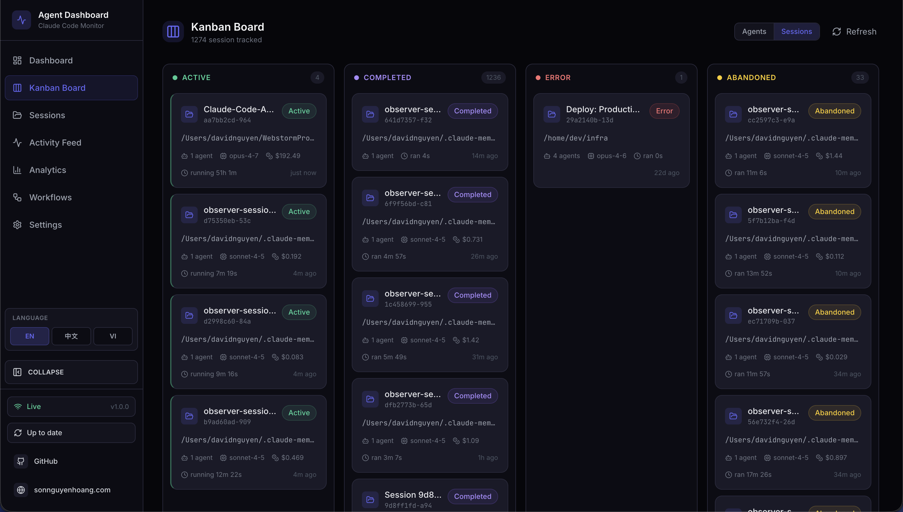
  <br>
  <em>🗂️ <strong>Kanban Board (sessions)</strong> — sessions grouped by status: Active / Completed / Error / Abandoned, toggleable from the same page</em>
</p>

<p align="center">
  
  <br>
  <em>📂 <strong>Sessions</strong> — searchable, filterable, server-paginated table of every recorded session with cost, model, agent count, and duration</em>
</p>

<p align="center">
  
  <br>
  <em>🔬 <strong>Session Detail</strong> — full agent hierarchy tree and chronological event timeline with multi-dimension filters and tool-aware payload renderers</em>
</p>

<p align="center">
  
  <br>
  <em>📰 <strong>Activity Feed</strong> — real-time event log with pause / resume, grouping, multi-dimension filters, and a "Session →" jump button per row</em>
</p>

<p align="center">
  
  <br>
  <em>📊 <strong>Analytics</strong> — token usage by model, tool frequency, activity heatmap, and session trends with live / offline indicator</em>
</p>

<p align="center">
  
  <br>
  <em>🔀 <strong>Workflows</strong> — agent orchestration DAGs, tool execution Sankey diagrams, collaboration networks, and 11 interactive sections of workflow intelligence</em>
</p>

<p align="center">
  
  <br>
  <em>⚙️ <strong>Settings</strong> — model pricing rules, hook installation status, data management, notification preferences, and system info</em>
</p>

The sidebar provides quick access to the Dashboard, Kanban Board, Sessions list, Activity Feed, Analytics, Workflows, and Settings. Each page is designed to give you deep insights into your Claude Code agent activity with real-time updates and rich visualizations.

---

## Features

The dashboard offers a comprehensive set of features to monitor and analyze your Claude Code sessions and agents:

| Feature                            | Description                                                                                                                                                                                                                                                                  |
|------------------------------------|------------------------------------------------------------------------------------------------------------------------------------------------------------------------------------------------------------------------------------------------------------------------------|
| **Dashboard**                      | Overview stats, active agent cards with collapsible subagent hierarchy, recent activity feed                                                                                                                                                                                 |
| **Kanban Board**                   | Two views with a header toggle (persisted in `localStorage`): **Agents** — 5 columns (Idle / Connected / Working / Completed / Error) — and **Sessions** — 4 columns (Active / Completed / Error / Abandoned). Each column fetches its own status from the server (effectively unlimited per status), then paginates client-side at 10 cards per column with a "Show more" affordance. WS subscription scopes to the active view (`agent_*` vs `session_*` frames) so off-view updates don't trigger refetches |
| **Sessions**                       | Searchable, filterable, **server-paginated** table of every recorded session. Each page click hits `/api/sessions?status=&q=&limit=10&offset=…`, so cost computation runs only over the visible page — independent of how many sessions exist in the database. The search box (`q=`) does case-insensitive matching across `id` / `name` / `cwd` on the server with a 300 ms debounce, and the response carries a `total` count for the paginator UI. Status filter, search, and pagination compose. |
| **Session Detail**                 | Per-session agent hierarchy tree and full event timeline with multi-dimension filters (status, event type, tool, agent, text search, date range), Pre/Post grouping by `tool_use_id`, human-readable summary block, and tool-aware input/response renderers (terminal for Bash, unified diff for Edit, line-numbered code for Read/Write, match list for Grep, key/value card for MCP tools) |
| **Activity Feed**                  | Real-time streaming event log with pause/resume, multi-dimension filters (same toolbar as Session Detail plus a Session filter), server-driven "Load more" pagination, debounced filter-aware live refresh preserving the loaded page size, grouping toggle, origin prefix showing project › session › subagent, and a "Session →" button per row                                         |
| **Analytics**                      | Token usage, tool frequency, activity heatmap (centered, day-of-week aligned starting Sunday, day-name tooltips), session trends, live/offline connection indicator                                                                                                           |
| **Live Updates**                   | WebSocket push -- no polling, instant UI updates                                                                                                                                                                                                                             |
| **Auto-Discovery**                 | Sessions and agents are created automatically from hook events                                                                                                                                                                                                               |
| **History Import**                 | Imports sessions from `~/.claude/` on startup. Enhanced JSONL extraction: API errors (quota/rate/invalid_request), turn durations, entrypoint (cli/sdk-ts), permission modes, thinking block counts, usage extras (service_tier, speed, inference_geo), tool result errors, and subagent JSONL files (`subagents/agent-*.jsonl` with `.meta.json`). Backfills existing sessions on re-import. Recent JSONL files (< 10 min) are imported as "active" |
| **Subagent Hierarchy**             | Collapsible parent-child agent tree on Dashboard and Session Detail. Agents with subagents show expand/collapse chevrons; leaf agents show a dot indicator. Auto-expands when subagents are active                                                                           |
| **Background Agents**              | Correctly tracks backgrounded subagents without premature completion                                                                                                                                                                                                         |
| **Cost Tracking**                  | Per-model cost estimation with configurable pricing rules and per-session breakdowns. Compaction-aware token accounting preserves totals across context compressions. Transcript reads are cached with incremental byte-offset updates for efficient token extraction        |
| **Transcript Cache**               | Real-time extraction from JSONL transcripts: tokens, compactions, API errors (`isApiErrorMessage` entries stored as `APIError` events), turn durations (stored as `TurnDuration` events), thinking block counts, and usage extras (service_tier, speed, inference_geo). Session metadata is enriched with these fields in real-time |
| **Notifications**                  | Full Web Push (VAPID) pipeline for reliable delivery. Arrive even when the tab is backgrounded or the browser is closed. Explicitly configured for macOS audio support. Configurable per-event toggles with subscription management |
| **Update Notifier**                | Server periodically runs a non-blocking `git fetch` and compares the local checkout to `origin/master`/`origin/main`/`origin/HEAD`. When upstream is ahead, the UI surfaces a modal with the exact `git pull && npm run setup` command and a one-click **Copy** button; the Sidebar gets a persistent "Check for updates" button with live badge. The dashboard never pulls or restarts itself — the user runs the command in a terminal — so the mechanism cannot break dev sessions, pm2/systemd/Docker supervision, or leave orphaned processes |
| **Settings**                       | System info, hook status, model pricing management, notification preferences, data export, session cleanup                                                                                                                                                                   |
| **MCP Server (Local)**             | Enterprise-grade local MCP server in `mcp/` with three transport modes (stdio, HTTP+SSE, interactive REPL), 25 typed tools across 6 domains, strict input schemas, retry/backoff, localhost-only API enforcement, and tiered mutation/destructive safety gates. HTTP mode serves Streamable HTTP (2025-11-25) and legacy SSE (2024-11-05) on configurable port. REPL mode provides tab-completed interactive tool invocation with colored output |
| **Workflows**                      | D3.js-powered visualization page with 11 interactive sections: agent orchestration DAG, tool execution Sankey diagram, collaboration network, subagent effectiveness (day-of-week charts with rich tooltips), detected workflow patterns, model delegation flow, error propagation map (horizontal bars with rate badges, agent type breakdown, API/session error cards), concurrency timeline, session complexity scatter, compaction impact analysis, and per-session drill-in. Status filter tabs (Active Only / Completed / All) filter all 11 sections. Cross-filtering, JSON export, and real-time WebSocket auto-refresh with 3-second debounce |
| **Compaction Tracking**            | Detects `/compact` events from JSONL transcripts, creates compaction agents and events. Backfills legacy compactions on startup. Periodic scanner catches compactions within 2 minutes even when no hooks fire. Shares the transcript cache so no duplicate file reads occur |
| **Subsessions/Resumed Sessions**   | Automatically reactivates sessions when new events arrive, correctly handles `/resume` and orphaned sessions. Periodic sweep (every 2 min) marks abandoned sessions that slip past event-based detection                                                                     |
| **Pre-Existing Session Detection** | Sessions already running when the server starts are imported as "active" (based on recent JSONL file modification). Stop events also reactivate imported completed/abandoned sessions, so the first hook from an in-progress session always surfaces it on the dashboard     |
| **Responsive Design**              | Mobile-friendly layouts with stacking grids, scrollable tables, and collapsible sidebar                                                                                                                                                                                      |
| **UI Localization**                | Built-in language switching with translated UI copy and accessibility labels for English (`en`), Chinese (`zh`), and Vietnamese (`vi`)                                                                                                                                       |
| **Seed Data**                      | Built-in seed script for demos and development                                                                                                                                                                                                                               |
| **Statusline**                     | Color-coded CLI statusline showing model, context usage, git branch, per-direction tokens, and session cost (USD)                                                                                                                                                            |
| **Plugin Marketplace**             | Official Claude Code plugin marketplace with 5 plugins (ccam-analytics, ccam-productivity, ccam-devtools, ccam-insights, ccam-dashboard). 18 skills, 4 agents, 3 CLI tools, 2 hook configs. All grounded in actual data model — token baselines, pricing engine, workflow intelligence (11 datasets), session metadata. Install via `claude plugin marketplace add` |

---

## Quick Start

### Prerequisites

- **Node.js** >= 18.0.0 (22+ recommended)
- **npm** >= 9.0.0

### 1. Install

```bash
git clone https://github.com/hoangsonww/Claude-Code-Agent-Monitor.git
cd Claude-Code-Agent-Monitor
npm run setup
```

### 2. Configure Claude Code Hooks

```bash
npm run install-hooks
```

This adds hook entries to `~/.claude/settings.json` that forward events to the dashboard. Existing hooks are preserved.

### 3. Start

```bash
# Development (hot reload on both server and client)
npm run dev

# Production (single process, built client)
npm run build && npm start
```

> [!TIP]
> **Makefile alternative** — all commands are also available via `make` if you have it installed on your system. Run `make help` to see every target, or use shortcuts like `make dev`, `make build`, `make test`, etc.

### 4. Open

| Mode        | URL                     |
| ----------- | ----------------------- |
| Development | `http://localhost:5173` |
| Production  | `http://localhost:4820` |

### 5. Optional: Build and run the local MCP server

```bash
npm run mcp:install
npm run mcp:build
npm run mcp:start              # stdio (default — for MCP host integration)
npm run mcp:start:http         # HTTP + SSE server on port 8819
npm run mcp:start:repl         # interactive CLI with tab completion
```

For stdio mode, configure your MCP host (Claude Code / Claude Desktop / other MCP clients):

- command: `node`
- args: `["<ABSOLUTE_PATH>/mcp/build/index.js"]`

For HTTP mode, point remote MCP clients at `http://127.0.0.1:8819/mcp` (Streamable HTTP) or `http://127.0.0.1:8819/sse` (legacy SSE).

See [mcp/README.md](./mcp/README.md) for full host configuration, transport details, safety flags, and tool catalog.

### Optional: Seed Demo Data

```bash
npm run seed
```

Creates 8 sample sessions, 23 agents, and 106 events so you can explore the UI immediately.

### Alternative: Docker / Podman

A `Dockerfile` and `docker-compose.yml` are included. Both Docker and Podman are supported.

**With Docker Compose:**

```bash
docker compose up -d --build
```

**With Podman Compose:**

```bash
CLAUDE_HOME="$HOME/.claude" podman compose up -d --build
```

**With plain Docker or Podman (no Compose):**

```bash
# Docker
docker build -t agent-monitor .
docker run -d --name agent-monitor \
  -p 4820:4820 \
  -v "$HOME/.claude:/root/.claude:ro" \
  -v agent-monitor-data:/app/data \
  agent-monitor

# Podman
podman build -t agent-monitor .
podman run -d --name agent-monitor \
  -p 4820:4820 \
  -v "$HOME/.claude:/root/.claude:ro" \
  -v agent-monitor-data:/app/data \
  agent-monitor
```

The dashboard is then available at `http://localhost:4820`.

**Volume mounts:**

| Mount | Purpose |
|---|---|
| `~/.claude:/root/.claude:ro` | Read legacy session history for import |
| `agent-monitor-data:/app/data` | Persist the SQLite database across restarts |

> [!IMPORTANT]
> **Note:** Claude Code hooks must still point to a running hook-handler process on the host. The container itself does not receive hooks — run `npm run install-hooks` on the host to configure hooks that POST to `http://localhost:4820`.

---

## How It Works

The dashboard integrates with Claude Code via its native hook system to provide real-time monitoring of agent activity. Here's an overview of the architecture and data flow:

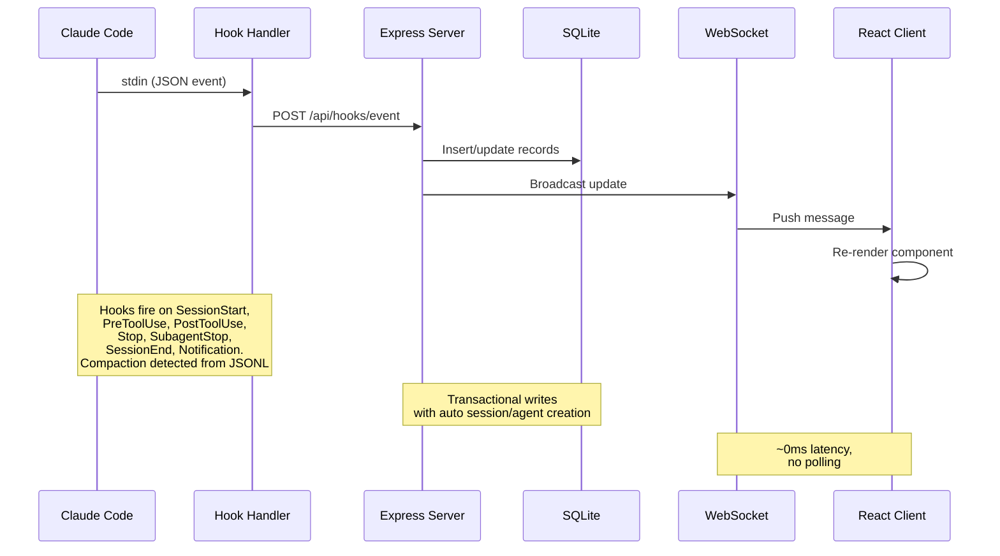

> [!IMPORTANT]
> See [ARCHITECTURE.md](./ARCHITECTURE.md) for a deep dive into the server architecture, database schema, API routes, WebSocket design, client routing, hook handler flow, deployment modes, and detailed lifecycle diagrams for sessions and agents.

### Hook Lifecycle

1. **Claude Code** fires a hook on session start, tool use, turn end, subagent completion, and session exit
2. **Hook Handler** (`scripts/hook-handler.js`) reads the JSON event from stdin and POSTs it to the API. Fails silently with a 5s timeout so it never blocks Claude Code
3. **Server** processes the event inside a SQLite transaction:
   - Auto-creates sessions and main agents on first contact
   - Detects `Agent` tool calls to track subagent creation
   - Sets agent to "working" on `PreToolUse`, keeps it working through `PostToolUse`
   - On `Stop` (Claude finishes responding), main agent goes to "idle" — even on non-tool turns where Claude responds without invoking any tools, ensuring timestamps and activity logs stay accurate. Background subagents continue running. Session stays `active` — the user can send more messages
   - Marks subagents completed individually via `SubagentStop`
   - On `SessionEnd` (CLI process exits), marks all agents and the session as `completed`
   - On `SessionStart`, any other active session with no activity for 5+ minutes is automatically marked "abandoned" with its agents completed. This handles `/resume` inside a session, Ctrl+C, and other scenarios where a session is orphaned without a clean `SessionEnd`
   - Reactivates completed/error/abandoned sessions when new work events arrive (session resumed). Stop and SubagentStop events also reactivate completed/abandoned sessions — this handles pre-existing sessions imported before the server started, where the first hook event may be a Stop
   - Detects conversation compaction (`isCompactSummary` entries in the JSONL transcript) and creates `Compaction` agents + events. Token baselines are preserved across compactions so no usage is lost. Transcript reads use a shared stat-based cache with incremental byte-offset reads — only new bytes appended since the last read are parsed, giving ~50x speedup for long sessions
   - Extracts API errors (`isApiErrorMessage` entries: quota limits, rate limits, invalid_request) and raw `type: "error"` responses from JSONL transcripts, stored as `APIError` events. Turn durations (`system` subtype `turn_duration`) are stored as `TurnDuration` events. Tool result errors (`toolUseResult.is_error`) are tracked as `ToolError` events
   - A periodic server sweep (every 2 min) catches abandoned sessions and new compactions that slipped past event-based detection (e.g., `/compact` fires no hook, `/resume` within seconds of session creation). The sweep shares the transcript cache with the hook handler, avoiding duplicate I/O. Abandoned session cleanup also evicts the transcript cache entry to bound memory
4. **WebSocket** broadcasts the change to all connected clients
5. **UI** receives the update and re-renders the affected components in real-time with no polling.

### Agent State Machine

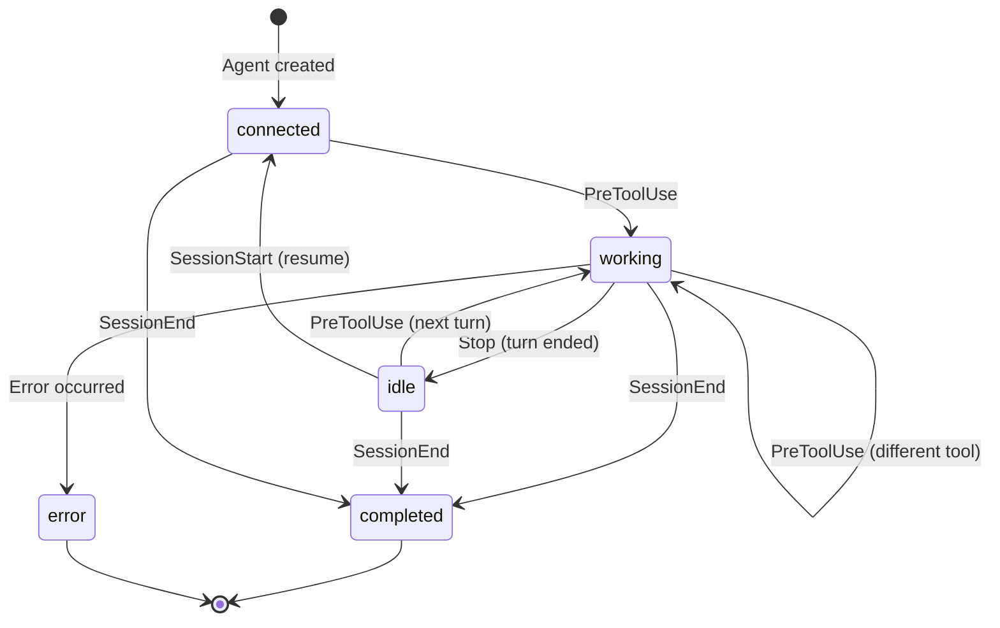

### Session State Machine

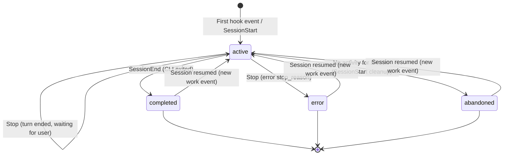

### Cost Calculation Flow

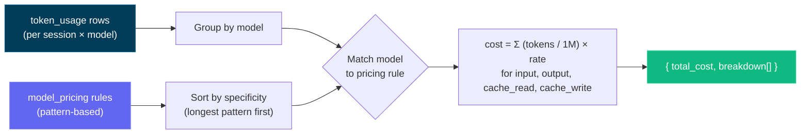

> [!IMPORTANT]
> The cost calculation flow is based on token usage and model pricing rules. Ensure your pricing rules are up-to-date to reflect accurate costs. Update the model pricing table via the Settings page to maintain accurate cost tracking - the dashboard does not automatically fetch pricing updates from external sources. Once you set the pricing rules, the dashboard applies them retroactively to all sessions for consistent cost reporting.

---

## Configuration

| Environment Variable    | Default       | Description                                   |
| ----------------------- | ------------- | --------------------------------------------- |
| `DASHBOARD_PORT`        | `4820`        | Port for the Express server                   |
| `CLAUDE_DASHBOARD_PORT` | `4820`        | Port used by hook handler to reach the server |
| `NODE_ENV`              | `development` | Set to `production` to serve the built client |
| `DASHBOARD_UPDATE_CHECK` | _(enabled)_ | Set to `0` / `false` / `off` to disable periodic git upstream checks |
| `DASHBOARD_UPDATE_CHECK_INTERVAL_MS` | `300000` (5 min) | Interval between automatic checks; floor 60 000 ms. Users can also click **Check now** in the update modal or in the sidebar to run one on demand. |

For git clones, the server periodically `git fetch`es `origin` and compares your checkout to `origin/master`, `origin/main`, or `origin/HEAD`. When you are behind, a message appears in the server terminal and a modal appears in the UI with the exact command to run. The dashboard never pulls or restarts itself — you copy the command, run it in a terminal, then restart the server the same way you started it.

---

## npm Scripts

| Command                 | Description                                                |
| ----------------------- | ---------------------------------------------------------- |
| `npm run setup`         | Install server and client dependencies                     |
| `npm run update:pull-setup` | `git pull --ff-only` then `npm run setup` (manual upgrade) |
| `npm run dev`           | Start server (watch mode) + client (Vite HMR) concurrently |
| `npm run dev:server`    | Start only the Express server with `--watch`               |
| `npm run dev:client`    | Start only the Vite dev server                             |
| `npm run build`         | Build the React client to `client/dist/`                   |
| `npm start`             | Start production server (serves built client)              |
| `npm run install-hooks` | Configure Claude Code hooks in `~/.claude/settings.json`   |
| `npm run seed`          | Populate database with sample data                         |
| `npm run import-history`| Import legacy sessions from `~/.claude/` (also runs on startup) |
| `npm run clear-data`    | Delete all sessions, agents, events, and token usage            |
| `npm run mcp:install`   | Install dependencies for local MCP package (`mcp/`)       |
| `npm run mcp:build`     | Build MCP server TypeScript into `mcp/build/`             |
| `npm run mcp:start`     | Start MCP server (stdio transport — for MCP hosts)        |
| `npm run mcp:start:http`| Start MCP server (HTTP + SSE transport on port 8819)      |
| `npm run mcp:start:repl`| Start MCP server (interactive REPL with tab completion)   |
| `npm run mcp:dev`       | Run MCP server in dev mode (`tsx`, stdio)                 |
| `npm run mcp:dev:http`  | Run MCP server in dev mode (`tsx`, HTTP + SSE)            |
| `npm run mcp:dev:repl`  | Run MCP server in dev mode (`tsx`, interactive REPL)      |
| `npm run mcp:typecheck` | Type-check MCP source without emitting build output        |
| `npm run mcp:docker:build` | Build MCP container image with Docker (`agent-dashboard-mcp:local`) |
| `npm run mcp:podman:build` | Build MCP container image with Podman (`localhost/agent-dashboard-mcp:local`) |

---

## Agent Extensions

This repository includes a comprehensive extension layer for both Claude Code and Codex:

- Claude Code: `CLAUDE.md`, `.claude/rules/`, `.claude/skills/`
- Claude subagents: `.claude/agents/`
- Codex: `AGENTS.md`, `.codex/rules/`, `.codex/agents/`, `.codex/skills/`

### Extension Architecture

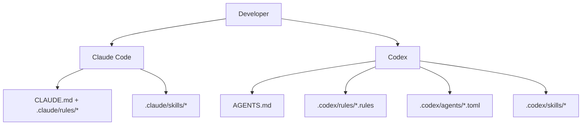

### Claude Code Layer

- Persistent context:
  - [`CLAUDE.md`](./CLAUDE.md)
- Path-scoped rules:
  - [`.claude/rules/backend-node.md`](./.claude/rules/backend-node.md)
  - [`.claude/rules/frontend-react.md`](./.claude/rules/frontend-react.md)
  - [`.claude/rules/mcp-typescript.md`](./.claude/rules/mcp-typescript.md)
  - [`.claude/rules/docs-markdown.md`](./.claude/rules/docs-markdown.md)
- Skills:
  - `repo-onboarding`
  - `ship-feature`
  - `mcp-operations`
  - `debug-live-issue`
- Subagents:
  - `backend-reviewer`
  - `frontend-reviewer`
  - `mcp-reviewer`

### Codex Layer

- Persistent context:
  - [`AGENTS.md`](./AGENTS.md)
- Execution policy:
  - [`.codex/rules/default.rules`](./.codex/rules/default.rules)
- Custom subagent templates:
  - [`.codex/agents/`](./.codex/agents)
- Skills:
  - [`.codex/skills/`](./.codex/skills)
- Setup:
  - [`.codex/README.md`](./.codex/README.md)

---

## MCP Integration

This project includes a local, production-grade MCP server at `mcp/` that exposes dashboard operations as tools for AI agents. It supports three transport modes to suit different integration scenarios.

### MCP Transport Modes

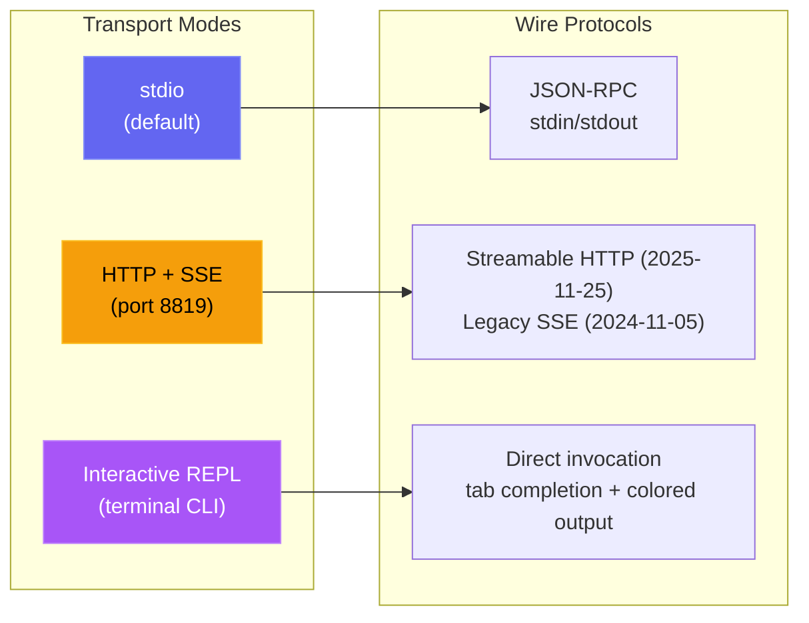

| Mode | Command | Use Case |
| --- | --- | --- |
| **stdio** | `npm run mcp:start` | Claude Code, Claude Desktop, IDE MCP hosts |
| **HTTP** | `npm run mcp:start:http` | Remote MCP clients, web integrations, multi-session |
| **REPL** | `npm run mcp:start:repl` | Ops debugging, manual tool invocation, local admin |

<p align="center">
  
</p>

### MCP Architecture

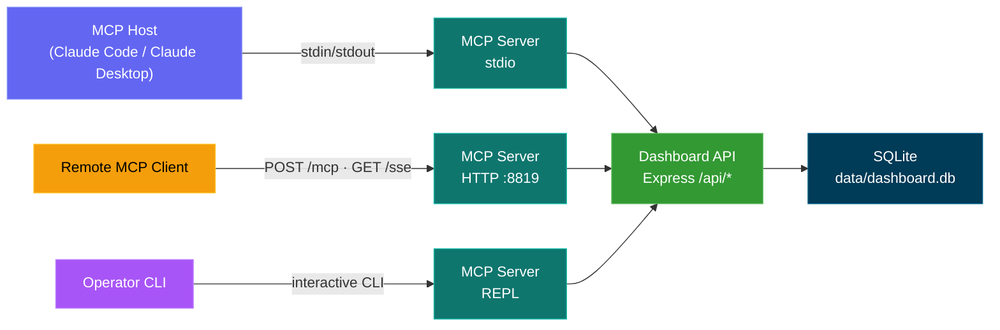

### MCP Tool Surface

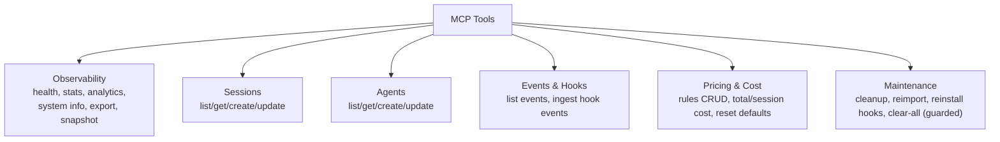

### MCP Safety Model

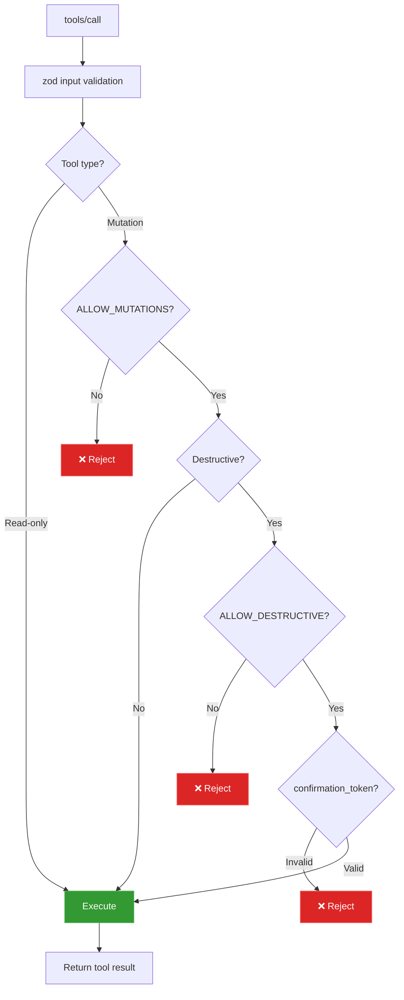

### MCP Operational Modes

- Read-only mode (default): `MCP_DASHBOARD_ALLOW_MUTATIONS=false`
- Admin mode: `MCP_DASHBOARD_ALLOW_MUTATIONS=true`
- Destructive mode: requires both:
  - `MCP_DASHBOARD_ALLOW_MUTATIONS=true`
  - `MCP_DASHBOARD_ALLOW_DESTRUCTIVE=true`
  - tool input `confirmation_token: "CLEAR_ALL_DATA"`

Full details: [mcp/README.md](./mcp/README.md)

---

## API Reference

All endpoints return JSON. Error responses follow the shape `{ error: { code, message } }`.

### OpenAPI / Swagger

| Method | Path                | Description                         |
| ------ | ------------------- | ----------------------------------- |
| `GET`  | `/api/openapi.json` | Raw OpenAPI 3.0 spec                |
| `GET`  | `/api/docs`         | Interactive Swagger UI documentation |

The OpenAPI document is generated from `server/openapi.js`, and Swagger UI is served directly by the backend.

<p align="center">
  
</p>

### Health

| Method | Path          | Description                           |
| ------ | ------------- | ------------------------------------- |
| `GET`  | `/api/health` | Returns `{ status: "ok", timestamp }` |

### Sessions

| Method  | Path                | Query Params                | Description                           |
| ------- | ------------------- | --------------------------- | ------------------------------------- |
| `GET`   | `/api/sessions`     | `status`, `q`, `limit`, `offset` | List sessions with agent counts and per-session cost. `q` does case-insensitive search across `id` / `name` / `cwd`. `limit` defaults to 50, max 10000. Response includes `total` for paginators. |
| `GET`   | `/api/sessions/:id` | --                          | Session detail with agents and events |
| `POST`  | `/api/sessions`     | --                          | Create session (idempotent on `id`)   |
| `PATCH` | `/api/sessions/:id` | --                          | Update session status/metadata        |

### Agents

| Method  | Path              | Query Params                              | Description                   |
| ------- | ----------------- | ----------------------------------------- | ----------------------------- |
| `GET`   | `/api/agents`     | `status`, `session_id`, `limit`, `offset` | List agents with filters      |
| `GET`   | `/api/agents/:id` | --                                        | Single agent detail           |
| `POST`  | `/api/agents`     | --                                        | Create agent                  |
| `PATCH` | `/api/agents/:id` | --                                        | Update agent status/task/tool |

### Events

| Method | Path          | Query Params                    | Description                |
| ------ | ------------- | ------------------------------- | -------------------------- |
| `GET`  | `/api/events` | `session_id`, `limit`, `offset` | List events (newest first) |

### Stats

| Method | Path         | Description                                            |
| ------ | ------------ | ------------------------------------------------------ |
| `GET`  | `/api/stats` | Aggregate counts, status distributions, WS connections |

### Analytics

| Method | Path             | Description                                                |
| ------ | ---------------- | ---------------------------------------------------------- |
| `GET`  | `/api/analytics` | Token/tool/session aggregates for charts and trend views   |

### Hooks

| Method | Path               | Description                                  |
| ------ | ------------------ | -------------------------------------------- |
| `POST` | `/api/hooks/event` | Receive and process a Claude Code hook event |

**Hook event payload:**

```json
{
  "hook_type": "PreToolUse",
  "data": {
    "session_id": "abc-123",
    "tool_name": "Bash",
    "tool_input": { "command": "ls -la" }
  }
}
```

### Pricing

| Method   | Path                     | Description                              |
| -------- | ------------------------ | ---------------------------------------- |
| `GET`    | `/api/pricing`           | List all pricing rules                   |
| `PUT`    | `/api/pricing`           | Create or update a pricing rule          |
| `DELETE` | `/api/pricing/:pattern`  | Delete a pricing rule                    |
| `GET`    | `/api/pricing/cost`      | Total cost across all sessions           |
| `GET`    | `/api/pricing/cost/:id`  | Cost breakdown for a specific session    |

### Workflows

| Method | Path                          | Description                                             |
| ------ | ----------------------------- | ------------------------------------------------------- |
| `GET`  | `/api/workflows`              | Aggregate workflow data (orchestration, tools, patterns). Optional `?status=active\|completed` query param filters all 11 data sections by session status |
| `GET`  | `/api/workflows/session/:id`  | Per-session drill-in (agent tree, tool timeline, events) |

### Settings

| Method | Path                           | Description                                      |
| ------ | ------------------------------ | ------------------------------------------------ |
| `GET`  | `/api/settings/info`           | System info, DB stats, hook status               |
| `POST` | `/api/settings/clear-data`     | Delete all sessions, agents, events, token usage |
| `POST` | `/api/settings/reimport`       | Re-import legacy sessions from `~/.claude/`      |
| `POST` | `/api/settings/reinstall-hooks`| Reinstall Claude Code hooks                      |
| `POST` | `/api/settings/reset-pricing`  | Reset pricing to defaults                        |
| `GET`  | `/api/settings/export`         | Export all data as JSON download                 |
| `POST` | `/api/settings/cleanup`        | Abandon stale sessions, purge old data           |

### Import History

Bring existing Claude Code sessions into the dashboard from three
different sources, all funneled through the same parser the server uses
for live ingestion so imported tokens, per-model cost, compactions,
subagents, tool use, and turn durations match real-time capture
bit-for-bit. Re-imports are idempotent: sessions are keyed by ID and
compaction baselines preserve pre-compaction token totals, so running
the importer twice never double-counts usage or cost.

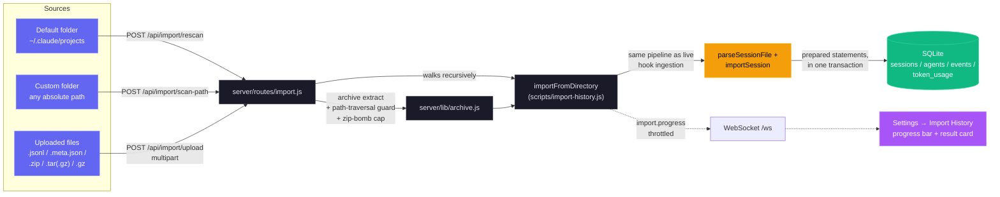

**Routes**

| Method | Path                    | Description                                                              |
| ------ | ----------------------- | ------------------------------------------------------------------------ |
| `GET`  | `/api/import/guide`     | OS-aware paths, archive command, supported extensions, step instructions |
| `POST` | `/api/import/rescan`    | Rescan the default `~/.claude/projects` directory                        |
| `POST` | `/api/import/scan-path` | Scan an absolute directory (body `{ path }`); walks recursively          |
| `POST` | `/api/import/upload`    | Multipart upload of `.jsonl`, `.meta.json`, `.zip`, `.tar(.gz)`, `.gz`   |

**Supported inputs.** Loose JSONL (`.jsonl`) session transcripts, their
companion `.meta.json` sidecars, and archives (`.zip`, `.tar`,
`.tar.gz`/`.tgz`, plain `.gz`) containing any nested directory layout.
Both canonical Claude Code layouts are recognized automatically:
`<project>/<sessionId>/subagents/agent-*.jsonl` (default) and
`<project>/subagents/<sessionId>/agent-*.jsonl` (alternative).

**Accuracy guarantees.** Sessions are deduplicated by UUID; re-running
the importer is always safe. The compaction `baseline_input` /
`baseline_output` / `baseline_cache_read` / `baseline_cache_write`
columns preserve token counts from before a transcript was compacted,
so re-ingesting a post-compaction JSONL never erases historical cost.

**Safety.** Archive extraction validates every entry against path
traversal (absolute paths and `..` segments are rejected). A
configurable extraction cap (`CCAM_IMPORT_MAX_EXTRACT_BYTES`, default
4 GB) stops zip/tar/gzip bombs. Upload size is capped per file
(`CCAM_IMPORT_MAX_BYTES`, default 1 GB) and per request
(`CCAM_IMPORT_MAX_FILES`, default 2000). All staging directories are
per-request and reclaimed in `finally`, including when multer rejects
all files up front.

**Progress.** Import activity is broadcast over the existing WebSocket
as `import.progress` messages (`phase`: `start` / `scan` / `extract` /
`parse` / `complete` / `error`), throttled to avoid flooding the
channel on large imports.

**UI.** Use the **Settings → Import History** panel for a guided,
drag-and-drop experience with step-by-step instructions, live progress,
and a post-import summary showing imported / enriched / skipped /
error counts.

<p align="center">
  
</p>

### WebSocket

Connect to `ws://localhost:4820/ws` to receive real-time push messages:

```json
{
  "type": "agent_updated",
  "data": { "id": "...", "status": "working", "current_tool": "Edit" },
  "timestamp": "2026-03-05T15:43:01.800Z"
}
```

**Message types:** `session_created`, `session_updated`, `agent_created`, `agent_updated`, `new_event`

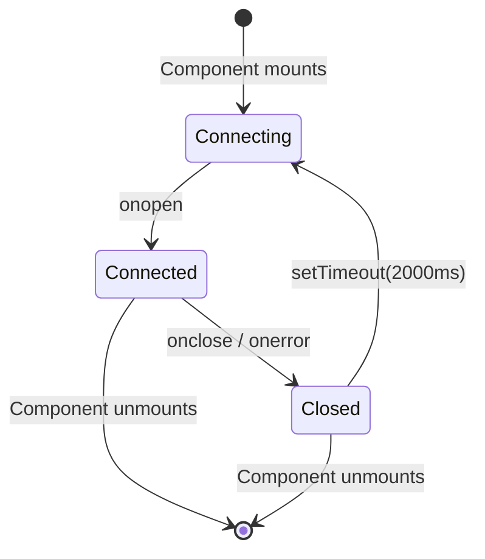

---

## Hook Events

The dashboard processes these Claude Code hook types:

| Hook Type      | Trigger                        | Dashboard Action                                                                             |
| -------------- | ------------------------------ | -------------------------------------------------------------------------------------------- |
| `SessionStart` | Claude Code session begins     | Creates session and main agent. Reactivates resumed sessions. Abandons orphaned sessions with no activity for 5+ minutes |
| `PreToolUse`   | Agent starts using a tool      | Sets agent to `working`, sets `current_tool`. If tool is `Agent`, creates subagent record    |
| `PostToolUse`  | Tool execution completed       | Clears `current_tool`. Agent stays `working` (no status change)                              |
| `Stop`         | Claude finishes responding     | Main agent to `idle` (even on non-tool turns). Background subagents keep running. Session stays `active` |
| `SubagentStop` | Background agent finished      | Matches and completes the subagent by description, type, or task                             |
| `Notification` | Agent notification             | Logs event. Compaction-related notifications are tagged as `Compaction` events. Triggers a browser notification if the user has notifications enabled |
| `SessionEnd`   | Claude Code CLI process exits  | Marks all agents and the session as `completed`                                              |
| `Compaction`   | `/compact` detected in JSONL   | Creates a compaction subagent (type `compaction`) and Compaction event. Detected via `isCompactSummary` entries in the transcript JSONL. Also detected by periodic scanner for active sessions |
| `APIError`     | API error in JSONL transcript  | Extracted from `isApiErrorMessage` entries (quota, rate limit, invalid_request) and raw `type: "error"` responses. Stored as event with error details |
| `TurnDuration` | Turn timing in JSONL transcript| Extracted from `system` subtype `turn_duration` messages with `durationMs`. Stored as event for turn-level timing analysis |
| `ToolError`    | Tool result error in JSONL     | Extracted from `toolUseResult.is_error` entries. Tracks tool-level failures for error propagation analysis |

---

## Browser Notifications

The dashboard supports persistent browser notifications via Web Push (VAPID) for real-time alerts even when the dashboard tab is not focused or the browser is backgrounded.

### How It Works

1. **Enable** notifications in the Settings page via the master toggle
2. **Grant** browser permission when prompted — this registers a Service Worker and creates a push subscription
3. **Configure** which events trigger notifications:

| Event                        | Default | Description                                                     |
| ---------------------------- | ------- | --------------------------------------------------------------- |
| New session starts           | On      | Fires when a new Claude Code session is created                 |
| Claude finished responding   | Off     | Fires on `Stop` events when Claude finishes a response turn     |
| Session closed               | Off     | Fires on `SessionEnd` when the CLI process exits                |
| Session errors               | On      | Fires when a session ends with an error                         |
| Subagent spawned             | Off     | Fires when a background subagent is created                     |

Additionally, any `Notification` hook event from Claude Code triggers a browser notification regardless of the per-event toggles (as long as the master toggle is enabled).

### Notifications Architecture

- **VAPID Pipeline:** Uses `web-push` on the server for secure message delivery. VAPID keys are auto-generated and stored in `data/vapid-keys.json`.
- **Service Worker:** A dedicated worker (`client/public/sw.js`) handles incoming `push` events and displays notifications with `silent: false` to ensure audio playback on macOS.
- **Subscriptions:** Browser-specific endpoints are stored in the `push_subscriptions` table in SQLite.
- **Persistence:** Notifications arrive even if the browser is closed, as the Service Worker operates in the background.
- **Test notification:** button in Settings lets you verify the VAPID pipeline and audio playback.

---

## Update Notifier

The dashboard watches its own git checkout and surfaces a modal whenever the canonical default branch has commits ahead of HEAD. **Branch- and fork-aware:** if you have an `upstream` remote (the standard convention for forks), it's preferred over `origin`; the chosen remote's `master`/`main`/`HEAD` is the comparison ref. The `manual_command` adapts to your situation — `git pull --ff-only` only when your branch actually tracks the canonical ref, otherwise a `git fetch` (and a fast-forward merge in the fork case) so the command never lies. Users get the exact command to run in a terminal — the server **never** pulls or restarts itself, which keeps the mechanism portable across dev sessions, pm2/systemd/launchd/Docker supervision, and remote deployments.

<p align="center">
  
</p>

### How It Works

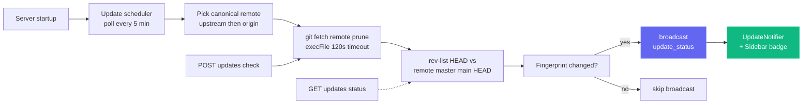

A single check is cheap (`git fetch <remote> --prune` against the canonical remote — `upstream` if configured, else `origin`), wrapped with `execFile` (no shell) and a 120s timeout. Failures — offline network, non-git install, no remotes configured, unresolvable upstream ref — all return **soft payloads** (e.g. `fetch_error: "..."`) rather than throwing, so a flaky remote never blocks the dashboard.

### UI Surfaces

| Surface | Behavior |
| --- | --- |
| **Modal** (`client/src/components/UpdateNotifier.tsx`) | Appears when `update_available === true` and the user hasn't already dismissed this specific `remote_sha`. Shows commits-behind, the tracked ref, an optional `situation_note` (when on a feature branch / fork the note explains why the command differs), the copy-pastable command, and three buttons: **Copy command** (primary), **Check now**, **Dismiss**. ESC and backdrop clicks dismiss. Keyed by `remote_sha` in `localStorage`, so a newer upstream commit re-opens the modal automatically. |
| **Sidebar button** (`client/src/components/Sidebar.tsx`) | Always-visible "Check for updates" button in the footer. Emerald border + green badge dot when behind, amber when the last check hit a fetch error. Clicking it clears any prior dismissal, then fires `POST /api/updates/check`. |
| **Server terminal** | When the scheduler transitions from "up to date" to "behind," it prints a framed block to stdout with the command so users running headless still see it. |

### API Surface

| Endpoint | Purpose |
| --- | --- |
| `GET /api/updates/status` | Read-only check: runs `git fetch` against the canonical remote, compares HEAD to its default branch, returns the payload. |
| `POST /api/updates/check` | Same check, but also broadcasts `update_status` over WebSocket so all connected clients update at once. |

Both endpoints return the same payload shape:

```json
{
  "git_repo": true,
  "update_available": true,
  "repo_root": "/Users/you/Claude-Code-Agent-Monitor",
  "remote_ref": "upstream/master",
  "canonical_remote": "upstream",
  "current_branch": "master",
  "tracking_upstream": "origin/master",
  "tracks_canonical": false,
  "situation": "fork_or_diverged_tracking",
  "local_sha": "abc1234...",
  "remote_sha": "def5678...",
  "commits_behind": 3,
  "manual_command": "cd \"/...\" && git fetch upstream && git merge --ff-only upstream/master && npm run setup",
  "situation_note": "You're on 'master' tracking 'origin/master'. This command fast-forwards your branch from upstream/master (the canonical default).",
  "message": "3 commit(s) on upstream/master not in your checkout."
}
```

`situation` is one of `tracking_canonical` (typical clone on the default branch — `git pull --ff-only` works), `fork_or_diverged_tracking` (local branch name matches canonical, but tracks a different remote — `git fetch <remote> && git merge --ff-only <ref>`), `feature_branch` (off the default branch — fetch only, integration left to the user), or `detached_head`.

### What's Intentionally **Not** Here

There is no `POST /api/updates/apply` and no self-restart helper, by design. Self-updating a process from inside itself is unreliable without an external supervisor — `npm run dev` (concurrently), `npm start`, `pm2`, `systemd`, `launchd`, and Docker each need different restart logic, and `git pull` / `npm install` failures on a dying server have no clean rollback path. Detection-only keeps behaviour predictable across every supervisor, every OS, and every branch state, while still closing the "when do I need to pull?" information gap; the user owns the actual update in their own shell.

### Configuration

| Env Var | Default | Notes |
| --- | --- | --- |
| `DASHBOARD_UPDATE_CHECK` | enabled | Set to `0` / `false` / `off` to disable the scheduler entirely. |
| `DASHBOARD_UPDATE_CHECK_INTERVAL_MS` | `300000` (5 min) | Interval between automatic checks. Floor is 60 000 ms — values below are clamped. |

---

## VS Code Extension

The **Claude Code Agent Monitor** is available as a first-class VS Code extension, allowing you to monitor your AI agents without leaving your editor.

<p align="center">
  
</p>

### 🚀 Key Features
- **Live Sidebar**: Dedicated Activity Bar view showing real-time Agent Health (Working, Connected, Idle, etc.).
- **Usage Analytics**: Track total tokens, live USD costs, and event counts directly in the sidebar.
- **Status Bar Integration**: Quick-glance pulse monitor in the bottom bar showing active sessions and agents.
- **Deep Navigation**: One-click access to specific dashboard views (Kanban, Analytics, Settings) or recent sessions.
- **Integrated Tab**: Opens the full monitoring dashboard as a native VS Code webview tab.

### 📦 Installation & Setup
1. Open the [vscode-extension](./vscode-extension) directory.
2. Install the Marketplace extension or package it yourself using `vsce package`.
3. Ensure your local dashboard server is running (`npm run dev`).
4. Click the **Radar icon** in the VS Code Activity Bar to get started.

For detailed developer configuration, see the [.vscode](./.vscode) and [vscode-extension](./vscode-extension) directories.

> [!TIP]
> Extension on VS Code Marketplace: [Claude Code Agent Monitor](https://marketplace.visualstudio.com/items?itemName=hoangsonw.claude-code-agent-monitor)

---

## Data Storage

- **Engine:** SQLite 3 via `better-sqlite3` (optional) or Node.js built-in `node:sqlite`
- **Location:** `data/dashboard.db`
- **Journal mode:** WAL (concurrent reads during writes)
- **Reset:** Delete `data/dashboard.db` to clear all data

### Entity Relationship Diagram

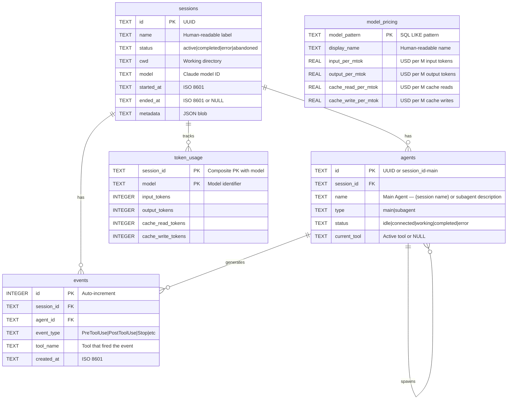

---

## Plugin Marketplace

Extend Claude Code with official Agent Monitor plugins — analytics, productivity tools, developer utilities, AI-powered insights, and dashboard connectivity.

### Add the marketplace

```bash
claude plugin marketplace add hoangsonww/Claude-Code-Agent-Monitor
```

### Available plugins

| Plugin | Install command | Skills |
|--------|----------------|--------|
| **ccam-analytics** | `claude plugin install ccam-analytics@hoangsonww-claude-code-agent-monitor` | `session-report`, `cost-breakdown`, `usage-trends`, `productivity-score` |
| **ccam-productivity** | `claude plugin install ccam-productivity@hoangsonww-claude-code-agent-monitor` | `daily-standup`, `weekly-report`, `sprint-summary`, `workflow-optimizer` |
| **ccam-devtools** | `claude plugin install ccam-devtools@hoangsonww-claude-code-agent-monitor` | `session-debug`, `hook-diagnostics`, `data-export`, `health-check` |
| **ccam-insights** | `claude plugin install ccam-insights@hoangsonww-claude-code-agent-monitor` | `pattern-detect`, `anomaly-alert`, `optimization-suggest`, `session-compare` |
| **ccam-dashboard** | `claude plugin install ccam-dashboard@hoangsonww-claude-code-agent-monitor` | `dashboard-status`, `quick-stats` + MCP server |

### CLI tools included

- `ccam-stats` — Terminal dashboard (sessions, costs, tokens with compaction baselines)
- `ccam-doctor` — System diagnostics (API, database, hooks, data freshness)
- `ccam-export` — Data export (JSON, CSV) for sessions, events, analytics, costs

### Example usage

```bash
# In Claude Code, after installing a plugin:
/ccam-analytics:session-report latest
/ccam-analytics:cost-breakdown this week
/ccam-productivity:daily-standup today
/ccam-insights:pattern-detect tools
/ccam-dashboard:quick-stats
```

📖 Full documentation: [docs/plugins.md](docs/PLUGINS.md)

---

## Statusline

A standalone CLI statusline utility for Claude Code that displays model name, user, working directory, git branch, context window usage bar, per-direction token counts, and session cost -- all color-coded with ANSI escape sequences.

```
nguyens6@host ~/agent-dashboard/client | Sonnet 4.6 | main | ████████░░ 79% | 3↑ 2↓ 156586c | $0.4231
```

| Segment     | Color                | Example                                                        |
| ----------- | -------------------- | -------------------------------------------------------------- |
| Model       | Cyan                 | `Sonnet 4.6`                                                   |
| User        | Green                | `nguyens6`                                                     |
| CWD         | Yellow               | `~/agent-dashboard`                                            |
| Git branch  | Magenta              | `main`                                                         |
| Context bar | Green / Yellow / Red | `████████░░ 79%`                                               |
| Tokens      | Green / Cyan / Dim   | `3↑ 2↓ 156586c` (green `↑` in, cyan `↓` out, dim `c` cache)    |
| Cost (USD)  | Green / Yellow / Red | `$0.4231` (session total — shown on API and subscription plans)|

Cost color thresholds: green under $5, yellow $5–$20, red $20+.

See [`statusline/README.md`](statusline/README.md) for installation instructions.

<p align="center">
  
</p>

---

## Server Architecture

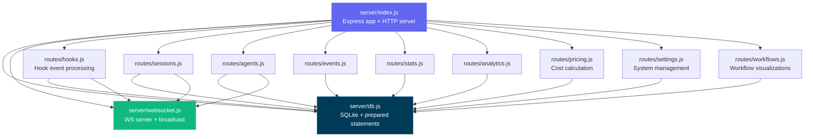

---

## Client Routing


---

## Hook Handler Flow

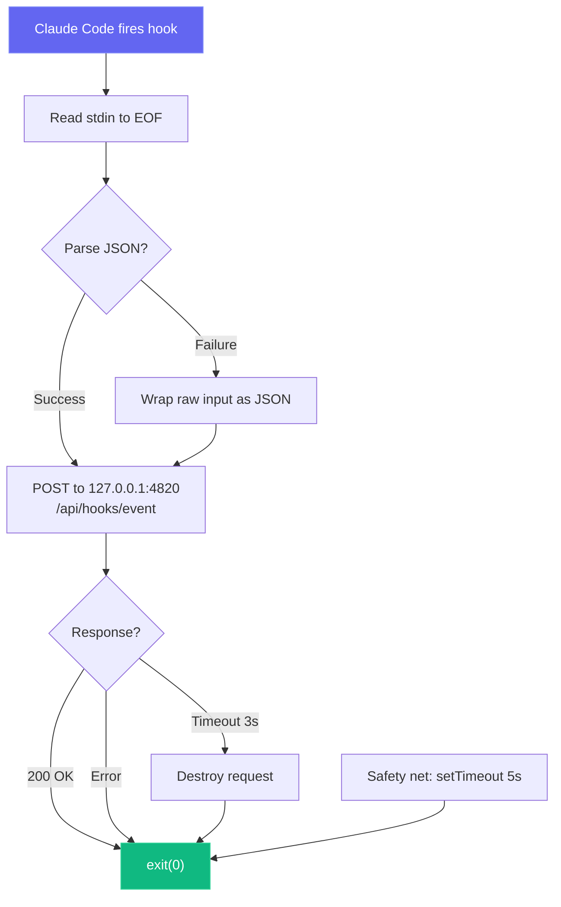

---

## Deployment Modes

We support both development and production deployment modes with different process architectures:

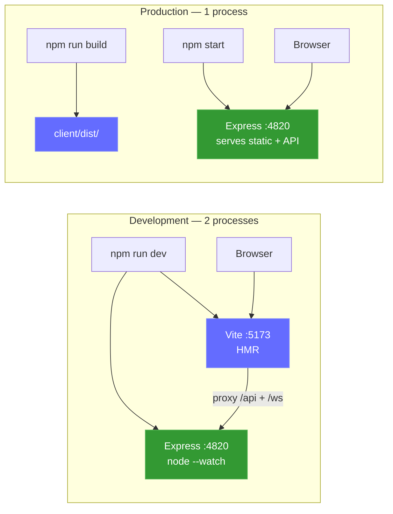

Optional local MCP sidecar (supports stdio, HTTP+SSE, and REPL transports):

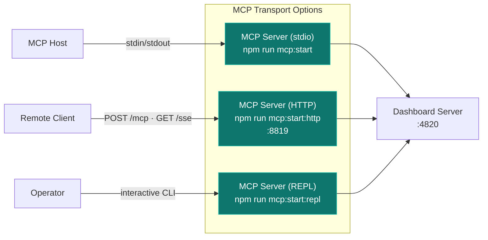

### Cloud Deployment

The `deployments/` directory provides cloud-agnostic, enterprise-grade infrastructure for deploying the dashboard to production. Supports Helm, Kustomize, and Terraform across AWS, GCP, Azure, and OCI with blue-green, canary, and rolling release strategies.

```mermaid
graph TB
  subgraph "Deployment Methods"
    HELM["⎈ Helm Chart<br/>Parameterized installs"]
    KUST["📦 Kustomize<br/>Overlay-based patching"]
    TF["🏗️ Terraform<br/>Full cloud provisioning"]
  end

  subgraph "Cloud Providers"
    AWS["☁️ AWS<br/>ECS Fargate + ALB"]
    GCP["☁️ GCP<br/>Cloud Run + GCLB"]
    AZ["☁️ Azure<br/>ACI + App Gateway"]
    OCI["☁️ OCI<br/>OKE + LBaaS"]
  end

  subgraph "Release Strategies"
    ROLL["Rolling Update"]
    BG["Blue-Green"]
    CAN["Canary + Analysis"]
  end

  subgraph "Observability"
    PROM["📊 Prometheus + Grafana"]
    CX["📡 Coralogix<br/>Logs · Metrics · Traces · SLOs"]
  end

  HELM & KUST --> ROLL & BG & CAN
  TF --> AWS & GCP & AZ & OCI
  ROLL & BG & CAN --> PROM & CX

  style HELM fill:#0f1689,color:#fff
  style KUST fill:#326ce5,color:#fff
  style TF fill:#7b42bc,color:#fff
  style AWS fill:#ff9900,color:#fff
  style GCP fill:#4285f4,color:#fff
  style AZ fill:#0078d4,color:#fff
  style OCI fill:#f80000,color:#fff
  style PROM fill:#e6522c,color:#fff
  style CX fill:#1a1a2e,color:#fff
```

```bash
# Helm (recommended for Kubernetes)
helm install agent-monitor deployments/helm/agent-monitor \
  -f deployments/helm/agent-monitor/values-production.yaml \
  -n agent-monitor --create-namespace

# Kustomize
kubectl apply -k deployments/kubernetes/overlays/production

# Terraform (full infra + app)
cd deployments/terraform/providers/aws
terraform init && terraform apply -var-file=../../environments/production/terraform.tfvars

# Script orchestrator
./deployments/scripts/deploy.sh --env production --method helm --strategy blue-green
```

The deployment stack includes CI/CD pipelines (GitHub Actions + GitLab CI), comprehensive monitoring (Prometheus, Grafana, Alertmanager with 13 alert rules, Coralogix full-stack observability with OpenTelemetry Collector for logs, metrics, traces, and SLO tracking), operational scripts (deploy, rollback, blue-green switch, backup/restore, teardown), and a full security posture (Restricted Pod Security Standard, TLS 1.3, network policies, Trivy scanning).

> [!NOTE]
> 📘 **Full deployment guide:** See [DEPLOYMENT.md](DEPLOYMENT.md) for step-by-step instructions, architecture diagrams, and operational workflows.

---

## Project Structure

```
agent-dashboard/
|-- CLAUDE.md                   # Claude Code project memory and working agreements
|-- AGENTS.md                   # Codex project instructions
|-- package.json                # Root scripts (dashboard + MCP helpers) + server dependencies
|-- .claude/
|   +-- rules/                  # Path-scoped Claude rules
|   +-- skills/                 # Claude reusable project skills
|   +-- agents/                 # Claude custom subagents
|-- .claude-plugin/
|   +-- marketplace.json        # Plugin marketplace manifest (5 plugins)
|-- plugins/
|   |-- ccam-analytics/         # Analytics: session reports, cost breakdown, usage trends, productivity score
|   |   |-- .claude-plugin/plugin.json
|   |   |-- skills/ (4)         # session-report, cost-breakdown, usage-trends, productivity-score
|   |   |-- agents/             # analytics-advisor (Sonnet model)
|   |   |-- hooks/hooks.json    # Stop + SubagentStop event logging
|   |   +-- bin/ccam-stats      # Terminal dashboard CLI
|   |-- ccam-productivity/      # Productivity: standups, reports, sprints, workflow optimizer
|   |-- ccam-devtools/          # DevTools: debug, diagnostics, export, health checks
|   |   +-- bin/                # ccam-doctor + ccam-export CLIs
|   |-- ccam-insights/          # Insights: patterns, anomalies, optimization, comparison
|   +-- ccam-dashboard/         # Dashboard connector: status, quick stats, MCP integration
|       +-- .mcp.json           # MCP server configuration
|-- server/
|   |-- index.js                 # Express app, HTTP server, static serving
|   |-- db.js                    # SQLite schema, migrations, prepared statements
|   |-- websocket.js             # WebSocket server with heartbeat
|   +-- routes/
|       |-- hooks.js             # Hook event processing (transactional)
|       |-- sessions.js          # Session CRUD
|       |-- agents.js            # Agent CRUD
|       |-- events.js            # Event listing
|       |-- stats.js             # Aggregate statistics
|       |-- analytics.js         # Token, tool, and trend analytics
|       |-- workflows.js         # Aggregate workflow data and per-session drill-in
|       |-- pricing.js           # Model pricing CRUD and cost calculation
|       +-- settings.js          # System info, data management, export, cleanup
|   +-- lib/
|       +-- transcript-cache.js  # Stat-based JSONL transcript cache with incremental reads. Extracts tokens, compactions, API errors, turn durations, thinking blocks, and usage extras (service_tier, speed, inference_geo)
|   +-- compat-sqlite.js         # node:sqlite compatibility wrapper (fallback for better-sqlite3)
|-- client/
|   |-- package.json             # Client dependencies
|   |-- index.html               # HTML entry point
|   |-- vite.config.ts           # Vite + proxy config
|   |-- tailwind.config.js       # Custom dark theme
|   |-- tsconfig.json            # Strict TypeScript
|   +-- src/
|       |-- main.tsx             # React entry
|       |-- App.tsx              # Router + WebSocket provider
|       |-- index.css            # Tailwind + custom utilities
|       |-- lib/
|       |   |-- types.ts         # Shared TypeScript interfaces
|       |   |-- api.ts           # Typed fetch client
|       |   |-- format.ts        # Date/time formatting utilities
|       |   +-- eventBus.ts      # Pub/sub for WebSocket distribution
|       |-- hooks/
|       |   |-- useWebSocket.ts      # Auto-reconnecting WebSocket hook
|       |   +-- useNotifications.ts  # Browser notification triggers from WebSocket events
|       |-- components/
|       |   |-- Layout.tsx       # Shell with sidebar + outlet
|       |   |-- Sidebar.tsx      # Navigation + connection indicator
|       |   |-- AgentCard.tsx    # Agent info card with status
|       |   |-- StatCard.tsx     # Metric card
|       |   |-- StatusBadge.tsx  # Color-coded status pills
|       |   |-- EmptyState.tsx   # Placeholder for empty lists
|       |   +-- workflows/       # D3.js workflow visualization components
|       |       |-- OrchestrationDAG.tsx            # Horizontal DAG of agent spawning patterns
|       |       |-- ToolExecutionFlow.tsx           # d3-sankey diagram of tool-to-tool transitions
|       |       |-- AgentCollaborationNetwork.tsx   # Force-directed agent pipeline graph
|       |       |-- SubagentEffectiveness.tsx       # Scorecard grid with SVG success rings
|       |       |-- WorkflowPatterns.tsx            # Auto-detected orchestration sequences
|       |       |-- ModelDelegationFlow.tsx         # Model routing through agent hierarchies
|       |       |-- ErrorPropagationMap.tsx         # Error clustering by hierarchy depth
|       |       |-- ConcurrencyTimeline.tsx         # Swim-lane parallel agent execution
|       |       |-- SessionComplexityScatter.tsx    # D3 bubble chart (duration vs agents vs tokens)
|       |       |-- CompactionImpact.tsx            # Token compression events and recovery
|       |       |-- WorkflowStats.tsx               # Aggregate workflow statistics
|       |       +-- SessionDrillIn.tsx              # Per-session agent tree, tool timeline, events
|       +-- pages/
|           |-- Dashboard.tsx      # Overview page
|           |-- KanbanBoard.tsx    # Agents/Sessions toggle, status columns
|           |-- Sessions.tsx       # Server-paginated sessions table
|           |-- SessionDetail.tsx  # Single session deep dive
|           |-- ActivityFeed.tsx   # Real-time event stream
|           |-- Analytics.tsx      # Token usage, heatmap, trends
|           |-- Workflows.tsx      # D3.js workflow visualizations and session drill-in
|           |-- Settings.tsx       # Model pricing, notifications, hooks, export, cleanup
|           +-- NotFound.tsx       # 404 catch-all page
|-- scripts/
|   |-- hook-handler.js          # Lightweight stdin-to-HTTP forwarder
|   |-- install-hooks.js         # Auto-configures ~/.claude/settings.json
|   |-- import-history.js        # Imports sessions from ~/.claude/ with enhanced JSONL extraction (API errors, turn durations, entrypoint, permission modes, thinking blocks, usage extras, tool errors, subagent JSONL files)
|   +-- seed.js                  # Sample data generator
|-- mcp/
|   |-- package.json             # MCP package scripts + dependencies
|   |-- README.md                # MCP setup, host config, tool catalog, safety model
|   |-- src/
|   |   |-- index.ts             # MCP runtime entrypoint (transport router)
|   |   |-- server.ts            # MCP server assembly
|   |   |-- clients/             # Dashboard API client with retry/backoff
|   |   |-- config/              # Environment/CLI config parsing
|   |   |-- core/                # Logger, tool registry, result helpers
|   |   |-- policy/              # Mutation/destructive guards
|   |   |-- tools/               # Domain-specific tool modules (6 domains)
|   |   |-- transports/          # HTTP+SSE server, REPL, tool collector
|   |   |-- ui/                  # ANSI banner, colors, formatter, tables
|   |   +-- types/               # Shared MCP type definitions
|   +-- build/                   # Built MCP runtime output
|-- deployments/
|   |-- README.md                # Deployment infrastructure reference
|   |-- terraform/               # Cloud provisioning (AWS, GCP, Azure, OCI)
|   |   |-- modules/             # Reusable modules (networking, compute, db, lb, monitoring)
|   |   |-- providers/           # Cloud-specific implementations
|   |   +-- environments/        # Per-env tfvars (dev, staging, production)
|   |-- kubernetes/              # Kustomize manifests
|   |   |-- base/                # 11 base resources (deployment, service, ingress, hpa, etc.)
|   |   |-- overlays/            # Environment overlays (dev, staging, production)
|   |   |-- components/          # Optional add-ons (mcp-sidecar, monitoring)
|   |   +-- strategies/          # Blue-green and canary deployment strategies
|   |-- helm/agent-monitor/      # Helm chart with 12 templates and 4 value sets
|   |-- scripts/                 # Operational scripts (deploy, rollback, backup, teardown)
|   |-- monitoring/              # Prometheus, Grafana, Alertmanager, Coralogix (OTel Collector)
|   +-- ci/                      # CI/CD pipelines (GitHub Actions, GitLab CI)
|-- .codex/
|   |-- config.toml              # Codex runtime configuration
|   |-- README.md                # Codex setup guide for agents and skills
|   |-- rules/                   # Codex execution policy rules
|   |-- agents/                  # Codex custom agent templates
|   +-- skills/                  # Codex project skills
|-- statusline/
|   |-- README.md                # Statusline installation & usage guide
|   |-- statusline.py            # Python script that renders the statusline
|   +-- statusline-command.sh    # Shell wrapper for Claude Code's statusLine config
+-- data/
    +-- dashboard.db             # SQLite database (gitignored)
```

---

## Troubleshooting

| Problem                           | Solution                                                                                                                                                         |
| --------------------------------- | ---------------------------------------------------------------------------------------------------------------------------------------------------------------- |
| `better-sqlite3` fails to install | This is non-fatal — the server falls back to Node.js built-in `node:sqlite` automatically (Node 22+). On older Node versions, install Python 3 and C++ build tools, then run `npm rebuild better-sqlite3` |
| Hooks not firing                  | Run `npm run install-hooks` and restart Claude Code. Verify hooks exist in `~/.claude/settings.json`                                                             |
| Dashboard shows no data           | Ensure the server is running (`npm run dev`) before starting a Claude Code session. Check `http://localhost:4820/api/health`                                     |
| WebSocket disconnected            | The client auto-reconnects every 2 seconds. Check that port 4820 is not blocked by a firewall                                                                    |
| Stale data after restart          | The database persists across restarts. Run `npm run seed` for fresh demo data, or delete `data/dashboard.db` to reset                                            |
| MCP tools fail to connect         | Confirm dashboard API is up on `MCP_DASHBOARD_BASE_URL` and rebuild/start MCP (`npm run mcp:build`, `npm run mcp:start`)                                         |

---

## License

MIT. See [LICENSE](LICENSE) for details.
