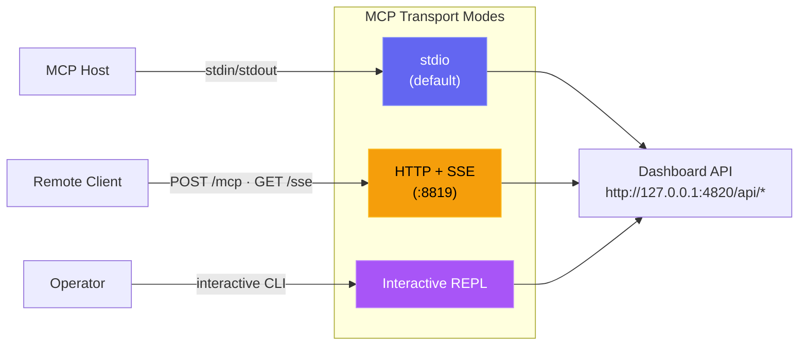

# Setup Guide

## How it works

Agent Dashboard integrates with Claude Code through its native hook system. When Claude Code performs any action (session start, tool use, turn completion, subagent finish, session exit), it fires a hook that calls a small Node.js script bundled with this project. That script forwards the event over HTTP to the dashboard server, which stores it in SQLite and broadcasts it to the browser over WebSocket.

```
Claude Code  →  hook fires  →  hook-handler.js  →  POST /api/hooks/event
                                                         ↓
Browser  ←  WebSocket broadcast  ←  Express server  ←  SQLite
```

No extra Claude Code configuration is required in the normal host-run path — when you start the dashboard with `npm run dev` or `npm start`, the server configures the hooks automatically on startup. Container deployments are the exception: after the container is up, run `npm run install-hooks` on the host so Claude Code points at `http://localhost:4820`.

---

## Configuration

### Hook auto-installation

When the dashboard is running directly on the host, the server writes the following to `~/.claude/settings.json` every time it starts:

```json
{
  "hooks": {
    "SessionStart": [{ "hooks": [{ "type": "command", "command": "node \"/path/to/scripts/hook-handler.js\" SessionStart" }] }],
    "PreToolUse":   [{ "matcher": "*", "hooks": [{ "type": "command", "command": "node \"/path/to/scripts/hook-handler.js\" PreToolUse" }] }],
    "PostToolUse":  [{ "matcher": "*", "hooks": [{ "type": "command", "command": "node \"/path/to/scripts/hook-handler.js\" PostToolUse" }] }],
    "Stop":         [{ "matcher": "*", "hooks": [{ "type": "command", "command": "node \"/path/to/scripts/hook-handler.js\" Stop" }] }],
    "SubagentStop": [{ "matcher": "*", "hooks": [{ "type": "command", "command": "node \"/path/to/scripts/hook-handler.js\" SubagentStop" }] }],
    "Notification": [{ "matcher": "*", "hooks": [{ "type": "command", "command": "node \"/path/to/scripts/hook-handler.js\" Notification" }] }],
    "SessionEnd":   [{ "hooks": [{ "type": "command", "command": "node \"/path/to/scripts/hook-handler.js\" SessionEnd" }] }]
  }
}
```

> [!NOTE]
> Note: `SessionStart` and `SessionEnd` hooks do not support the `matcher` field — they fire unconditionally on every session start and exit.

Existing hooks in that file are preserved. The dashboard only adds or updates entries that contain `hook-handler.js`.

To re-run hook installation manually:

```bash
npm run install-hooks
```

> [!TIP]
> Container note: do not rely on hook auto-install from inside Docker or Podman. The hook path written by a container would point at the container filesystem, not the host. Start the container first, then run `npm run install-hooks` on the host.

### Container runtime (Docker / Podman)

The repo includes both a multi-stage `Dockerfile` and a `docker-compose.yml` file. The container image serves the built client and API on port `4820`, stores SQLite data under `/app/data`, and can import legacy Claude history from a read-only `~/.claude` mount.

```bash
# Docker Compose
docker compose up -d --build

# Podman Compose
CLAUDE_HOME="$HOME/.claude" podman compose up -d --build

# Plain Docker
docker build -t agent-monitor .
docker run -d --name agent-monitor \
  -p 4820:4820 \
  -v "$HOME/.claude:/root/.claude:ro" \
  -v agent-monitor-data:/app/data \
  agent-monitor

# Plain Podman
podman build -t agent-monitor .
podman run -d --name agent-monitor \
  -p 4820:4820 \
  -v "$HOME/.claude:/root/.claude:ro" \
  -v agent-monitor-data:/app/data \
  agent-monitor
```

Container-specific behavior:

- The dashboard is available at `http://localhost:4820`
- `~/.claude:/root/.claude:ro` is used for history import only
- `agent-monitor-data:/app/data` persists the SQLite database
- Claude Code hooks still execute on the host, so install them from the host with `npm run install-hooks`

### Environment variables

| Variable | Default | Description |
|---|---|---|
| `DASHBOARD_PORT` | `4820` | Port the Express server listens on |
| `CLAUDE_DASHBOARD_PORT` | `4820` | Port the hook handler uses when posting events to the dashboard |
| `DASHBOARD_DB_PATH` | `data/dashboard.db` | Path to the SQLite database file |
| `NODE_ENV` | `development` | Set to `production` to serve built client |
| `MCP_DASHBOARD_BASE_URL` | `http://127.0.0.1:4820` | Base URL used by the local MCP server to call dashboard APIs |
| `MCP_DASHBOARD_ALLOW_MUTATIONS` | `false` | Enables mutating MCP tools |
| `MCP_DASHBOARD_ALLOW_DESTRUCTIVE` | `false` | Enables destructive MCP tools (in addition to mutations) |
| `MCP_TRANSPORT` | `stdio` | MCP transport mode: `stdio`, `http`, `repl` |
| `MCP_HTTP_PORT` | `8819` | Port for the MCP HTTP+SSE server (only when `MCP_TRANSPORT=http`) |
| `MCP_HTTP_HOST` | `127.0.0.1` | Bind address for the MCP HTTP server |

Example with custom port:

```bash
DASHBOARD_PORT=9000 npm run dev
```

> [!IMPORTANT]
> If you change the dashboard port, update `client/vite.config.ts` so the dev client proxies to the same port. Claude Code hooks reach the server through `CLAUDE_DASHBOARD_PORT`, so start Claude Code with that environment variable set to the new port, or change the default in `scripts/hook-handler.js`.

### MCP server (optional)

The project includes a local MCP server under `mcp/` so AI agents can call dashboard operations through standardized tools. It supports three transport modes: stdio for MCP host integration, HTTP+SSE for networked clients, and an interactive REPL for operator debugging.



Quick start:

```bash
npm run mcp:install
npm run mcp:build
npm run mcp:start              # stdio (for Claude Code / Claude Desktop)
npm run mcp:start:http         # HTTP + SSE server on port 8819
npm run mcp:start:repl         # interactive CLI with tab completion
```

For full host config and tool catalog, see [mcp/README.md](./mcp/README.md).

### Agent extension setup (Claude Code + Codex)

This repository ships extension files for both agent ecosystems:

- Claude Code:
  - `CLAUDE.md`
  - `.claude/rules/*`
  - `.claude/skills/*`
  - `.claude/agents/*`
- Codex:
  - `AGENTS.md`
  - `.codex/config.toml`
  - `.codex/rules/default.rules`
  - `.codex/agents/*`
  - `.codex/skills/*`

See [`.codex/README.md`](./.codex/README.md) for Codex extension details.

### VS Code extension setup

The **Claude Code Agent Monitor** is available as an integrated VS Code extension for seamless monitoring within your editor.

- **Activity Bar View**: Adds a custom "Radar" icon to the activity bar providing real-time agent health, token counts, and session stats.
- **Status Bar Integration**: Displays live session and agent pulse counts in the bottom bar.
- **Embedded Dashboard**: Renders the full web dashboard directly in a VS Code editor tab.
- **Automated Detection**: Automatically finds your dashboard server on ports `5173` or `4820`.

<p align="center">
  
</p>

To install or develop the extension:
1. Open the [vscode-extension](./vscode-extension) directory in VS Code.
2. Run `npm install` and `npm run package` to generate a local `.vsix` installer.
3. For developer details, see [vscode-extension/README.md](./vscode-extension/README.md).

> [!TIP]
> Extension on VS Code Marketplace: [Claude Code Agent Monitor](https://marketplace.visualstudio.com/items?itemName=hoangsonw.claude-code-agent-monitor)

---

## Database

The SQLite database is created automatically at `data/dashboard.db` on first run. The directory is created if it does not exist. The database uses WAL mode for concurrent reads and foreign keys for referential integrity.

### Clear all data

To remove all sessions, agents, events, and token usage (useful after running seed data or for a clean start):

```bash
npm run clear-data
```

### Data management via Settings page

The Settings page (`/settings`) provides a UI for:

- **Model Pricing** — view and edit per-model cost rates, reset to defaults, add custom models
- **Hook Configuration** — check which hooks are installed and reinstall them
- **Data Export** — download all sessions, agents, events, and pricing as a JSON file
- **Session Cleanup** — abandon stale active sessions after N hours, purge old completed sessions after N days
- **Clear All Data** — remove all sessions, agents, events, and token usage
- **Data Management** and **About** sections render with loading placeholders while server info is being fetched, so the page is always fully navigable

### Seed demo data

To populate the dashboard with sample sessions, agents, and events for UI exploration:

```bash
npm run seed
```

---

## Scripts reference

| Script | Command | Description |
|---|---|---|
| `setup` | `npm run setup` | Install all dependencies (server + client) |
| `dev` | `npm run dev` | Start server + client in development mode |
| `start` | `npm start` | Start server in production mode |
| `build` | `npm run build` | Build the React client to `client/dist/` |
| `install-hooks` | `npm run install-hooks` | Write Claude Code hooks to `~/.claude/settings.json` |
| `clear-data` | `npm run clear-data` | Delete all data from the database |
| `seed` | `npm run seed` | Insert demo sessions/agents/events |
| `import-history` | `npm run import-history` | Import legacy sessions from `~/.claude/` (also runs on startup) |
| `mcp:install` | `npm run mcp:install` | Install MCP package dependencies |
| `mcp:build` | `npm run mcp:build` | Build MCP server into `mcp/build/` |
| `mcp:start` | `npm run mcp:start` | Start MCP server (stdio, for MCP hosts) |
| `mcp:start:http` | `npm run mcp:start:http` | Start MCP HTTP+SSE server on port 8819 |
| `mcp:start:repl` | `npm run mcp:start:repl` | Start interactive MCP REPL |
| `mcp:dev` | `npm run mcp:dev` | Start MCP server in dev mode (stdio) |
| `mcp:dev:http` | `npm run mcp:dev:http` | Start MCP HTTP server in dev mode |
| `mcp:dev:repl` | `npm run mcp:dev:repl` | Start MCP REPL in dev mode |
| `mcp:typecheck` | `npm run mcp:typecheck` | Type-check MCP source |
| `mcp:docker:build` | `npm run mcp:docker:build` | Build MCP container image with Docker |
| `mcp:podman:build` | `npm run mcp:podman:build` | Build MCP container image with Podman |
| `test:mcp` | `npm run test:mcp` | Run MCP server unit tests |
| `claude` | Claude CLI | Uses `CLAUDE.md`, `.claude/rules`, and `.claude/skills` automatically |
| `test` | `npm test` | Run all server and client tests |
| `test:server` | `npm run test:server` | Run server integration tests only |
| `test:client` | `npm run test:client` | Run client unit tests only |
| `format` | `npm run format` | Format all files with Prettier |
| `format:check` | `npm run format:check` | Check formatting without writing |

---

## Makefile targets

All npm scripts are mirrored as `make` targets for convenience. Run `make help` to list them:

```bash
make help
```

Commonly used targets:

| Make target | Equivalent npm command | Description |
|---|---|---|
| `make setup` | `npm run setup` + MCP install | Install all dependencies (root + client + MCP) |
| `make dev` | `npm run dev` | Start server + client in watch mode |
| `make build` | `npm run build` | Build the React client for production |
| `make start` | `npm start` | Start the production server |
| `make prod` | `npm run build && npm start` | Build then start in one step |
| `make test` | `npm test` | Run all tests (server + client) |
| `make test-server` | `npm run test:server` | Run server tests only |
| `make test-client` | `npm run test:client` | Run client tests only |
| `make format` | `npm run format` | Format all files with Prettier |
| `make format-check` | `npm run format:check` | Check formatting without writing |
| `make mcp-build` | `npm run mcp:build` | Compile MCP TypeScript |
| `make mcp-typecheck` | `npm run mcp:typecheck` | Type-check MCP source |
| `make seed` | `npm run seed` | Load demo data |
| `make clear-data` | `npm run clear-data` | Delete all data rows |
| `make docker-up` | `docker compose up -d` | Start via docker-compose |
| `make docker-down` | `docker compose down` | Stop docker-compose stack |

---

## Statusline (optional)

The `statusline/` directory contains a standalone terminal statusline for Claude Code showing model, working directory, git branch, context window usage, and token counts. It is independent of the web dashboard.

See [statusline/README.md](./statusline/README.md) for installation instructions.

---

## Troubleshooting

### `better-sqlite3` errors during `npm install` / `npm run setup`

These warnings are **harmless**. `better-sqlite3` is an optional dependency — if it cannot compile, npm skips it and the server falls back to Node.js built-in `node:sqlite` (available on Node 22+).

You do **not** need Python, Visual Studio Build Tools, or any C++ compiler to run this project on Node 22+.

If you are on Node 18 or 20 and `better-sqlite3` prebuilds are not available for your platform, you have two options:

1. **Upgrade to Node.js 22+** — the built-in `node:sqlite` fallback requires no native compilation at all
2. **Install build tools** and run `npm rebuild better-sqlite3`:
   - **Windows:** install [Visual Studio Build Tools](https://visualstudio.microsoft.com/visual-cpp-build-tools/) with the C++ workload
   - **macOS:** `xcode-select --install`
   - **Linux:** `sudo apt install python3 make g++` (Debian/Ubuntu)

### "SQLite backend not available" error on startup

This means neither `better-sqlite3` nor `node:sqlite` could be loaded. The most common cause is running Node.js < 22 without `better-sqlite3` prebuilds. Upgrade to Node.js 22+ to resolve this.

### Database is locked / busy errors

The SQLite database uses WAL mode with a 5-second busy timeout. If you see lock errors:

- Ensure only one dashboard server instance is running
- Check for zombie `node server/index.js` processes: `ps aux | grep server/index`
- Delete `data/dashboard.db-wal` and `data/dashboard.db-shm` if the server was killed uncleanly, then restart

---

### No sessions appearing after starting Claude Code

**Check 1 — Is the server running?**

```bash
curl http://localhost:4820/api/health
# Expected: {"status":"ok","timestamp":"..."}
```

**Check 2 — Are hooks installed?**

Open `~/.claude/settings.json` and confirm it contains a `hooks` section with entries referencing `hook-handler.js`. If not, run:

```bash
npm run install-hooks
```

**Check 3 — Did you start a new Claude Code session after the server started?**

Hooks only apply to sessions started after installation. Restart Claude Code.

**Check 4 — Is Node.js in PATH when Claude Code runs hooks?**

On some systems, the shell environment when Claude Code fires hooks may not include the full PATH. Test with:

```bash
node --version
```

If Node.js is not found, use the full path to `node` in the hook command. Edit `scripts/install-hooks.js`, replace `node` with the absolute path (e.g. `/usr/local/bin/node`), and re-run `npm run install-hooks`.

---

### Dashboard shows "Disconnected" in the sidebar

The WebSocket connection to the server failed. Ensure the server is running:

```bash
npm run dev
```

The client will automatically reconnect every 2 seconds once the server is available.

---

### Events Today shows 0 despite recent activity

This was a known timezone bug (fixed in current version). If you are still seeing this, ensure you are running the latest code and restart the server.

---

### Port 4820 already in use

```bash
DASHBOARD_PORT=4821 npm run dev
```

Then update the Vite proxy in `client/vite.config.ts`:

```ts
proxy: {
  "/api": "http://localhost:4821",
  "/ws":  { target: "ws://localhost:4821", ws: true }
}
```

And make sure Claude Code posts hooks to the new port:

```bash
CLAUDE_DASHBOARD_PORT=4821 claude
# or edit scripts/hook-handler.js and change the default port
```

---

### Docker / Podman container starts but no sessions appear

**Check 1 — Is the container healthy?**

```bash
curl http://localhost:4820/api/health
# Expected: {"status":"ok","timestamp":"..."}
```

**Check 2 — Did you install hooks on the host?**

Hooks run on the host machine, not inside the container. After the container is up:

```bash
npm run install-hooks
```

**Check 3 — Are hooks pointing to the right port?**

Open `~/.claude/settings.json` and verify the hook commands reference `localhost:4820` (or whatever port the container is mapped to). If you changed the port mapping, update hooks accordingly.

---

### Docker build fails during `npm ci`

If the build fails in Stage 1 with `better-sqlite3` errors, this is expected and should not block the build — `better-sqlite3` is an optional dependency. If the build still fails:

- Ensure you are using the latest Dockerfile (it should use `node:22-alpine` and **not** install `python3`, `make`, or `g++`)
- Run `docker build --no-cache -t agent-monitor .` to force a clean rebuild
- Check that `package.json` has `better-sqlite3` under `optionalDependencies`, not `dependencies`
