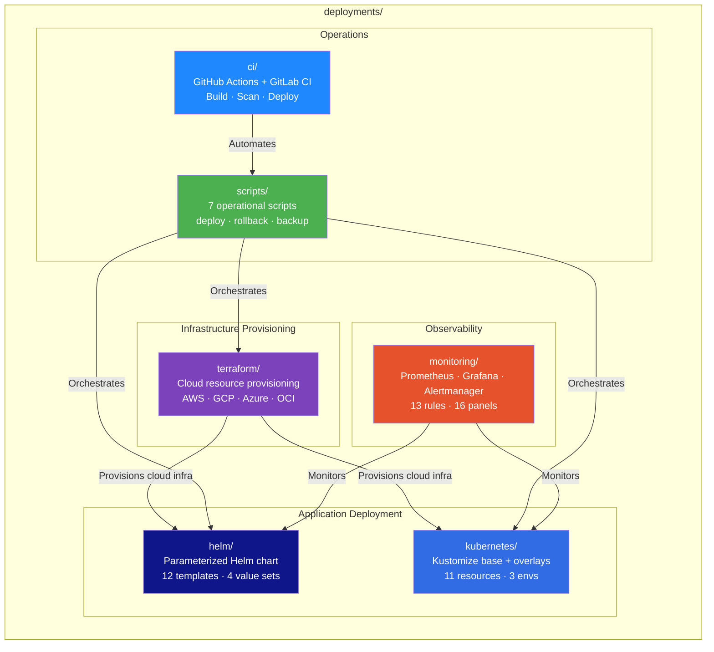
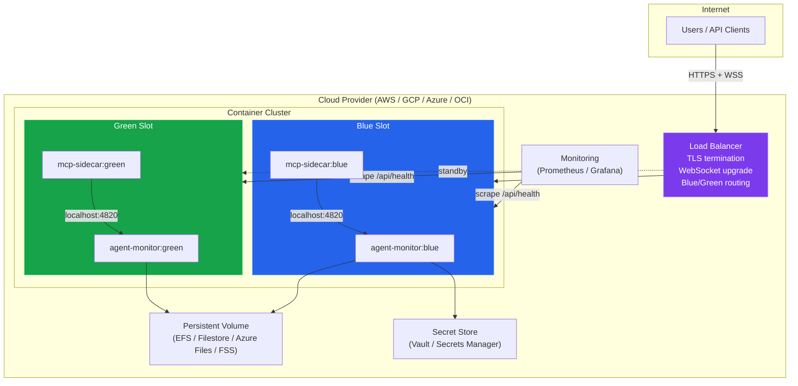
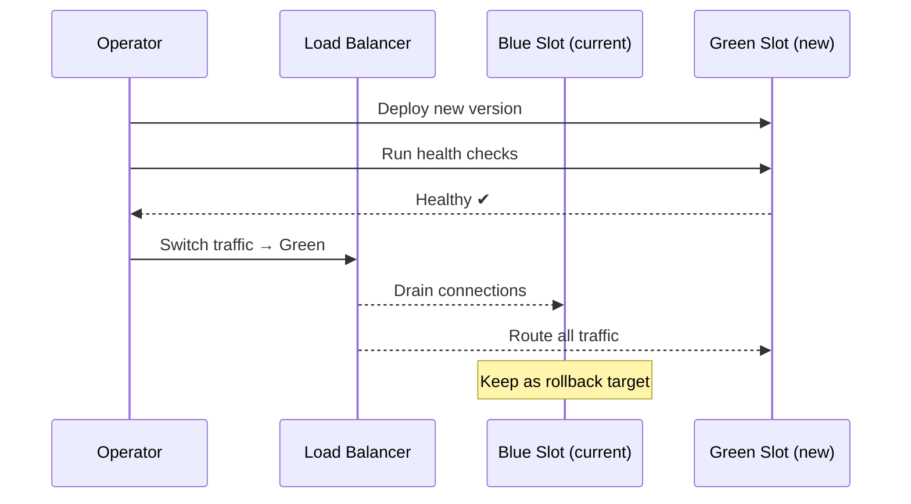
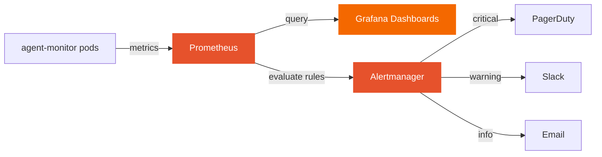
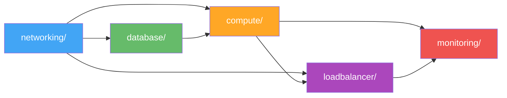
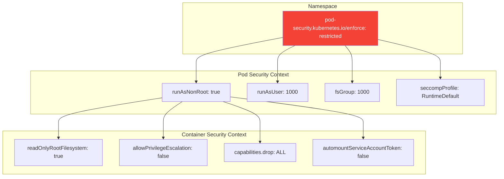
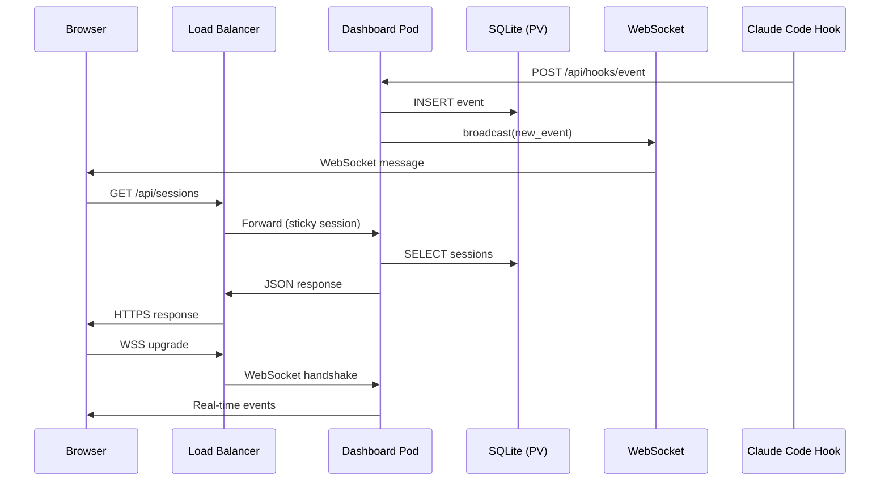

# Deployments

Production-ready, cloud-agnostic deployment infrastructure for the Claude Code Agent Monitor. Supports AWS, GCP, Azure, and OCI with Helm, Kustomize, and Terraform deployment methods, blue-green and canary release strategies, and full observability.

> **User-facing guide:** See [DEPLOYMENT.md](../DEPLOYMENT.md) in the project root for the step-by-step deployment guide with commands and workflows.
>
> This README is the **technical reference** for the infrastructure code in this directory.

---

## Infrastructure Architecture



## Directory Structure

```
deployments/
├── terraform/                  # Infrastructure as Code (HashiCorp Terraform)
│   ├── main.tf                 # Root module — orchestrates all child modules
│   ├── variables.tf            # Input variables with validation
│   ├── outputs.tf              # Exported values (URLs, IDs, endpoints)
│   ├── versions.tf             # Terraform + provider version constraints
│   ├── backend.tf              # State backends (S3, GCS, Azure Blob, OCI S3)
│   ├── modules/                # Reusable, cloud-agnostic modules
│   │   ├── networking/         # VPC, subnets, security groups, NAT
│   │   ├── compute/            # Container orchestration (ECS/Cloud Run/ACI/OKE)
│   │   ├── database/           # Persistent storage for SQLite (EFS/Filestore/Azure Files/FSS)
│   │   ├── loadbalancer/       # Application LB with WebSocket + blue-green weighted routing
│   │   ├── monitoring/         # Metrics, logs, alerts, dashboards
│   │   └── secrets/            # Vault integration or cloud-native secret stores
│   ├── providers/              # Cloud-specific root configurations
│   │   ├── aws/                # ECS Fargate + ALB + EFS + CloudWatch
│   │   ├── gcp/                # Cloud Run + GCLB + Filestore + Cloud Monitoring
│   │   ├── azure/              # ACI + App Gateway + Azure Files + Azure Monitor
│   │   └── oci/                # OKE + LBaaS + FSS + OCI Monitoring
│   └── environments/           # Per-environment variable overrides
│       ├── dev/                # 1 replica, 256 CPU, monitoring off
│       ├── staging/            # 2 replicas, 512 CPU, monitoring on
│       └── production/         # 3 replicas, 1024 CPU, HA, blue-green
├── kubernetes/                 # Kubernetes-native manifests (Kustomize)
│   ├── base/                   # 11 shared base resources
│   ├── overlays/               # Environment-specific patches
│   │   ├── dev/
│   │   ├── staging/
│   │   └── production/
│   ├── strategies/             # Advanced deployment patterns
│   │   ├── blue-green/         # Zero-downtime slot switching
│   │   └── canary/             # Progressive traffic shifting
│   └── components/             # Optional add-ons (Kustomize components)
│       ├── mcp-sidecar/        # MCP server as a sidecar container
│       └── monitoring/         # Prometheus ServiceMonitor
├── helm/                       # Helm chart (alternative to Kustomize)
│   └── agent-monitor/
│       ├── templates/          # Kubernetes resource templates
│       ├── values.yaml         # Default values
│       ├── values-dev.yaml
│       ├── values-staging.yaml
│       └── values-production.yaml
├── scripts/                    # Operational shell scripts
│   ├── deploy.sh               # Main deployment orchestrator
│   ├── rollback.sh             # Rollback to previous revision
│   ├── blue-green-switch.sh    # Switch active blue/green slot
│   ├── health-check.sh         # Comprehensive health verification
│   ├── db-backup.sh            # SQLite backup (local + cloud upload)
│   ├── db-restore.sh           # SQLite restore from backup
│   └── teardown.sh             # Full environment teardown
├── monitoring/                 # Observability stack configs
│   ├── prometheus/             # Scrape config + alert rules
│   ├── grafana/                # Dashboards + datasources
│   └── alertmanager/           # Alert routing (Slack, PagerDuty, email)
└── ci/                         # CI/CD pipeline definitions
    ├── github-actions/         # GitHub Actions workflows
    └── gitlab-ci/              # GitLab CI pipeline
```

## Architecture Overview



## Quick Start

### Option A: Helm (recommended for Kubernetes)

```bash
# Dev
helm install agent-monitor ./deployments/helm/agent-monitor \
  -f ./deployments/helm/agent-monitor/values-dev.yaml \
  -n agent-monitor --create-namespace

# Production
helm install agent-monitor ./deployments/helm/agent-monitor \
  -f ./deployments/helm/agent-monitor/values-production.yaml \
  -n agent-monitor --create-namespace
```

### Option B: Kustomize

```bash
# Dev
kubectl apply -k ./deployments/kubernetes/overlays/dev

# Production
kubectl apply -k ./deployments/kubernetes/overlays/production
```

### Option C: Terraform (full infra + app)

```bash
cd deployments/terraform/providers/aws   # or gcp, azure, oci
terraform init
terraform plan -var-file=../../environments/production/terraform.tfvars
terraform apply -var-file=../../environments/production/terraform.tfvars
```

### Option D: Script orchestrator

```bash
./deployments/scripts/deploy.sh --env production --method helm --strategy rolling
```

## Deployment Strategies

### Rolling Update (default)

Zero-downtime rolling replacement. One pod at a time is replaced with the new version.

```bash
./deployments/scripts/deploy.sh --env production --method helm --strategy rolling
```

### Blue-Green

Two identical environments. Traffic switches instantly from blue to green after validation.



```bash
# Deploy to inactive slot
./deployments/scripts/deploy.sh --env production --method helm --strategy blue-green

# Switch traffic
./deployments/scripts/blue-green-switch.sh --env production --target green

# Instant rollback
./deployments/scripts/blue-green-switch.sh --env production --target blue
```

### Canary

Progressive traffic shifting with automated analysis. Rolls back on metric degradation.

```bash
./deployments/scripts/deploy.sh --env production --method helm --strategy canary
```

## Cloud Provider Comparison

| Feature | AWS | GCP | Azure | OCI |
|---|---|---|---|---|
| Compute | ECS Fargate | Cloud Run / GKE | ACI / AKS | OKE |
| Load Balancer | ALB | GCLB | App Gateway | LBaaS |
| Persistent Storage | EFS | Filestore | Azure Files | FSS |
| Secrets | Secrets Manager | Secret Manager | Key Vault | Vault |
| Monitoring | CloudWatch | Cloud Monitoring | Azure Monitor | OCI Monitoring |
| DNS | Route 53 | Cloud DNS | Azure DNS | OCI DNS |
| TLS Certs | ACM | Managed Certs | App Gateway Certs | Certificates |

## Operations

### Health Checks

```bash
./deployments/scripts/health-check.sh --url https://monitor.example.com
./deployments/scripts/health-check.sh --url http://localhost:4820 --retries 30
```

### Backup & Restore

```bash
# Backup SQLite database
./deployments/scripts/db-backup.sh --env production --output ./backups/
./deployments/scripts/db-backup.sh --env production --upload s3://my-bucket/backups/

# Restore from backup
./deployments/scripts/db-restore.sh --env production --input ./backups/dashboard-20240101.db
```

### Rollback

```bash
# Helm rollback
./deployments/scripts/rollback.sh --env production --method helm --revision 3

# Kubernetes rollback
./deployments/scripts/rollback.sh --env production --method kustomize
```

### Teardown

```bash
./deployments/scripts/teardown.sh --env dev --method helm
```

## Monitoring

The monitoring stack provides:

- **Prometheus** scrape configuration and alert rules
- **Grafana** dashboard with request rate, latency, errors, WebSocket connections, resource usage
- **Alertmanager** routing to Slack, PagerDuty, and email



Deploy the monitoring stack:

```bash
# Apply Prometheus rules
kubectl apply -f ./deployments/monitoring/prometheus/rules/

# Import Grafana dashboard
# Upload monitoring/grafana/dashboards/agent-monitor.json via Grafana UI or API

# Apply Alertmanager config
kubectl create secret generic alertmanager-config \
  --from-file=./deployments/monitoring/alertmanager/alertmanager.yaml
```

## CI/CD

### GitHub Actions

Three workflows are provided:

| Workflow | Trigger | Purpose |
|---|---|---|
| `ci.yaml` | Push/PR to main | Lint, test, build, security scan |
| `deploy.yaml` | Tag `v*` or manual | Build → staging (auto) → production (manual) |
| `rollback.yaml` | Manual dispatch | Rollback to a specific revision |

### GitLab CI

Single `.gitlab-ci.yml` covering all stages from test through production deploy.

## Environment Variables

| Variable | Default | Description |
|---|---|---|
| `IMAGE_REGISTRY` | — | Container image registry URL |
| `IMAGE_TAG` | `latest` | Container image tag |
| `DASHBOARD_PORT` | `4820` | Dashboard API + UI port |
| `NODE_ENV` | `production` | Node.js environment |
| `MCP_TRANSPORT` | `stdio` | MCP transport mode (stdio/http/repl) |
| `MCP_HTTP_PORT` | `8819` | MCP HTTP server port |
| `TLS_CERT_ARN` | — | TLS certificate ARN/ID (cloud-specific) |
| `DOMAIN` | — | Public domain for ingress/DNS |

---

## Terraform Module Reference

The Terraform infrastructure is organized as reusable modules that work across all four cloud providers.

### Module Dependency Chain



### networking/

Provisions the cloud network foundation.

| Output | Description |
|--------|-------------|
| `vpc_id` | VPC / VNet / VCN identifier |
| `public_subnet_ids` | Subnets for load balancers |
| `private_subnet_ids` | Subnets for containers |
| `storage_security_group_ids` | SG allowing NFS (port 2049) |

### database/

Provisions persistent storage for SQLite data.

| Provider | Service | Encryption |
|----------|---------|:----------:|
| AWS | EFS (Elastic File System) | AES-256 at rest + TLS in transit |
| GCP | Filestore (NFS) | Google-managed |
| Azure | Azure Files (SMB/NFS) | SSE with platform key |
| OCI | File Storage Service (NFS) | Oracle-managed |

### compute/

Provisions dual blue/green container slots with auto-scaling.

| Provider | Service | Container Runtime |
|----------|---------|-------------------|
| AWS | ECS Fargate | Docker |
| GCP | Cloud Run v2 | Docker |
| Azure | Container Instances | Docker |
| OCI | Container Instances / OKE | Docker |

### loadbalancer/

Provisions the application load balancer with TLS termination and WebSocket support.

| Feature | Implementation |
|---------|---------------|
| TLS | TLS 1.3 minimum policy |
| WebSocket | Sticky sessions (cookie/ClientIP) |
| Blue-green | Weighted target groups (0-100) |
| Health checks | HTTP GET `/api/health` every 30s |
| Idle timeout | 300s (for long-lived WebSocket) |

### monitoring/

Provisions cloud-native monitoring and alerting.

| Provider | Metrics | Alarms | Logs |
|----------|---------|--------|------|
| AWS | CloudWatch | SNS → Email | CloudWatch Logs |
| GCP | Cloud Monitoring | Notification Channel | Cloud Logging |
| Azure | Azure Monitor | Action Group | Log Analytics |
| OCI | OCI Monitoring | Notification Topic | OCI Logging |

### Root Variables

Key variables defined in `terraform/variables.tf`:

| Variable | Type | Validation | Description |
|----------|------|-----------|-------------|
| `cloud_provider` | string | `aws\|gcp\|azure\|oci` | Target cloud |
| `environment` | string | `dev\|staging\|production` | Deployment tier |
| `vpc_cidr` | string | Valid CIDR | Network address space |
| `cpu` | number | `256\|512\|1024\|2048\|4096` | CPU units per container |
| `deployment_strategy` | string | `rolling\|blue-green\|canary` | Release strategy |
| `blue_weight` / `green_weight` | number | `0-100` | Traffic distribution |

---

## Kubernetes Security Posture

All Kubernetes manifests enforce the **Restricted Pod Security Standard**:



---

## Data Flow



---

## Related Documentation

- [DEPLOYMENT.md](../DEPLOYMENT.md) — Step-by-step deployment guide with workflows
- [terraform/README.md](./terraform/README.md) — Terraform module details
- [kubernetes/README.md](./kubernetes/README.md) — Kustomize overlay guide
