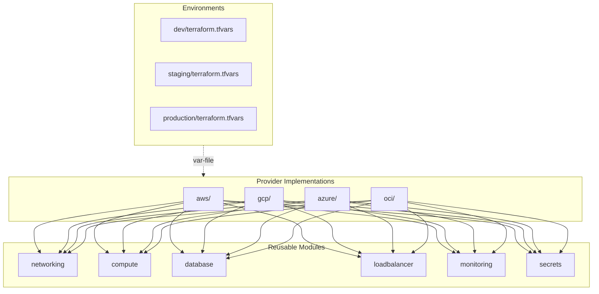

# Terraform Infrastructure

Cloud-agnostic infrastructure modules for deploying the Claude Code Agent Monitor to AWS, GCP, Azure, or OCI.

## Architecture



## Usage

```bash
# 1. Choose your provider
cd providers/aws    # or gcp, azure, oci

# 2. Initialize
terraform init

# 3. Plan with environment
terraform plan -var-file=../../environments/production/terraform.tfvars

# 4. Apply
terraform apply -var-file=../../environments/production/terraform.tfvars

# 5. Get outputs
terraform output
```

## Module Reference

| Module | Purpose | Key Resources |
|---|---|---|
| `networking` | VPC/VNet, subnets, NAT, security groups | VPC, public/private subnets, NAT gateway, firewall rules |
| `compute` | Container orchestration with blue-green slots | ECS tasks / Cloud Run / ACI / OKE deployments |
| `database` | Persistent storage for SQLite | EFS / Filestore / Azure Files / FSS with encryption |
| `loadbalancer` | Application LB with WebSocket + traffic splitting | ALB / GCLB / App Gateway / LBaaS, health checks |
| `monitoring` | Metrics, logs, alerts, dashboards | CloudWatch / Cloud Monitoring / Azure Monitor / OCI Monitoring |
| `secrets` | Secret management | Secrets Manager / Secret Manager / Key Vault / Vault |

## Remote State

Each provider is configured to use cloud-native remote state:

| Provider | Backend | Bucket |
|---|---|---|
| AWS | S3 + DynamoDB locking | `agent-monitor-tfstate-{account_id}` |
| GCP | GCS | `agent-monitor-tfstate-{project_id}` |
| Azure | Azure Blob Storage | `agentmonitortfstate` |
| OCI | OCI Object Storage | `agent-monitor-tfstate` |

## Environment Sizing

| Resource | Dev | Staging | Production |
|---|---|---|---|
| Replicas | 1 | 2 | 3 (auto-scale to 10) |
| CPU | 256 | 512 | 1024 |
| Memory | 512 MB | 1 GB | 2 GB |
| Storage | 5 GB | 10 GB | 50 GB (encrypted) |
| Multi-AZ | No | Yes | Yes |
| Monitoring | Basic | Standard | Full + alerts |
