# Agent Dashboard MCP Server

Local, enterprise-grade Model Context Protocol (MCP) server for this repository.

It exposes the existing dashboard backend (`/api/*`) as MCP tools for Claude Code, Claude Desktop, and other MCP hosts.

## Table of Contents

- [Overview](#overview)
- [Transport Modes](#transport-modes)
- [Runtime Architecture](#runtime-architecture)
- [Tool Domains](#tool-domains)
- [Safety and Control Model](#safety-and-control-model)
- [Prerequisites](#prerequisites)
- [Setup and Commands](#setup-and-commands)
- [Container Runtime (Docker / Podman)](#container-runtime-docker--podman)
- [Host Configuration](#host-configuration)
- [Configuration Variables](#configuration-variables)
- [Enterprise File Structure](#enterprise-file-structure)
- [Execution Flows](#execution-flows)
- [Operational Runbook](#operational-runbook)
- [Troubleshooting](#troubleshooting)

## Overview

The MCP server supports three transport modes:

| Mode | Transport | Use case |
| --- | --- | --- |
| **stdio** | JSON-RPC over stdin/stdout | MCP host integration (Claude Code, Claude Desktop) |
| **http** | SSE + Streamable HTTP over Express | Remote/networked MCP clients, web integrations |
| **repl** | Interactive CLI | Local debugging, manual tool invocation, ops tasks |

## Transport Modes

### stdio (default)

Standard MCP transport. An MCP host launches the server as a child process.

```bash
npm run mcp:start              # production
npm run mcp:dev                # development (tsx)
```

### HTTP (SSE + Streamable HTTP)

Express-based HTTP server exposing both modern Streamable HTTP (protocol 2025-11-25)
and legacy SSE (protocol 2024-11-05) transports on configurable port.

```bash
npm run mcp:start:http         # production
npm run mcp:dev:http           # development (tsx)
```

Endpoints:

| Endpoint | Methods | Protocol |
| --- | --- | --- |
| `/mcp` | POST, GET, DELETE | Streamable HTTP (2025-11-25) |
| `/sse` | GET | Legacy SSE stream (2024-11-05) |
| `/messages` | POST | Legacy SSE message endpoint |
| `/health` | GET | Server health check |

### REPL (Interactive CLI)

Interactive terminal with tab completion, colored output, and formatted results.

```bash
npm run mcp:start:repl         # production
npm run mcp:dev:repl           # development (tsx)
```

REPL commands:

| Command | Description |
| --- | --- |
| `help` | Show all commands |
| `tools [domain]` | List tools (optionally filtered) |
| `domains` | List tool domains with counts |
| `health` | Quick dashboard health check |
| `stats` | Dashboard overview statistics |
| `status` | Full operational snapshot |
| `config` | Show current configuration |
| `clear` | Clear screen |
| `exit` | Quit |
| `<tool_name> {json}` | Invoke tool with JSON args |
| `<tool_name> k=v ...` | Invoke tool with key=value args |

CLI argument overrides: `--transport=stdio|http|repl`, `--repl`, `--http`

## Runtime Architecture

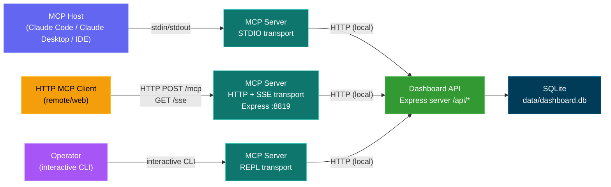

## Tool Domains

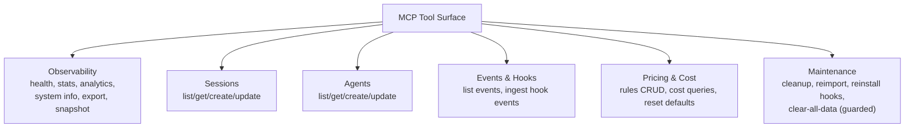

Read-focused tools:

- `dashboard_health_check`
- `dashboard_get_stats`
- `dashboard_get_analytics`
- `dashboard_get_system_info`
- `dashboard_export_data`
- `dashboard_get_operational_snapshot`
- `dashboard_list_sessions`
- `dashboard_get_session`
- `dashboard_list_agents`
- `dashboard_get_agent`
- `dashboard_list_events`
- `dashboard_get_pricing_rules`
- `dashboard_get_total_cost`
- `dashboard_get_session_cost`

Mutation tools (require `MCP_DASHBOARD_ALLOW_MUTATIONS=true`):

- `dashboard_create_session`
- `dashboard_update_session`
- `dashboard_create_agent`
- `dashboard_update_agent`
- `dashboard_ingest_hook_event`
- `dashboard_upsert_pricing_rule`
- `dashboard_delete_pricing_rule`
- `dashboard_reset_pricing_defaults`
- `dashboard_cleanup_data`
- `dashboard_reimport_history`
- `dashboard_reinstall_hooks`

Destructive tools (require mutation flag + destructive flag):

- `dashboard_clear_all_data`
  - requires `confirmation_token` exactly `CLEAR_ALL_DATA`

## Safety and Control Model

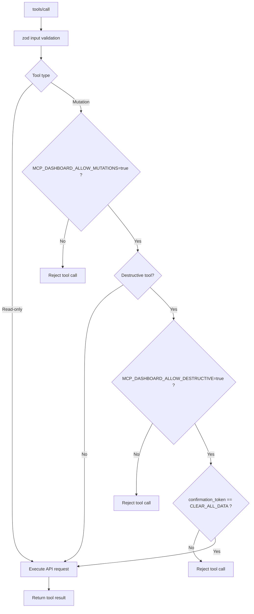

Core controls:

- Local dashboard host enforcement (`localhost`, `127.0.0.1`, `::1`, `host.docker.internal`, `gateway.docker.internal`, `host.containers.internal`)
- Strict schema validation per tool
- Centralized mutation/destructive policy gates
- Retry/backoff and timeout for resilient API calls
- Structured stderr logging only (stdio-safe)

## Transport Decision Guide

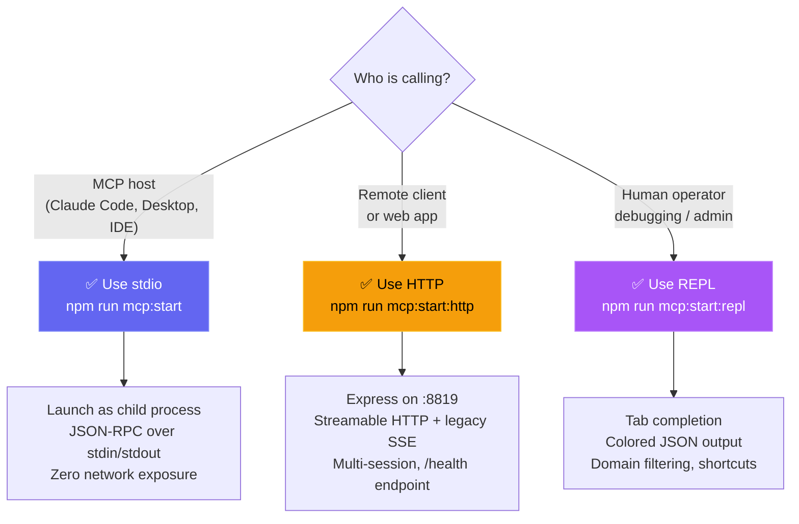

## Prerequisites

- Node.js `>= 18.18.0`
- Dashboard server running:
  - dev: `npm run dev`
  - prod: `npm run build && npm start`

## Setup and Commands

Recommended from repository root:

```bash
npm run mcp:install
npm run mcp:build
npm run mcp:start             # stdio (default)
npm run mcp:start:http        # HTTP + SSE server
npm run mcp:start:repl        # interactive REPL
```

Alternative from `mcp/` directly:

```bash
cd mcp
npm install
npm run build
npm start                     # stdio
npm run start:http            # HTTP + SSE
npm run start:repl            # REPL
```

Development mode (tsx, no build needed):

```bash
npm run mcp:dev               # stdio
npm run mcp:dev:http          # HTTP + SSE
npm run mcp:dev:repl          # interactive REPL
```

Available scripts:

- `npm run mcp:install`
- `npm run mcp:build`
- `npm run mcp:start` / `npm run mcp:start:http` / `npm run mcp:start:repl`
- `npm run mcp:dev` / `npm run mcp:dev:http` / `npm run mcp:dev:repl`
- `npm run mcp:typecheck`
- `npm run mcp:docker:build` (from repo root)
- `npm run mcp:podman:build` (from repo root)

## Container Runtime (Docker / Podman)

The MCP server supports all transports inside containers. For stdio mode, run as a short-lived
interactive process (`-i`). For HTTP mode, expose the configured port.

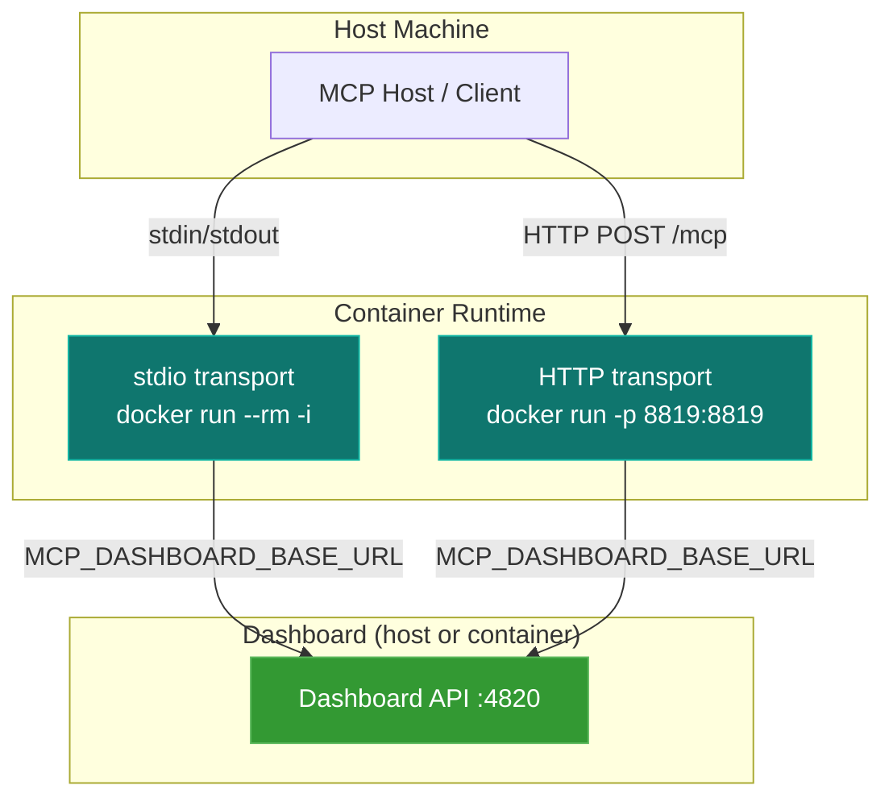

Build from repository root:

```bash
# Docker
npm run mcp:docker:build

# Podman
npm run mcp:podman:build
```

Manual build commands:

```bash
# Docker (repo root)
docker build -f mcp/Dockerfile -t agent-dashboard-mcp:local .

# Podman (repo root)
podman build -f mcp/Dockerfile -t localhost/agent-dashboard-mcp:local .
```

Container networking options:

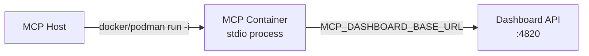

Recommended runtime patterns:

```bash
# Docker bridge network, map host alias explicitly
docker run --rm -i --init \
  --add-host=host.docker.internal:host-gateway \
  -e MCP_DASHBOARD_BASE_URL=http://host.docker.internal:4820 \
  agent-dashboard-mcp:local

# Podman host network (Linux/rootless): keep loopback URL
podman run --rm -i --network=host \
  -e MCP_DASHBOARD_BASE_URL=http://127.0.0.1:4820 \
  localhost/agent-dashboard-mcp:local

# Podman bridge mode: use built-in host alias
podman run --rm -i \
  -e MCP_DASHBOARD_BASE_URL=http://host.containers.internal:4820 \
  localhost/agent-dashboard-mcp:local
```

## Host Configuration

### Direct Node runtime (recommended for local development)

Example MCP host config (Windows path style):

```json
{
  "mcpServers": {
    "agent-dashboard": {
      "command": "node",
      "args": [
        "C:\\ABSOLUTE\\PATH\\TO\\Claude-Code-Agent-Monitor\\mcp\\build\\index.js"
      ],
      "env": {
        "MCP_DASHBOARD_BASE_URL": "http://127.0.0.1:4820",
        "MCP_DASHBOARD_ALLOW_MUTATIONS": "false",
        "MCP_DASHBOARD_ALLOW_DESTRUCTIVE": "false",
        "MCP_LOG_LEVEL": "info"
      }
    }
  }
}
```

For macOS/Linux, use POSIX paths in `args`.

### Docker runtime wrapper

```json
{
  "mcpServers": {
    "agent-dashboard": {
      "command": "docker",
      "args": [
        "run",
        "--rm",
        "-i",
        "--init",
        "--add-host=host.docker.internal:host-gateway",
        "-e",
        "MCP_DASHBOARD_BASE_URL=http://host.docker.internal:4820",
        "agent-dashboard-mcp:local"
      ],
      "env": {
        "MCP_DASHBOARD_ALLOW_MUTATIONS": "false",
        "MCP_DASHBOARD_ALLOW_DESTRUCTIVE": "false",
        "MCP_LOG_LEVEL": "info"
      }
    }
  }
}
```

### Podman runtime wrapper

```json
{
  "mcpServers": {
    "agent-dashboard": {
      "command": "podman",
      "args": [
        "run",
        "--rm",
        "-i",
        "--network=host",
        "localhost/agent-dashboard-mcp:local"
      ],
      "env": {
        "MCP_DASHBOARD_BASE_URL": "http://127.0.0.1:4820",
        "MCP_DASHBOARD_ALLOW_MUTATIONS": "false",
        "MCP_DASHBOARD_ALLOW_DESTRUCTIVE": "false",
        "MCP_LOG_LEVEL": "info"
      }
    }
  }
}
```

## Configuration Variables

| Variable | Default | Description |
| --- | --- | --- |
| `MCP_SERVER_NAME` | `agent-dashboard-mcp` | MCP server name reported to host |
| `MCP_SERVER_VERSION` | `1.0.0` | MCP server version |
| `MCP_DASHBOARD_BASE_URL` | `http://127.0.0.1:4820` | Dashboard API base URL (must be local-only hostname) |
| `MCP_DASHBOARD_TIMEOUT_MS` | `10000` | API timeout per request |
| `MCP_DASHBOARD_RETRY_COUNT` | `2` | Retries for idempotent requests |
| `MCP_DASHBOARD_RETRY_BACKOFF_MS` | `250` | Exponential retry backoff base |
| `MCP_DASHBOARD_ALLOW_MUTATIONS` | `false` | Enables mutating tools |
| `MCP_DASHBOARD_ALLOW_DESTRUCTIVE` | `false` | Enables destructive tools (requires mutations) |
| `MCP_LOG_LEVEL` | `info` | `debug`, `info`, `warn`, `error` |
| `MCP_TRANSPORT` | `stdio` | Transport mode: `stdio`, `http`, `repl` |
| `MCP_HTTP_PORT` | `8819` | HTTP server port (only for `http` transport) |
| `MCP_HTTP_HOST` | `127.0.0.1` | HTTP server bind address |

CLI flags `--transport=stdio|http|repl`, `--repl`, `--http` override the env variable.

Reference file: `mcp/.env.example`

## Enterprise File Structure

```text
mcp/
  src/
    clients/
      dashboard-api-client.ts      # HTTP client with retry/backoff
    config/
      app-config.ts                # Env/CLI config parsing
    core/
      logger.ts                    # Structured stderr logger
      tool-registry.ts             # MCP + collector dual registrar
      tool-result.ts               # Tool response formatting
    policy/
      tool-guards.ts               # Mutation/destructive gates
    tools/
      schemas.ts                   # Shared zod schemas
      domains/
        observability-tools.ts
        session-tools.ts
        agent-tools.ts
        event-tools.ts
        pricing-tools.ts
        maintenance-tools.ts
      index.ts                     # MCP tool registration orchestrator
    transports/
      http-server.ts               # Express SSE + Streamable HTTP server
      repl.ts                      # Interactive CLI with tab completion
      tool-collector.ts            # Tool handler collector for REPL
    types/
      tool-context.ts
    ui/
      banner.ts                    # ASCII art banner + server info display
      colors.ts                    # Zero-dep ANSI color/style helpers
      formatter.ts                 # Tables, boxes, badges, JSON highlighting
    server.ts                      # McpServer builder
    index.ts                       # Entry point (transport router)
  build/
  Dockerfile
  package.json
  tsconfig.json
```

## Execution Flows

Tool execution flow (all transports):

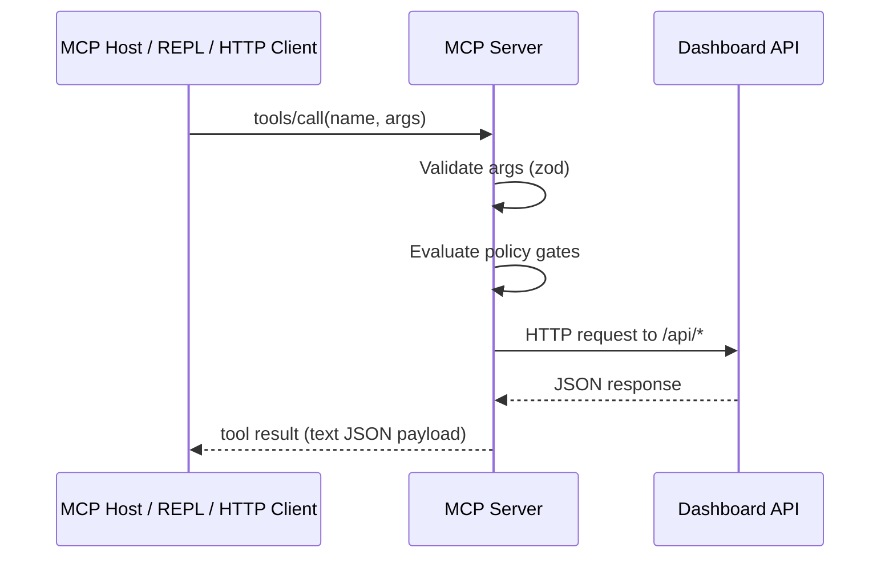

HTTP transport session lifecycle:

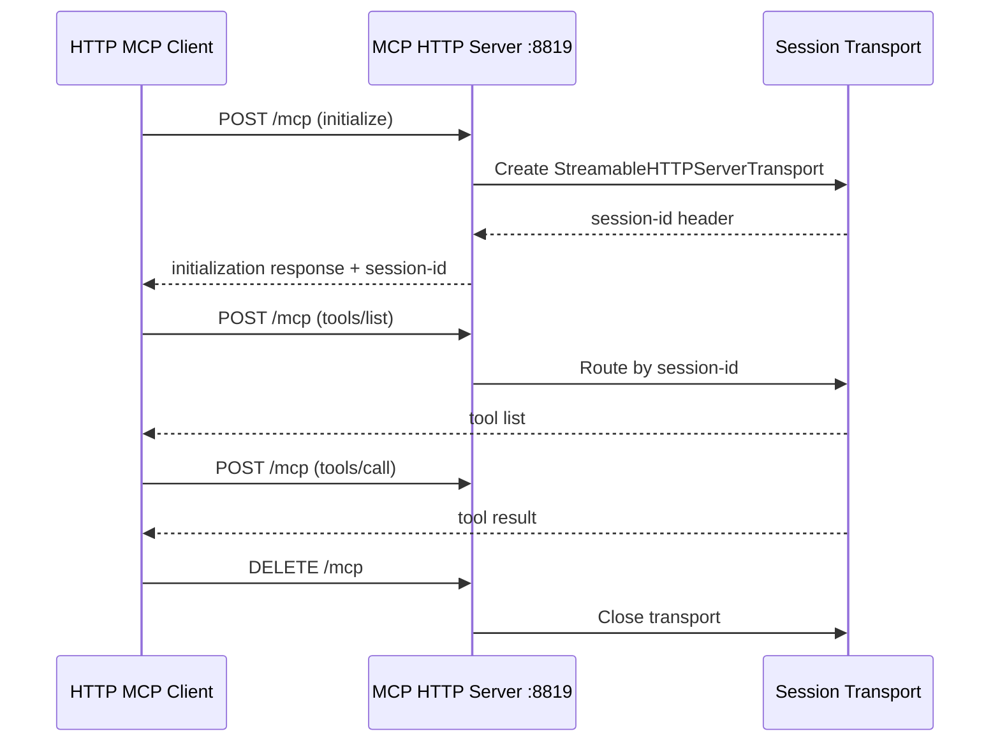

REPL interactive flow:

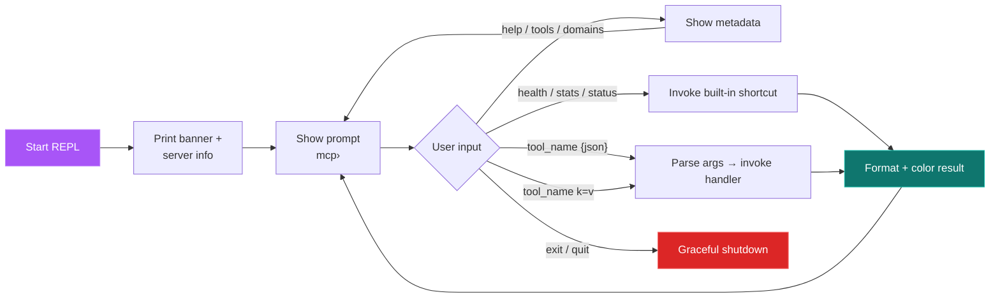

Failure handling:

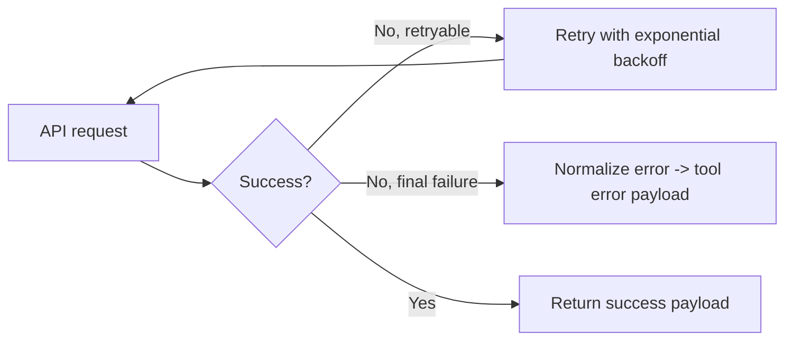

## Operational Runbook

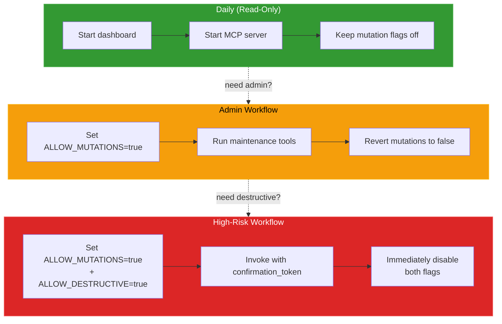

Read-only daily usage:

1. Start dashboard (`npm run dev` or `npm start`)
2. Start MCP (`npm run mcp:start`, `mcp:start:http`, or `mcp:start:repl`)
3. Keep mutation flags disabled

Admin workflow:

1. Set `MCP_DASHBOARD_ALLOW_MUTATIONS=true`
2. Run required maintenance tools (via REPL: `dashboard_cleanup_data abandon_hours=24`)
3. Revert mutation flag to `false`

High-risk workflow:

1. Set both mutation and destructive flags to `true`
2. Use destructive tool with explicit confirmation token
3. Disable destructive mode immediately after operation

## REPL Usage Examples

List tools filtered by domain:
```
mcp› tools observability
mcp› tools maintenance
mcp› domains
```

Invoke tools with JSON arguments:
```
mcp› dashboard_list_sessions {"limit": 5, "status": "active"}
mcp› dashboard_get_session {"session_id": "abc-123"}
```

Invoke tools with key=value shorthand:
```
mcp› dashboard_list_agents status=working limit=10
mcp› dashboard_get_session_cost session_id=abc-123
```

Built-in shortcuts:
```
mcp› health        # → dashboard_health_check
mcp› stats         # → dashboard_get_stats
mcp› status        # → dashboard_get_operational_snapshot
mcp› config        # show current configuration
```

## Troubleshooting

1. Tools fail with connection error
   - Verify dashboard is reachable at `MCP_DASHBOARD_BASE_URL`
   - Verify `GET /api/health` works
2. Mutation tools denied
   - Set `MCP_DASHBOARD_ALLOW_MUTATIONS=true`
3. Destructive tool denied
   - Set `MCP_DASHBOARD_ALLOW_DESTRUCTIVE=true`
   - Pass `confirmation_token: "CLEAR_ALL_DATA"`
4. Host cannot start MCP
   - Confirm absolute path to `mcp/build/index.js`
   - Rebuild: `npm run mcp:build`
5. HTTP server port already in use
   - Change port: `MCP_HTTP_PORT=9819 npm run mcp:start:http`
   - Or set `MCP_HTTP_PORT` in `.env`
6. REPL shows no color output
   - Ensure terminal supports ANSI colors
   - Set `FORCE_COLOR=1` if auto-detection fails
7. Docker runtime cannot reach dashboard
   - Use Docker host alias + `--add-host=host.docker.internal:host-gateway`
   - Set `MCP_DASHBOARD_BASE_URL=http://host.docker.internal:4820`
8. Podman runtime cannot reach dashboard
   - Prefer `--network=host` with `MCP_DASHBOARD_BASE_URL=http://127.0.0.1:4820`
   - For bridge mode, use `MCP_DASHBOARD_BASE_URL=http://host.containers.internal:4820`
9. Container image build fails
   - Build from repository root so `file:..` dependency resolves
   - Use `docker build -f mcp/Dockerfile ... .` or `podman build -f mcp/Dockerfile ... .`
